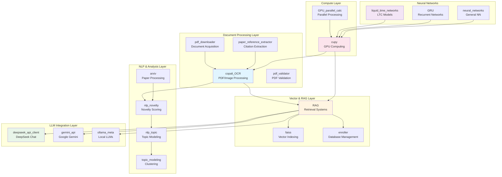
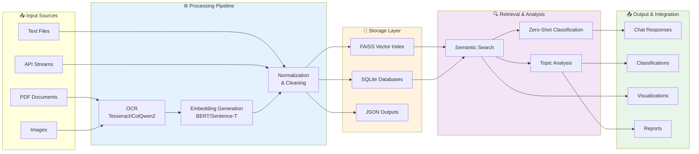
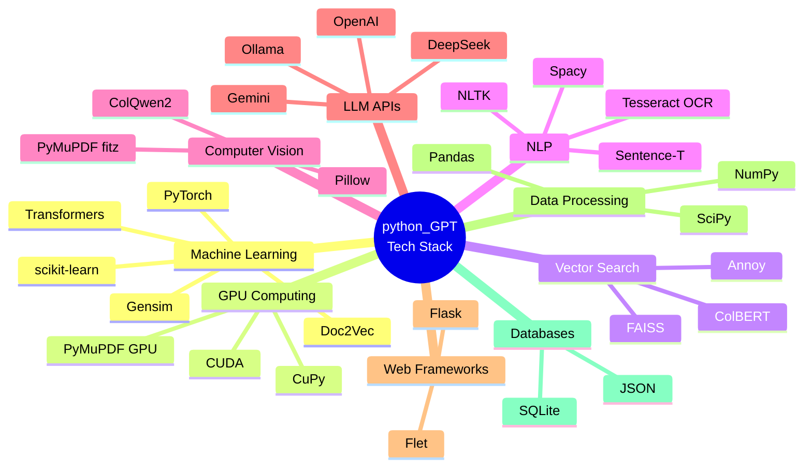
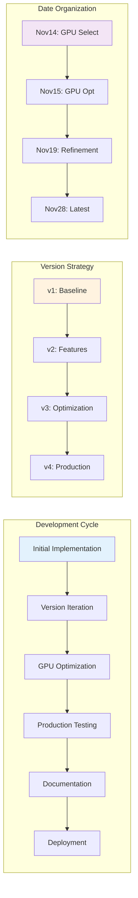
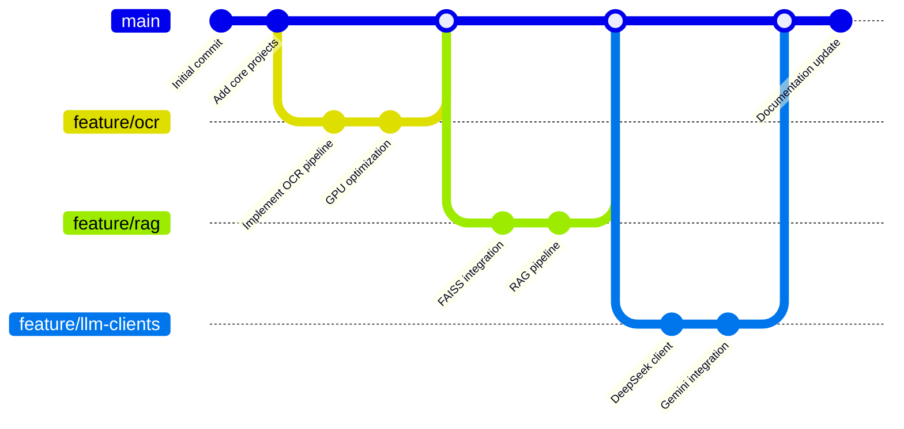
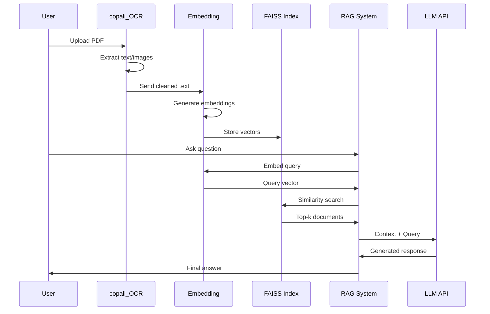

# Python GPT Repository

A comprehensive AI/ML experimentation platform focused on document understanding, vector-based retrieval, and large language model integration, with emphasis on GPU acceleration and production deployment.

## 📊 Repository Overview



## 🏗️ Architecture & Data Flow



## 🗂️ Directory Structure

```mermaid
graph TD
    ROOT[python_GPT]

    ROOT --> DOC[📄 Document Processing]
    ROOT --> VEC[🔍 Vector & RAG]
    ROOT --> NLP[📝 NLP & Analysis]
    ROOT --> LLM[🤖 LLM Integration]
    ROOT --> GPU[⚡ GPU Computing]
    ROOT --> NN[🧠 Neural Networks]
    ROOT --> INFRA[🏗️ Infrastructure]
    ROOT --> UTIL[🛠️ Utilities]

    DOC --> DOC1[copali_OCR<br/>6.5M]
    DOC --> DOC2[pdf_validator]
    DOC --> DOC3[pdf_downloader]
    DOC --> DOC4[paper_reference_extractor]
    DOC --> DOC5[pdf_to_text]

    VEC --> VEC1[RAG<br/>627K]
    VEC --> VEC2[faiss<br/>108K]
    VEC --> VEC3[enroller]

    NLP --> NLP1[nlp_novelty]
    NLP --> NLP2[nlp_topic]
    NLP --> NLP3[topic_modeling]
    NLP --> NLP4[arxiv]
    NLP --> NLP5[tf_idvectorizer]

    LLM --> LLM1[deepseek_api_client]
    LLM --> LLM2[gemini_api]
    LLM --> LLM3[gemini_xch]
    LLM --> LLM4[ollama_meta]

    GPU --> GPU1[cupy<br/>497K]
    GPU --> GPU2[GPU_parallel_calc]

    NN --> NN1[liquid_time_networks]
    NN --> NN2[GRU]
    NN --> NN3[neural_networks]

    INFRA --> INFRA1[Proof of WorkForce]
    INFRA --> INFRA2[fail2ban]
    INFRA --> INFRA3[terminal_ingress]
    INFRA --> INFRA4[kernel_module_visualizer]
    INFRA --> INFRA5[SICNS]

    UTIL --> UTIL1[JSON]
    UTIL --> UTIL2[pythonic_viz]
    UTIL --> UTIL3[boxes]
    UTIL --> UTIL4[disks]
    UTIL --> UTIL5[ishihara]
    UTIL --> UTIL6[jitter]
    UTIL --> UTIL7[ballistics]
    UTIL --> UTIL8[CRAM]

    style DOC fill:#e1f5ff
    style VEC fill:#fff4e1
    style NLP fill:#e8f5e9
    style LLM fill:#f3e5f5
    style GPU fill:#fce4ec
    style NN fill:#fff3e0
    style INFRA fill:#e0f2f1
    style UTIL fill:#fafafa
```



## 🔧 Technology Stack



## 📂 Major Project Categories

### 1. 📄 Document Processing (6.5M+)
Advanced OCR and document understanding pipeline with GPU optimization.

| Project | Purpose | Key Technologies |
|---------|---------|------------------|
| **copali_OCR** | Multi-modal PDF/image processing | Tesseract, PyMuPDF, ColQwen2, GPU batch processing |
| **pdf_validator** | PDF validation and quality checks | PyPDF2, structural validation |
| **pdf_downloader** | Automated PDF acquisition | async/await, requests, retry logic |
| **paper_reference_extractor** | Citation and reference extraction | Regex, NLP parsing |
| **pdf_to_text** | Text extraction with progress tracking | pdfminer, tqdm |

**Key Features:**
- GPU-accelerated batch processing
- Support for searchable and image-based PDFs
- LaTeX math recognition
- Multi-language OCR support
- Optimized for RTX 3060/3080/4080 GPUs

### 2. 🔍 Vector Database & RAG (735K+)
Retrieval-Augmented Generation systems with semantic search.

| Project | Purpose | Key Technologies |
|---------|---------|------------------|
| **RAG** | Full RAG pipeline implementation | FAISS, BERT, Zero-shot classification |
| **faiss** | Vector similarity indexing | Facebook AI Similarity Search |
| **enroller** | Database management for text files | SQLite, batch enrollment |

**Key Features:**
- FAISS-based vector indexing
- Zero-shot classification (facebook/bart-large-mnli)
- Multiple embedding models (BERT, DistillBERT, Mistral)
- Document retrieval and ranking
- Persistent vector storage

### 3. 📝 NLP & Analysis
Text analysis, novelty scoring, and topic modeling.

| Project | Purpose | Key Technologies |
|---------|---------|------------------|
| **nlp_novelty** | Measure text novelty and uniqueness | Doc2Vec, Gensim |
| **nlp_topic** | Topic modeling and extraction | LDA, clustering |
| **topic_modeling** | High-level topic analysis | scikit-learn, NMF |
| **arxiv** | Scientific paper downloading/processing | arXiv API, category filtering |
| **tf_idvectorizer** | TF-IDF vectorization techniques | scikit-learn, sparse matrices |

**Key Features:**
- Doc2Vec-based novelty scoring
- Topic clustering and visualization
- arXiv paper categorization
- Custom TF-IDF implementations

### 4. 🤖 LLM Integration
API clients for major language models.

| Project | Purpose | Key Technologies |
|---------|---------|------------------|
| **deepseek_api_client** | DeepSeek chat interface | Flet GUI, API integration |
| **gemini_api** | Google Gemini integration | REST API, async calls |
| **gemini_xch** | Data transformation layer | JSON parsing |
| **ollama_meta** | Local LLM orchestration | Ollama, chunking, streaming |

### 5. ⚡ GPU Computing (497K+)
High-performance parallel computing with CUDA.

| Project | Purpose | Key Technologies |
|---------|---------|------------------|
| **cupy** | GPU-accelerated NumPy operations | CuPy, CUDA kernels |
| **GPU_parallel_calc** | Parallel computation pipelines | Thread pools, async I/O |

**Key Features:**
- GPU-accelerated TF-IDF vectorization
- PCIe Gen4/Gen5 optimization
- Batch processing for large datasets
- Memory-efficient operations

### 6. 🧠 Neural Networks
Deep learning models and architectures.

| Project | Purpose | Key Technologies |
|---------|---------|------------------|
| **liquid_time_networks** | Neural ODE-inspired RNNs | PyTorch, custom layers |
| **GRU** | Gated Recurrent Units | PyTorch implementations |
| **neural_networks** | General neural network utilities | PyTorch, training loops |

**Key Features:**
- Liquid Time Constant (LTC) networks
- Multiple training strategies
- Loss function variations
- GPU-optimized training

### 7. 🏗️ Infrastructure & Tools
Supporting infrastructure and utilities.

| Project | Purpose | Key Technologies |
|---------|---------|------------------|
| **Proof of WorkForce** | Blockchain-based job listings | Flask, SQLite, blockchain concepts |
| **fail2ban** | Security analysis and GeoIP | Log parsing, IP tracking |
| **kernel_module_visualizer** | Linux kernel module analysis | System calls, visualization |
| **terminal_ingress** | Terminal session management | Bash, automation |

### 8. 🛠️ Utilities
Miscellaneous tools and helpers.

- **JSON**: Data formatting utilities
- **pythonic_viz**: Visualization tools
- **boxes**: Geometric calculations
- **disks**: Disk usage analysis
- **ishihara**: Color perception testing
- **jitter**: Network jitter analysis
- **ballistics**: Projectile simulation
- **CRAM**: Data compression utilities

## 🚀 Quick Start

### Prerequisites
```bash
# Python 3.10+
python3 --version

# CUDA Toolkit (for GPU features)
nvcc --version

# Virtual environment
python3 -m venv venv
source venv/bin/activate  # or venv_activate/
```

### Installation
```bash
# Clone repository
git clone <repository-url>
cd python_GPT

# Install core dependencies
pip install -r requirements.txt

# For specific projects, navigate and install
cd copali_OCR
pip install -r requirements.txt
```

### Common Workflows

#### 1. PDF Processing with OCR
```bash
cd copali_OCR
python pdf-ocr-ds.py --input docs/ --output output/ --gpu-device 0
```

#### 2. RAG System Setup
```bash
cd RAG
python setup_faiss_index.py
python query_engine.py --query "your question here"
```

#### 3. Topic Modeling
```bash
cd nlp_topic
python topic_model.py --input corpus.txt --num-topics 10
```

## 🎯 Development Patterns



### Observed Patterns

1. **Versioned Development**: Multiple implementations (v1-v9) for experimentation
2. **Date-Based Organization**: Monthly iterations (Nov14, Nov15, Nov19, Nov28)
3. **GPU-First Design**: Hardware-specific optimization for NVIDIA GPUs
4. **Modular Architecture**: Component-based with clear separation of concerns
5. **Production Focus**: Extensive error handling, logging, and monitoring

## 📈 Git Workflow



## 🔄 Data Flow Example: PDF → Chat Response



## 📊 Repository Statistics

- **Total Projects**: 45+
- **Python Files**: ~97 files
- **Total Size**: ~8MB+ (excluding models)
- **Languages**: Python (primary), Bash, Markdown
- **Active Development**: Monthly iterations
- **GPU Support**: CUDA-optimized
- **Documentation**: Extensive README files per project

## 🎓 Learning Resources

Each major project contains:
- **readme.md**: Project-specific documentation
- **requirements.txt**: Python dependencies
- **Example scripts**: Usage demonstrations
- **Troubleshooting guides**: Common issues and solutions

## 🤝 Contributing

This repository follows an iterative development pattern:
1. Create feature branch
2. Implement and test
3. Document changes
4. Create version (v1, v2, etc.)
5. Optimize (GPU, memory, speed)
6. Merge to main

## 📝 License

See [LICENSE](LICENSE) file for details.

## 🔗 Related Projects

- **Divergence Measures**: Jensen-Shannon and Kullback-Leibler implementations
- **Simulation**: Ballistic projectile physics
- **Analysis**: Statistical and mathematical utilities

## 📞 Support

For issues, questions, or contributions:
- Review project-specific README files
- Check troubleshooting guides in individual directories
- Examine example scripts for usage patterns

---

**Last Updated**: November 2025
**Repository**: python_GPT
**Maintainer**: Active development with monthly iterations
