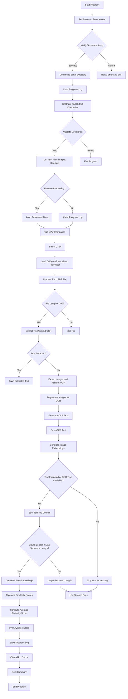

Below is a **Mermaid diagram** that visually represents the flow and functionality of the code. This diagram breaks down the key steps and logic of the program, focusing on how it processes PDF files, extracts text and images, and performs GPU-accelerated analysis.

---

### **Mermaid Diagram**



---

### **Explanation of the Diagram**

1. **Start Program**:
   - The program begins by setting up the Tesseract OCR environment and verifying its installation.

2. **Directory Validation**:
   - The user specifies input and output directories. The program validates these directories and lists all PDF files in the input directory.

3. **Progress Tracking**:
   - The program checks if the user wants to resume processing from the last stop or start fresh. It loads or clears the progress log accordingly.

4. **GPU Selection**:
   - The program fetches GPU information and allows the user to select a GPU for processing.

5. **Model Loading**:
   - The `ColQwen2` model and processor are loaded onto the selected GPU.

6. **PDF Processing**:
   - For each PDF file:
     - The program checks if the file name length is within limits.
     - It attempts to extract text directly from the PDF.
     - If no text is found, it extracts images and performs OCR.
     - The extracted text (either directly or via OCR) is saved.

7. **Image and Text Embeddings**:
   - The program generates embeddings for the extracted images and text chunks.
   - It calculates similarity scores between the text and image embeddings.

8. **Output and Summary**:
   - The program prints the average similarity score for each file and logs any skipped files.
   - It saves the progress log, clears GPU cache, and prints a summary of the processing results.

---

### **Key Features Highlighted**

- **Error Handling**: The program checks for errors at multiple stages (e.g., Tesseract setup, file length, chunk length) and logs issues.
- **GPU Acceleration**: The program leverages GPU resources for generating embeddings and performing similarity calculations.
- **Progress Tracking**: The program keeps track of processed files to avoid reprocessing and allows users to resume from the last stop.
- **Multimodal Analysis**: The program processes both text and images, generating embeddings and calculating similarity scores.

---

This diagram provides a high-level overview of the program's functionality and flow. If you'd like to dive deeper into any specific part, feel free to ask!

This portion of the code is responsible for calculating and displaying the **average similarity score** for the text and image embeddings generated from a processed PDF file. Here's a detailed breakdown of what it does:

---

### **What It Does**

1. **Check if `similarity_scores` Exist**:
   - The program first checks if the `similarity_scores` list is not empty (`if similarity_scores:`). This list contains the similarity scores between the text embeddings and image embeddings for the current PDF file.
   - If the list is empty, it means no similarity scores were calculated for the file, and the program skips the calculation and prints a message indicating this.

2. **Calculate the Average Similarity Score**:
   - If `similarity_scores` is not empty, the program calculates the **average similarity score** by:
     - Summing all the values in the `similarity_scores` list using `sum(similarity_scores)`.
     - Dividing the sum by the number of scores in the list (`len(similarity_scores)`).
   - The result is stored in the variable `avg_score`.

3. **Print the Average Similarity Score**:
   - The program prints the average similarity score for the current PDF file using an f-string:
     ```python
     print(f"Average Similarity Score for {pdf_file}: {avg_score:.4f}")
     ```
     - `{pdf_file}` is replaced with the name of the current PDF file.
     - `{avg_score:.4f}` formats the average score to 4 decimal places for readability.

4. **Handle the Case Where No Scores Were Calculated**:
   - If `similarity_scores` is empty (i.e., no scores were calculated), the program prints:
     ```python
     print("No similarity scores were calculated.")
     ```

---

### **Why It's Important**

This portion of the code is crucial for providing insights into the relationship between the text and images in the PDF file. Here's why:

1. **Measuring Text-Image Similarity**:
   - The similarity scores indicate how closely the textual content aligns with the visual content in the PDF. This is useful for understanding whether the text and images are related or complementary.
   - For example, in a document with charts and captions, the similarity score would likely be high, indicating that the text describes the images.

2. **Quality of Extracted Data**:
   - If no similarity scores are calculated, it could indicate issues with the extraction process (e.g., no text or images were extracted, or the embeddings could not be generated). This helps the user identify problematic files.

3. **User Feedback**:
   - The printed message provides clear feedback to the user about the processing results for each file. This is important for debugging and understanding the program's output.

---

### **Example Scenario**

#### **Case 1: Similarity Scores Calculated**
- Suppose the program processes a PDF file named `example.pdf` and calculates three similarity scores: `[0.85, 0.88, 0.90]`.
- The program calculates the average score:
  ```python
  avg_score = (0.85 + 0.88 + 0.90) / 3  # avg_score = 0.8767
  ```
- It then prints:
  ```
  Average Similarity Score for example.pdf: 0.8767
  ```

#### **Case 2: No Similarity Scores Calculated**
- Suppose the program processes another PDF file named `empty.pdf` and no similarity scores are generated.
- The program prints:
  ```
  No similarity scores were calculated.
  ```

---

### **Technical Details**

1. **Data Structure**:
   - `similarity_scores` is a list of floating-point numbers, where each number represents the similarity between a text chunk and the corresponding image embeddings.

2. **Mathematical Operation**:
   - The average score is calculated using the formula:
     \[
     \text{avg\_score} = \frac{\sum(\text{similarity\_scores})}{\text{len}(\text{similarity\_scores})}
     \]

3. **Formatting**:
   - The `.4f` format specifier ensures that the average score is printed with 4 decimal places, making the output more readable.

---

### **Summary**

This portion of the code:
- Calculates the **average similarity score** between text and image embeddings for a processed PDF file.
- Provides clear feedback to the user by printing the average score or indicating that no scores were calculated.
- Is important for understanding the relationship between the text and images in the document and for debugging the program's output.

If you have any further questions or need additional clarification, feel free to ask!
