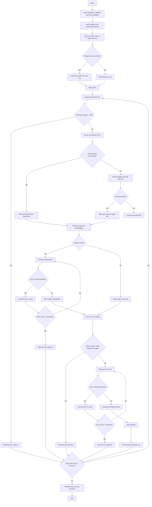

Below is a Mermaid flowchart that visually represents how the PDF processing script functions. This flowchart outlines the main steps and decision points in the program.



---

### Explanation of the Flowchart

1. **Start**:
   - The program begins by verifying the Tesseract configuration.

2. **Load Progress**:
   - Checks if there is a progress log (`processed_files.log`) to resume from.

3. **Resume or Start Fresh**:
   - Prompts the user to decide whether to resume from the last stop or start fresh.

4. **Select GPU**:
   - Allows the user to select a GPU for processing (if available).

5. **Process Each PDF File**:
   - Iterates through each PDF file in the input directory.

6. **File Name Length Check**:
   - Skips files with names longer than 200 characters.

7. **Text Extraction**:
   - Attempts to extract text directly from the PDF. If successful, saves the text to an output file.

8. **OCR Fallback**:
   - If direct text extraction fails, extracts images from the PDF and performs OCR.

9. **Error Handling**:
   - Skips files that exceed the error threshold and logs the errors.

10. **Image Processing**:
    - Processes images for embeddings if any are found.

11. **Text Chunk Processing**:
    - Splits the extracted text into chunks and processes them.

12. **Final Cleanup**:
    - Frees memory and logs a summary of the processing.

13. **End**:
    - The program terminates after processing all files.

---

### How to Use the Mermaid Flowchart

1. Copy the Mermaid code above.
2. Paste it into a Markdown file (e.g., `flowchart.md`).
3. Use a Mermaid-compatible Markdown viewer (e.g., [Mermaid Live Editor](https://mermaid-js.github.io/mermaid-live-editor/)) to render the flowchart.

This flowchart provides a clear visual representation of the program's logic and can be used for documentation or debugging purposes.

# PDF Processing Script with OCR and Text Extraction

This script processes PDF files in a specified directory, extracting text using both direct text extraction and OCR (Optical Character Recognition) with Tesseract. It also handles large documents, skips problematic files, and logs errors for later review. Below is a guide on how to set up and use the script.

---

## Features

1. **Text Extraction**:
   - Extracts text directly from PDFs using PyMuPDF (`fitz`).
   - Falls back to OCR using Tesseract if direct extraction fails.

2. **OCR with Tesseract**:
   - Preprocesses images for better OCR accuracy (grayscale, contrast adjustment, binarization).
   - Retries OCR up to 3 times if it fails.

3. **Error Handling**:
   - Skips documents that exceed a specified error threshold.
   - Logs errors to `error.log` for debugging.

4. **Resource Management**:
   - Cleans up GPU memory and other resources after processing each file.
   - Handles `KeyboardInterrupt` gracefully.

5. **Progress Tracking**:
   - Tracks processed files in `processed_files.log` to allow resuming from the last stop.

6. **GPU Support**:
   - Allows selecting a GPU for processing (if available).

---

## Prerequisites

### 1. **Python Environment**
   - Python 3.8 or higher.
   - Install required packages using `pip`:
     ```bash
     pip install pytesseract pymupdf pillow pypdfium2 torch
     ```

### 2. **Tesseract OCR**
   - Install Tesseract OCR:
     ```bash
     sudo apt-get install tesseract-ocr
     ```
   - Install the English language data:
     ```bash
     sudo apt-get install tesseract-ocr-eng
     ```
   - Verify the `TESSDATA_PREFIX` environment variable is set correctly (e.g., `/usr/share/tesseract-ocr/5/`).

### 3. **GPU Setup (Optional)**
   - Install CUDA and PyTorch with GPU support if you want to use a GPU for processing.
   - Ensure `nvidia-smi` is available to monitor GPU usage.

---

## Usage

1. **Clone the Repository**:
   ```bash
   git clone <repository-url>
   cd <repository-directory>
   ```

2. **Run the Script**:
   ```bash
   python pdf_processing_script.py
   ```

3. **Input Directory**:
   - Enter the path to the directory containing the PDF files you want to process.

4. **Output Directory**:
   - Enter the path to the directory where processed text files will be saved.

5. **Resume Processing**:
   - If you want to resume from the last stop, enter `y` when prompted. Otherwise, the script will start fresh.

6. **Select GPU**:
   - If multiple GPUs are available, select the one you want to use.

---

## Output

1. **Processed Text Files**:
   - Each PDF file will have a corresponding text file in the output directory with the suffix `_ocr_output.txt`.

2. **Logs**:
   - `processed_files.log`: Tracks which files have been processed.
   - `error.log`: Logs errors encountered during processing.

3. **Skipped Files**:
   - Files that were skipped due to errors or constraints are listed in the console and logged in `error.log`.

---

## Customization

### 1. **Error Threshold**
   - Modify the `error_threshold` variable in the script to change the maximum number of errors allowed before skipping a document.

### 2. **OCR Retries**
   - Adjust the `retries` parameter in the `robust_ocr` function to change the number of OCR retries.

### 3. **GPU Selection**
   - If you don’t want to use a GPU, remove or comment out the GPU-related code.

---

## Example

### Input Directory Structure
```
/input_directory/
    file1.pdf
    file2.pdf
    file3.pdf
```

### Output Directory Structure
```
/output_directory/
    file1_ocr_output.txt
    file2_ocr_output.txt
    file3_ocr_output.txt
```

### Log Files
```
/script_directory/
    processed_files.log
    error.log
```

---

## Troubleshooting

### 1. **Tesseract Errors**
   - Ensure `TESSDATA_PREFIX` is set correctly and `eng.traineddata` is present in the `tessdata` directory.
   - Verify Tesseract is installed and accessible in your system PATH.

### 2. **Memory Issues**
   - Reduce the batch size or use a smaller `resize_factor` in the `extract_images_and_text_ocr` function.
   - Ensure your system has enough RAM and GPU memory.

### 3. **Skipped Files**
   - Check `error.log` for details on why files were skipped.

---

## License

This project is licensed under the MIT License. See the [LICENSE](LICENSE) file for details.

---

## Acknowledgments

- [PyMuPDF](https://pymupdf.readthedocs.io/) for PDF text extraction.
- [Tesseract OCR](https://github.com/tesseract-ocr/tesseract) for optical character recognition.
- [PyTorch](https://pytorch.org/) for GPU acceleration.

---

## Contact

For questions or issues, please open an issue on the repository or contact the maintainer.

---

This `README.md` provides a comprehensive guide to setting up, using, and troubleshooting the PDF processing script.
