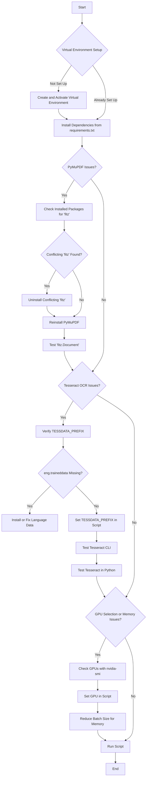

```mermaid
graph TD
    A[Start] --> B{Virtual Environment Setup}
    B -->|Not Set Up| C[Create and Activate Virtual Environment]
    C --> D[Install Dependencies from requirements.txt]
    B -->|Already Set Up| D
    
    D --> E{PyMuPDF Issues?}
    E -->|Yes| F[Check Installed Packages for 'fitz']
    F --> G{Conflicting 'fitz' Found?}
    G -->|Yes| H[Uninstall Conflicting 'fitz']
    H --> I[Reinstall PyMuPDF]
    G -->|No| I
    I --> J[Test 'fitz.Document']

    E -->|No| K{Tesseract OCR Issues?}
    K -->|Yes| L[Verify TESSDATA_PREFIX]
    L --> M{eng.traineddata Missing?}
    M -->|Yes| N[Install or Fix Language Data]
    M -->|No| O[Set TESSDATA_PREFIX in Script]
    O --> P[Test Tesseract CLI]
    P --> Q[Test Tesseract in Python]
    
    K -->|No| R{GPU Selection or Memory Issues?}
    R -->|Yes| S[Check GPUs with nvidia-smi]
    S --> T[Set GPU in Script]
    T --> U[Reduce Batch Size for Memory]
    R -->|No| V[Run Script]

    J --> K
    Q --> R
    U --> V
    V --> W[End]
```
