This code is a comprehensive script designed to process PDF files, extract text and images, and perform various operations such as OCR (Optical Character Recognition), text preprocessing, and similarity scoring using a deep learning model. Below is a detailed explanation of how the code works:

### 1. **Imports and Environment Setup**
   - **Imports**: The script imports various libraries including `os`, `pytesseract`, `pymupdf`, `torch`, `PIL`, `pypdfium2`, and custom modules from `colpali_engine`.
   - **TESSDATA_PREFIX**: The script sets the `TESSDATA_PREFIX` environment variable to specify the path to Tesseract OCR's language data. It then verifies the existence of the directory and the `eng.traineddata` file.

### 2. **Image Preprocessing for OCR**
   - **`preprocess_image_for_ocr(image)`**: This function preprocesses an image to improve OCR accuracy. It converts the image to grayscale, increases contrast, and applies a binary threshold.

### 3. **Text Extraction from PDF**
   - **`extract_text_without_ocr(pdf_path)`**: This function attempts to extract embedded text directly from a PDF using PyMuPDF (`pymupdf`). If the PDF contains embedded text, it is extracted without using OCR.

### 4. **Image and Text Extraction with OCR**
   - **`extract_images_and_text_ocr(pdf_path, resize_factor=2)`**: This function extracts images and text from a PDF. If the PDF does not contain embedded text, it uses OCR to extract text from images. The images are resized and preprocessed before OCR.

### 5. **Text Chunking**
   - **`split_text_into_chunks(text, chunk_size)`**: This function splits a large text into smaller chunks of a specified size, which is useful for processing large texts in manageable parts.

### 6. **GPU Information and Selection**
   - **`get_gpu_info()`**: This function fetches GPU information using `nvidia-smi` and returns a list of available GPUs along with their utilization.
   - **`select_gpu(gpus)`**: This function prompts the user to select a GPU from the available options.

### 7. **Progress Tracking**
   - **`load_progress()`**: Loads the list of processed files from a log file.
   - **`save_progress(processed_files)`**: Saves the list of processed files to a log file.

### 8. **Output Saving**
   - **`save_output(output_file, content, file_format)`**: Saves the extracted text to a specified file format (txt, json, csv).

### 9. **User Input and Directory Verification**
   - The script prompts the user to input the target directory containing PDF files, the output directory for processed text files, and the desired output format. It then verifies that the directories exist.

### 10. **Processing PDF Files**
   - **Loading Progress**: The script loads the list of already processed files to avoid reprocessing them.
   - **Filtering Files**: It filters out PDF files that have already been processed.
   - **Resume or Start Fresh**: The user is prompted to decide whether to resume from the last stop or start fresh.
   - **GPU Selection**: The user selects a GPU for processing.

### 11. **Model Loading**
   - The script loads a deep learning model (`ColQwen2`) and its processor (`ColQwen2Processor`) onto the selected GPU. The model is set to evaluation mode and uses half-precision (`torch.float16`) to save memory.

### 12. **Processing Each PDF File**
   - **File Length Check**: The script skips files with names longer than 200 characters.
   - **Text and Image Extraction**: It extracts images and text from each PDF file. If the PDF contains embedded text, it uses that; otherwise, it uses OCR.
   - **Saving OCR Output**: The OCR-like text is saved to a file in the output directory.
   - **Image Processing**: The script processes images in batches to prevent out-of-memory errors. It generates embeddings for the images using the deep learning model.
   - **Text Processing**: If the PDF contains text, the script splits it into chunks and processes each chunk using the model. It calculates similarity scores between the text chunks and image embeddings.
   - **Progress Saving**: After processing each file, the script saves the progress to the log file.

### 13. **Error Handling and Final Cleanup**
   - **Error Handling**: The script catches and logs any errors that occur during processing.
   - **Memory Cleanup**: After processing, the script clears GPU memory and garbage collects to free up resources.
   - **Skipped Files**: The script lists any files that were skipped due to errors or other issues.

### Summary
This script is a sophisticated tool for processing PDF files, extracting text and images, and performing deep learning-based operations such as OCR and similarity scoring. It includes robust error handling, progress tracking, and memory management to ensure efficient and reliable processing of large volumes of PDF files.


### Importance of Not Including `fitz` Import

The `fitz` import is typically associated with PyMuPDF, a Python binding for the MuPDF library, which is used for handling PDF files. However, in the provided code, the import statement for `fitz` is not included. Here are some reasons why this might be important:

1. **Clarity and Maintainability**:
   - **Explicit Dependencies**: By not including unnecessary imports, the code maintains clarity about its dependencies. This makes it easier for other developers to understand which libraries are actually being used.
   - **Reduced Complexity**: Fewer imports mean less potential for conflicts or confusion about which library is being used for what purpose.

2. **Performance and Resource Management**:
   - **Reduced Overhead**: Importing fewer modules reduces the initial overhead of loading the script. This can be particularly important in environments where startup time is critical.
   - **Memory Efficiency**: Each imported module consumes memory. By only importing what is necessary, the script is more memory-efficient.

3. **Error Prevention**:
   - **Avoiding Conflicts**: Different libraries might have overlapping functionality or naming conventions. Not importing `fitz` avoids potential conflicts with other libraries that might be imported.
   - **Dependency Management**: Ensuring that only the necessary dependencies are imported simplifies dependency management and reduces the risk of version conflicts.

### Importance of Getting TESSDATA Right from Bash/Host System Standpoint

Setting up the `TESSDATA_PREFIX` correctly and ensuring that the Tesseract OCR language data files are available is crucial for the proper functioning of the OCR functionality in the script. Here’s why:

1. **Correct Environment Setup**:
   - **Environment Variables**: The `TESSDATA_PREFIX` environment variable tells Tesseract where to find its language data files. Setting this correctly ensures that Tesseract can locate the necessary files without errors.
   - **Consistency**: Ensuring that the environment variable is set correctly across different environments (development, testing, production) ensures consistent behavior of the OCR functionality.

2. **Error Handling and Debugging**:
   - **FileNotFoundError**: The script explicitly checks for the existence of the `tessdata` directory and the `eng.traineddata` file. This proactive error handling prevents runtime errors and provides clear feedback if the setup is incorrect.
   - **User Feedback**: By raising a `FileNotFoundError`, the script informs the user about the missing files, guiding them on how to resolve the issue.

3. **Performance and Accuracy**:
   - **OCR Accuracy**: Tesseract’s performance and accuracy depend on the quality and availability of its trained data. Ensuring that the correct language data is available improves the accuracy of the OCR results.
   - **Resource Utilization**: Proper setup ensures that Tesseract can efficiently utilize the available resources, leading to better performance.

### Practical Steps to Ensure TESSDATA Setup

From a bash/host system standpoint, here are the practical steps to ensure the TESSDATA setup is correct:

1. **Install Tesseract**:
   - Ensure Tesseract OCR is installed on the system. This can be done using package managers like `apt` on Ubuntu:
     ```bash
     sudo apt-get install tesseract-ocr
     ```

2. **Set TESSDATA_PREFIX**:
   - Set the `TESSDATA_PREFIX` environment variable to point to the directory containing the Tesseract language data. This can be done in the `.bashrc` or `.bash_profile` file:
     ```bash
     export TESSDATA_PREFIX=/usr/share/tesseract-ocr/5/
     ```
   - Reload the shell configuration:
     ```bash
     source ~/.bashrc
     ```

3. **Verify Installation**:
   - Verify that the `tessdata` directory and the `eng.traineddata` file exist in the specified path:
     ```bash
     ls $TESSDATA_PREFIX/tessdata/eng.traineddata
     ```
   - If the file is missing, download the language data:
     ```bash
     sudo apt-get install tesseract-ocr-eng
     ```

4. **Run the Script**:
   - Ensure the script is run in an environment where the `TESSDATA_PREFIX` is correctly set and the necessary files are available.

By following these steps, you ensure that the Tesseract OCR setup is correct, leading to reliable and accurate OCR results in the script. This setup is crucial for the OCR functionality to work as expected, especially in automated or production environments.

```mermaid
graph TD
    A[Start] --> B[Set TESSDATA_PREFIX environment variable]
    B --> C{Verify TESSDATA_PREFIX and eng.traineddata file}
    C -->|Success| D[Define preprocess_image_for_ocr]
    C -->|Failure| E[Raise FileNotFoundError]
    D --> F[Define extract_text_without_ocr]
    F --> G[Define extract_images_and_text_ocr]
    G --> H[Define split_text_into_chunks]
    H --> I[Define get_gpu_info]
    I --> J[Define select_gpu]
    J --> K[Define paths for progress tracking]
    K --> L[Define load_progress]
    L --> M[Define save_progress]
    M --> N[Define save_output]
    N --> O[Ask user for input and output directories]
    O --> P{Verify directories exist}
    P -->|Success| Q[Load progress at the beginning]
    P -->|Failure| R[Print error message and exit]
    Q --> S[Filter files to process]
    S --> T{Check if files to process}
    T -->|Yes| U[Prompt user to resume or start fresh]
    T -->|No| V[Print message and exit]
    U --> W{Resume or start fresh}
    W -->|Resume| X[Load progress]
    W -->|Start fresh| Y[Clear progress log]
    X --> Z[Fetch GPU information and prompt user to select a GPU]
    Y --> Z
    Z --> AA[Set selected GPU for torch]
    AA --> AB[Load model and processor]
    AB --> AC[Set maximum chunk size and sequence length]
    AC --> AD[Initialize list to store skipped files]
    AD --> AE[Process each PDF file in input directory]
    AE --> AF{Check file name length}
    AF -->|Exceeds 200 characters| AG[Skip file]
    AF -->|Within limit| AH[Set PDF path]
    AG --> AE
    AH --> AI[Extract images and text using OCR]
    AI --> AJ[Print processing message]
    AJ --> AK[Save OCR text to output file]
    AK --> AL[Print save message]
    AL --> AM{Check if images are present}
    AM -->|Yes| AN[Process images]
    AM -->|No| AO[Print message]
    AN --> AO
    AO --> AP{Check if direct text extraction is empty}
    AP -->|Yes| AQ[Set PDF text to OCR text]
    AP -->|No| AR[Check if PDF text is not empty]
    AQ --> AR
    AR -->|Yes| AS[Split text into chunks]
    AR -->|No| AT[Print message]
    AS --> AU[Process text chunks]
    AU --> AV{Check if chunk length exceeds max sequence length}
    AV -->|Yes| AW[Skip file]
    AV -->|No| AX[Process queries]
    AW --> AE
    AX --> AY[Generate query embeddings]
    AY --> AZ[Calculate similarity scores]
    AZ --> BA[Print average similarity score]
    BA --> BB[Add file to processed list]
    BB --> BC[Save progress]
    BC --> BD[Print success message]
    BD --> AE
    AT --> AE
    AE --> BE[Clear GPU cache and collect garbage]
    BE --> BF{Check if skipped files are present}
    BF -->|Yes| BG[Print list of skipped files]
    BF -->|No| BH[Print message]
    BG --> BI[End]
    BH --> BI
```


This Mermaid diagram provides a visual representation of the program's flow, highlighting the key steps and decision points in the process. You can visualize this diagram using any Mermaid live editor or integrating it into a Markdown file that supports Mermaid syntax.
