Certainly! Below is a Mermaid diagram representing the flow of the program's operation:



```mermaid
graph TD
    A[Start] --> B[Set TESSDATA_PREFIX environment variable]
    B --> C{Verify TESSDATA_PREFIX and eng.traineddata file}
    C -->|Success| D[Define preprocess_image_for_ocr]
    C -->|Failure| E[Raise FileNotFoundError]
    D --> F[Define extract_text_without_ocr]
    F --> G[Define extract_images_and_text_ocr]
    G --> H[Define split_text_into_chunks]
    H --> I[Define get_gpu_info]
    I --> J[Define select_gpu]
    J --> K[Define paths for progress tracking]
    K --> L[Define load_progress]
    L --> M[Define save_progress]
    M --> N[Define save_output]
    N --> O[Ask user for input and output directories]
    O --> P{Verify directories exist}
    P -->|Success| Q[Load progress at the beginning]
    P -->|Failure| R[Print error message and exit]
    Q --> S[Filter files to process]
    S --> T{Check if files to process}
    T -->|Yes| U[Prompt user to resume or start fresh]
    T -->|No| V[Print message and exit]
    U --> W{Resume or start fresh}
    W -->|Resume| X[Load progress]
    W -->|Start fresh| Y[Clear progress log]
    X --> Z[Fetch GPU information and prompt user to select a GPU]
    Y --> Z
    Z --> AA[Set selected GPU for torch]
    AA --> AB[Load model and processor]
    AB --> AC[Set maximum chunk size and sequence length]
    AC --> AD[Initialize list to store skipped files]
    AD --> AE[Process each PDF file in input directory]
    AE --> AF{Check file name length}
    AF -->|Exceeds 200 characters| AG[Skip file]
    AF -->|Within limit| AH[Set PDF path]
    AG --> AE
    AH --> AI[Extract images and text using OCR]
    AI --> AJ[Print processing message]
    AJ --> AK[Save OCR text to output file]
    AK --> AL[Print save message]
    AL --> AM{Check if images are present}
    AM -->|Yes| AN[Process images]
    AM -->|No| AO[Print message]
    AN --> AO
    AO --> AP{Check if direct text extraction is empty}
    AP -->|Yes| AQ[Set PDF text to OCR text]
    AP -->|No| AR[Check if PDF text is not empty]
    AQ --> AR
    AR -->|Yes| AS[Split text into chunks]
    AR -->|No| AT[Print message]
    AS --> AU[Process text chunks]
    AU --> AV{Check if chunk length exceeds max sequence length}
    AV -->|Yes| AW[Skip file]
    AV -->|No| AX[Process queries]
    AW --> AE
    AX --> AY[Generate query embeddings]
    AY --> AZ[Calculate similarity scores]
    AZ --> BA[Print average similarity score]
    BA --> BB[Add file to processed list]
    BB --> BC[Save progress]
    BC --> BD[Print success message]
    BD --> AE
    AT --> AE
    AE --> BE[Clear GPU cache and collect garbage]
    BE --> BF{Check if skipped files are present}
    BF -->|Yes| BG[Print list of skipped files]
    BF -->|No| BH[Print message]
    BG --> BI[End]
    BH --> BI
```

This Mermaid diagram provides a visual representation of the program's flow, highlighting the key steps and decision points in the process. You can visualize this diagram using any Mermaid live editor or integrating it into a Markdown file that supports Mermaid syntax.


Here's a tree-like pseudo code representation of the provided Python script:

```
import necessary libraries

set TESSDATA_PREFIX environment variable
verify TESSDATA_PREFIX and eng.traineddata file

define preprocess_image_for_ocr(image)
    convert image to grayscale
    increase contrast
    apply binary threshold
    return processed image

define extract_text_without_ocr(pdf_path)
    initialize text variable
    try
        open PDF using PyMuPDF
        for each page in PDF
            append page text to text variable
    except MuPDF error
        print error message
        return empty string
    return text

define extract_images_and_text_ocr(pdf_path, resize_factor)
    initialize images list
    extract text without OCR
    if extracted text is not empty
        return images, extracted text, extracted text
    try
        load PDF using PdfDocument
    except Exception
        print error message
        return empty list, empty string, empty string
    initialize ocr_text variable
    for each page in PDF
        get page size
        render page to bitmap
        try
            convert bitmap to PIL image
        except AttributeError
            convert bitmap to pixmap and then to PIL image
        resize PIL image
        preprocess PIL image for OCR
        try
            perform OCR on processed image
        except TesseractError
            print error message
        append OCR text to ocr_text variable
        append PIL image to images list
    return images, empty string, ocr_text

define split_text_into_chunks(text, chunk_size)
    split text into words
    return list of text chunks

define get_gpu_info()
    run nvidia-smi command
    decode output
    initialize gpus list
    for each line in output
        split line into index, name, utilization
        append GPU info to gpus list
    return gpus

define select_gpu(gpus)
    print available GPUs
    prompt user to select a GPU
    return selected GPU index

define paths for progress tracking

define load_progress()
    if progress file exists
        load processed files from progress file
    return set of processed files

define save_progress(processed_files)
    save processed files to progress file

define save_output(output_file, content, file_format)
    if file_format is txt
        write content to text file
    elif file_format is json
        write content to JSON file
    elif file_format is csv
        write content to CSV file
    else
        raise ValueError for unsupported file format

ask user for input and output directories
verify directories exist

load progress at the beginning
filter files to process
if no files to process
    print message and exit

prompt user to resume or start fresh
if not resuming
    clear progress log

fetch GPU information and prompt user to select a GPU
set selected GPU for torch

load model and processor
set maximum chunk size and sequence length

initialize list to store skipped files

for each PDF file in input directory
    if file name length exceeds 200 characters
        print message and skip file
    set PDF path
    try
        extract images and text using OCR
        print processing message
        save OCR text to output file
        print save message
        initialize list for image embeddings
        if images are present
            for each image in images
                process image batch
                try
                    print processing message
                    generate image embeddings
                    append embeddings to list
                except Exception
                    print error message
                    clear GPU cache and collect garbage
                clear GPU cache and collect garbage
            if image embeddings are present
                concatenate image embeddings
            else
                set image embeddings to None
                print message
        else
            set image embeddings to None
            print message
        if direct text extraction is empty and OCR text is present
            set PDF text to OCR text
        if PDF text is not empty
            print processing message
            split text into chunks
            initialize list for similarity scores
            for each chunk in text chunks
                if chunk length exceeds max sequence length
                    print message and skip file
                try
                    process queries
                    try
                        print processing message
                        generate query embeddings
                        clear GPU cache and collect garbage
                        if image embeddings are present
                            calculate similarity scores
                            append score to list
                    except Exception
                        print error message
                        clear GPU cache and collect garbage
                except CUDA OutOfMemoryError
                    print message
                    clear GPU cache and collect garbage
                    skip file
            if similarity scores are present
                calculate average similarity score
                print average score
            else
                print message
        else
            print message
        add file to processed list
        save progress
        print success message
    except Exception
        print error message
        log error to file
        continue

clear GPU cache and collect garbage

if skipped files are present
    print list of skipped files
else
    print message
```

This pseudo code provides a structured overview of the script, highlighting the main functions, their purposes, and the flow of operations.
