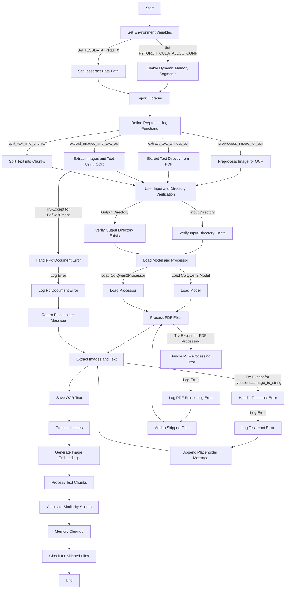

```mermaid
graph TD
    A[Start] --> B[Set Environment Variables]
    B -->|Set PYTORCH_CUDA_ALLOC_CONF| C[Enable Dynamic Memory Segments]
    B -->|Set TESSDATA_PREFIX| D[Set Tesseract Data Path]
    C --> E[Import Libraries]
    D --> E
    E --> F[Define Preprocessing Functions]
    F -->|preprocess_image_for_ocr| G[Preprocess Image for OCR]
    F -->|extract_text_without_ocr| H[Extract Text Directly from PDF]
    F -->|extract_images_and_text_ocr| I[Extract Images and Text Using OCR]
    F -->|split_text_into_chunks| J[Split Text into Chunks]
    G --> K[User Input and Directory Verification]
    H --> K
    I --> K
    J --> K
    K -->|Input Directory| L[Verify Input Directory Exists]
    K -->|Output Directory| M[Verify Output Directory Exists]
    L --> N[Load Model and Processor]
    M --> N
    N -->|Load ColQwen2 Model| O[Load Model]
    N -->|Load ColQwen2Processor| P[Load Processor]
    O --> Q[Process PDF Files]
    P --> Q
    Q --> R[Extract Images and Text]
    R --> S[Save OCR Text]
    S --> T[Process Images]
    T --> U[Generate Image Embeddings]
    U --> V[Process Text Chunks]
    V --> W[Calculate Similarity Scores]
    W --> X[Memory Cleanup]
    X --> Y[Check for Skipped Files]
    Y --> Z[End]
    I -->|Try-Except for PdfDocument| AA[Handle PdfDocument Error]
    AA -->|Log Error| AB[Log PdfDocument Error]
    AB --> AC[Return Placeholder Message]
    AC --> R
    R -->|Try-Except for pytesseract.image_to_string| AD[Handle Tesseract Error]
    AD -->|Log Error| AE[Log Tesseract Error]
    AE --> AF[Append Placeholder Message]
    AF --> R
    Q -->|Try-Except for PDF Processing| AG[Handle PDF Processing Error]
    AG -->|Log Error| AH[Log PDF Processing Error]
    AH --> AI[Add to Skipped Files]
    AI --> Q
```
