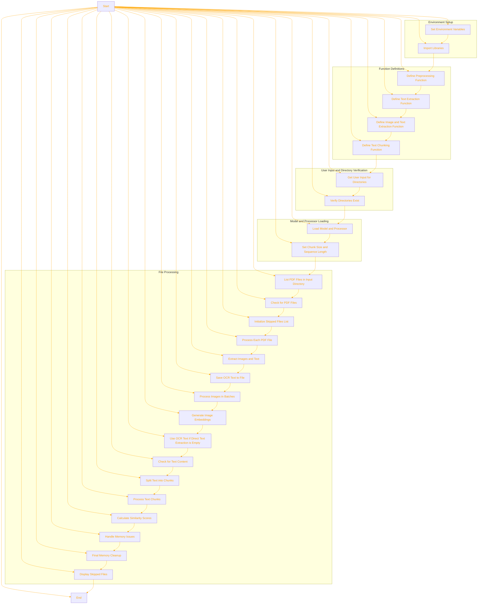

```mermaid
%%{init: {'themeVariables': { 'primaryColor': '#666666', 'edgeLabelBackground': '#333333', 'primaryTextColor': '#FFA500', 'secondaryTextColor': '#FFA500', 'tertiaryTextColor': '#FFA500', 'lineColor': '#FFA500', 'textColor': '#FFA500', 'background': '#333333'}}}%%
graph TD
    A[Start] --> B[Set Environment Variables]
    A --> C[Import Libraries]
    A --> D[Define Preprocessing Function]
    A --> E[Define Text Extraction Function]
    A --> F[Define Image and Text Extraction Function]
    A --> G[Define Text Chunking Function]
    A --> H[Get User Input for Directories]
    A --> I[Verify Directories Exist]
    A --> J[Load Model and Processor]
    A --> K[Set Chunk Size and Sequence Length]
    A --> L[List PDF Files in Input Directory]
    A --> M[Check for PDF Files]
    A --> N[Initialize Skipped Files List]
    A --> O[Process Each PDF File]
    A --> P[Extract Images and Text]
    A --> Q[Save OCR Text to File]
    A --> R[Process Images in Batches]
    A --> S[Generate Image Embeddings]
    A --> T[Use OCR Text if Direct Text Extraction is Empty]
    A --> U[Check for Text Content]
    A --> V[Split Text into Chunks]
    A --> W[Process Text Chunks]
    A --> X[Calculate Similarity Scores]
    A --> Y[Handle Memory Issues]
    A --> Z[Final Memory Cleanup]
    A --> AA[Display Skipped Files]
    A --> AB[End]

    B --> C
    C --> D
    D --> E
    E --> F
    F --> G
    G --> H
    H --> I
    I --> J
    J --> K
    K --> L
    L --> M
    M --> N
    N --> O
    O --> P
    P --> Q
    Q --> R
    R --> S
    S --> T
    T --> U
    U --> V
    V --> W
    W --> X
    X --> Y
    Y --> Z
    Z --> AA
    AA --> AB

    subgraph Environment Setup
        B
        C
    end

    subgraph Function Definitions
        D
        E
        F
        G
    end

    subgraph User Input and Directory Verification
        H
        I
    end

    subgraph Model and Processor Loading
        J
        K
    end

    subgraph File Processing
        L
        M
        N
        O
        P
        Q
        R
        S
        T
        U
        V
        W
        X
        Y
        Z
        AA
    end
```
