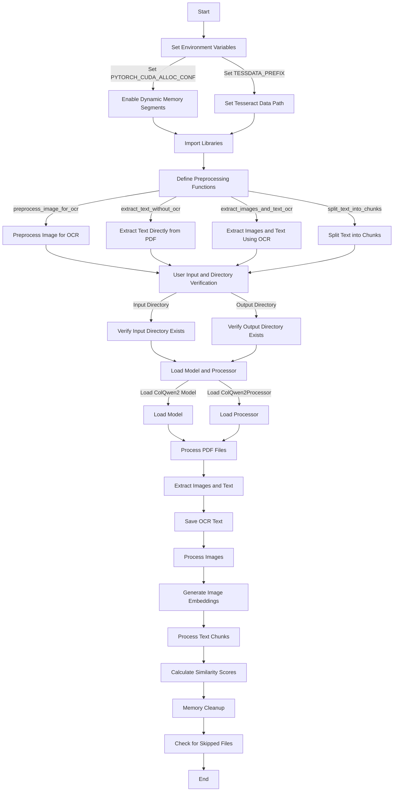
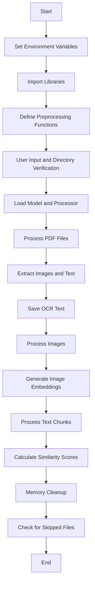

### Explanation of the Code

The code is designed to process PDF files, extract text and images, and then use a machine learning model to analyze the extracted content. Here's a step-by-step breakdown of how the code works:

1. **Environment Setup**:
   - The code sets up the environment by enabling dynamic memory segments for CUDA (GPU) memory management.
   - It also sets the `TESSDATA_PREFIX` environment variable, which is necessary for Tesseract OCR to find its language data files.

2. **Imports**:
   - The code imports various libraries, including `os`, `pytesseract`, `fitz` (PyMuPDF), `PIL` (Pillow), `torch`, and custom models (`ColQwen2`, `ColQwen2Processor`) from the `colpali_engine` package.

3. **Preprocessing Functions**:
   - `preprocess_image_for_ocr(image)`: This function preprocesses images to improve OCR accuracy by converting them to grayscale, increasing contrast, and applying a binary threshold.
   - `extract_text_without_ocr(pdf_path)`: This function attempts to extract embedded text directly from the PDF using PyMuPDF.
   - `extract_images_and_text_ocr(pdf_path, resize_factor=2)`: This function extracts images and text from the PDF. If embedded text is available, it uses that; otherwise, it performs OCR on the images.
   - `split_text_into_chunks(text, chunk_size)`: This function splits the extracted text into chunks of a specified size to manage memory usage.

4. **User Input and Directory Verification**:
   - The code prompts the user to input the directories for the PDF files and the output directory for processed text files.
   - It verifies that the directories exist; if not, it exits the program.

5. **Model Loading**:
   - The code loads a pre-trained model (`ColQwen2`) and its processor onto the GPU. The model is loaded in half-precision (`torch.float16`) to save memory.

6. **PDF Processing**:
   - The code iterates over all PDF files in the input directory.
   - For each PDF, it extracts images and text using the `extract_images_and_text_ocr` function.
   - It saves the OCR-like text to a file in the output directory.
   - It processes the images using the model to generate image embeddings.
   - It processes the text in chunks, ensuring that each chunk does not exceed a maximum sequence length.
   - It calculates similarity scores between the text chunks and the image embeddings.

7. **Memory Management**:
   - The code uses `torch.cuda.empty_cache()` to free up GPU memory after processing each PDF.

8. **Skipped Files**:
   - The code keeps track of files that were skipped due to memory issues or exceeding the maximum sequence length.

9. **Final Cleanup**:
   - The code performs a final memory cleanup using `torch.cuda.empty_cache()`.

### Detailed Mermaid Diagram

This diagram provides a high-level overview of the code's flow and the relationships between different components.

### Mermaid Diagram

Below is a Mermaid diagram that visually explains the flow of the code:

