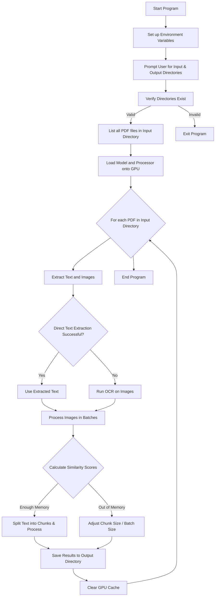

Here is a `README.md` file for the program, detailing its usage, installation requirements, and functionality, as well as a Mermaid diagram to visualize the program flow.

---

### README.md

```markdown
# PDF Processing and Similarity Scoring with PyTorch and OCR

This program processes PDF files in a specified directory by extracting text and images, performing OCR (Optical Character Recognition) where necessary, and calculating similarity scores between text and images using a deep learning model (`ColQwen2`). The results are saved in a specified output directory.

## Features

- **OCR-based text extraction**: Extracts text from images within PDFs if direct text extraction fails.
- **Dynamic Memory Management**: Adjusts batch sizes and chunk sizes to prevent GPU memory overload.
- **Similarity Scoring**: Calculates similarity scores between extracted images and text content.
- **Adaptive GPU Memory Allocation**: Uses `expandable_segments` to reduce memory fragmentation and better manage limited GPU resources.

## Requirements

- Python 3.8+
- CUDA-compatible GPU (for running the model on the GPU)
- Libraries:
  - `torch`
  - `pytesseract`
  - `pypdfium2`
  - `fitz` (from `PyMuPDF`)
  - `Pillow`
  - `colpali_engine` (for `ColQwen2` model)
  
Install the required packages:

```bash
pip install torch pytesseract pypdfium2 pymupdf pillow colpali_engine
```

## Usage

1. **Set Up Tesseract**: Ensure Tesseract OCR is installed and configured on your system.
2. **Run the Script**: Execute the script, providing the input (source) directory containing PDFs and the output directory for processed text files.
3. **Select Directories**: The program will prompt you to enter the paths for the target (input) directory and the output directory.
4. **Results**: For each PDF file processed, an OCR-extracted text file and similarity scores (if calculated) are saved in the output directory.

### Example

```bash
python pdf_processor.py
```

When prompted, provide the paths to your input and output directories. The program will process each PDF in the input directory and save the output text files in the specified output directory.

## Environment Variables

To enhance memory management, the following environment variable is set within the script:

```python
os.environ["PYTORCH_CUDA_ALLOC_CONF"] = "expandable_segments:True"
```

This setting enables PyTorch to manage GPU memory more dynamically, preventing out-of-memory issues.

## Explanation of Key Program Components

1. **PDF Text and Image Extraction**: Extracts text directly from PDFs if possible; otherwise, applies OCR to images in the PDF.
2. **Dynamic Memory Allocation**: Adjusts chunk size and batch size based on GPU memory constraints, minimizing memory errors.
3. **Similarity Scoring**: Calculates similarity scores between extracted text and images using `ColQwen2` and saves the results.

## Notes

- The `max_chunk_size` and `batch_size` are dynamically adjusted to handle memory constraints.
- Adjust the `max_chunk_size` and `batch_size` in the code if your GPU memory is particularly limited.

## Troubleshooting

- **Out of Memory Errors**: Reduce `max_chunk_size` or `batch_size` further if memory issues persist.
- **Tesseract Configuration**: Ensure Tesseract OCR is properly installed and configured. Update `TESSDATA_PREFIX` if necessary.

## License

This project is licensed under the MIT License - see the LICENSE file for details.


---

### Mermaid Diagram (`program_flow.mmd`)

This Mermaid diagram illustrates the high-level flow of the program.



### Diagram Explanation

1. **User Prompts and Setup**:
   - Sets up necessary environment variables and prompts the user to enter input and output directories.
   - Verifies the provided directories.

2. **Model Loading**:
   - Loads the `ColQwen2` model and processor onto the GPU only after verifying directories.

3. **PDF Processing**:
   - Iterates over each PDF in the input directory.
   - Attempts direct text extraction; if unsuccessful, uses OCR to extract text from images.

4. **Image and Text Processing**:
   - Processes images in manageable batches.
   - Calculates similarity scores for text and images.

5. **Dynamic Memory Management**:
   - Adjusts chunk and batch sizes dynamically based on available GPU memory.

6. **Results Saving and Cleanup**:
   - Saves output to the specified directory.
   - Clears GPU cache at the end of each PDF processing cycle to free up memory.

---

This `README.md` file provides users with essential information about setup, usage, and troubleshooting, while the Mermaid diagram visually conveys the program flow. Let me know if there are further details you'd like added!
