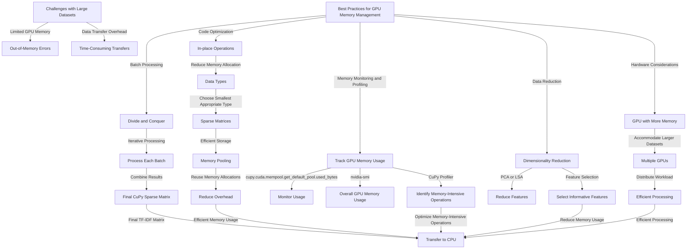

Your expanded explanation and example code for batch processing are excellent. Let's encapsulate this information into a comprehensive Mermaid diagram that visually represents the challenges and best practices for GPU memory management with CuPy.

### Mermaid Diagram for GPU Memory Management with CuPy

```mermaid
graph TD
    A[Challenges with Large Datasets] -->|Limited GPU Memory| B[Out-of-Memory Errors]
    A -->|Data Transfer Overhead| C[Time-Consuming Transfers]

    D[Best Practices for GPU Memory Management] -->|Batch Processing| E[Divide and Conquer]
    E -->|Iterative Processing| F[Process Each Batch]
    F -->|Combine Results| G[Final CuPy Sparse Matrix]

    D -->|Code Optimization| H[In-place Operations]
    H -->|Reduce Memory Allocation| I[Data Types]
    I -->|Choose Smallest Appropriate Type| J[Sparse Matrices]
    J -->|Efficient Storage| K[Memory Pooling]
    K -->|Reuse Memory Allocations| L[Reduce Overhead]

    D -->|Memory Monitoring and Profiling| M[Track GPU Memory Usage]
    M -->|cupy.cuda.mempool.get_default_pool().used_bytes()| N[Monitor Usage]
    M -->|nvidia-smi| O[Overall GPU Memory Usage]
    M -->|CuPy Profiler| P[Identify Memory-Intensive Operations]

    D -->|Data Reduction| Q[Dimensionality Reduction]
    Q -->|PCA or LSA| R[Reduce Features]
    Q -->|Feature Selection| S[Select Informative Features]

    D -->|Hardware Considerations| T[GPU with More Memory]
    T -->|Accommodate Larger Datasets| U[Multiple GPUs]
    U -->|Distribute Workload| V[Efficient Processing]

    G -->|Final TF-IDF Matrix| W[Transfer to CPU]
    L -->|Efficient Memory Usage| W
    P -->|Optimize Memory-Intensive Operations| W
    S -->|Reduce Memory Usage| W
    V -->|Efficient Processing| W
```

### Explanation:

- **Challenges with Large Datasets:**
  - **Limited GPU Memory:** Even powerful GPUs have finite memory, which can be exceeded by large datasets.
  - **Out-of-Memory Errors:** When data exceeds GPU memory, out-of-memory errors occur, causing crashes.
  - **Data Transfer Overhead:** Transferring large amounts of data between CPU and GPU can be time-consuming and create bottlenecks.

- **Best Practices for GPU Memory Management:**
  - **Batch Processing:**
    - **Divide and Conquer:** Split the dataset into smaller batches that fit comfortably in GPU memory.
    - **Iterative Processing:** Process each batch separately on the GPU and combine the results.
    - **Combine Results:** Combine the processed batches into a final CuPy sparse matrix.

  - **Code Optimization:**
    - **In-place Operations:** Use in-place operations to reduce memory allocation.
    - **Data Types:** Choose the smallest appropriate data type to reduce memory usage.
    - **Sparse Matrices:** Utilize CuPy's sparse matrix formats for efficient storage and processing.
    - **Memory Pooling:** Use CuPy's memory pool to reuse memory allocations, reducing overhead.

  - **Memory Monitoring and Profiling:**
    - **Track GPU Memory Usage:** Monitor GPU memory usage during execution using CuPy's memory pool and `nvidia-smi`.
    - **CuPy Profiler:** Profile the code to identify memory-intensive operations and optimize them.

  - **Data Reduction:**
    - **Dimensionality Reduction:** Apply techniques like PCA or LSA to reduce the number of features.
    - **Feature Selection:** Select the most informative features based on statistical measures or feature importance scores.

  - **Hardware Considerations:**
    - **GPU with More Memory:** Consider using a GPU with more memory to accommodate larger datasets.
    - **Multiple GPUs:** Distribute the workload across multiple GPUs for very large datasets.

- **Final TF-IDF Matrix:**
  - **Transfer to CPU:** Transfer the final TF-IDF matrix back to the CPU for further processing or analysis.

This Mermaid diagram visually represents the challenges and best practices for managing GPU memory with CuPy, ensuring efficient and stable processing of large datasets.
