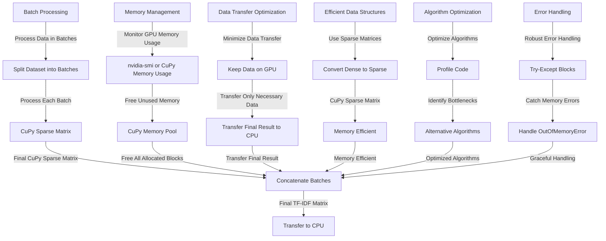

You're right, GPU memory management is crucial when dealing with large datasets in CuPy. Here's an expanded explanation of the challenges and best practices:

**Challenges with Large Datasets:**

* **Limited GPU Memory:** Even powerful GPUs have finite memory. Large datasets, especially in high-dimensional spaces (like with TF-IDF), can easily exceed the available memory.
* **Out-of-Memory Errors:** When your data exceeds the GPU memory, you'll encounter out-of-memory errors, causing your CuPy scripts to crash.
* **Data Transfer Overhead:** Transferring large amounts of data between CPU and GPU can be time-consuming and create bottlenecks.

**Best Practices for GPU Memory Management:**

1. **Batch Processing:**

   * **Divide and Conquer:** Split your dataset into smaller batches that can fit comfortably in GPU memory.
   * **Iterative Processing:** Process each batch separately on the GPU and combine the results as needed.
   * **Example:** If you have a million documents, process them in batches of 10,000 or 100,000.

2. **Code Optimization:**

   * **In-place Operations:** Use in-place operations whenever possible (e.g., `a += b` instead of `a = a + b`) to reduce memory allocation.
   * **Data Types:** Choose the smallest appropriate data type (e.g., `float32` instead of `float64`) to reduce memory usage.
   * **Sparse Matrices:** For TF-IDF, utilize CuPy's sparse matrix formats (CSR, CSC) to efficiently store and process the data, as most entries will be zero.
   * **Memory Pooling:**  CuPy provides a memory pool (`cupy.cuda.MemoryPool`) to reuse memory allocations, reducing overhead.

3. **Memory Monitoring and Profiling:**

   * **`cupy.cuda.mempool.get_default_pool().used_bytes()`:**  Track GPU memory usage during execution.
   * **`nvidia-smi`:** Monitor overall GPU memory usage from the command line.
   * **CuPy Profiler:** Profile your code to identify memory-intensive operations and optimize them.

4. **Data Reduction:**

   * **Dimensionality Reduction:** Techniques like Principal Component Analysis (PCA) or Latent Semantic Analysis (LSA) can reduce the number of features (dimensions) in your TF-IDF matrix, thus reducing memory usage.
   * **Feature Selection:** Select the most informative features based on statistical measures or feature importance scores from a model.

5. **Hardware Considerations:**

   * **GPU with More Memory:** If feasible, consider using a GPU with more memory to accommodate larger datasets.
   * **Multiple GPUs:**  For very large datasets, you can explore distributing the workload across multiple GPUs.

**Example of Batch Processing:**

```python
import cupy as cp
from sklearn.feature_extraction.text import TfidfVectorizer
from cupyx.scipy.sparse import vstack

def tfidf_cupy_batch(documents, batch_size=10000):
  """
  Calculates TF-IDF in batches to handle large datasets.
  """
  vectorizer = TfidfVectorizer()
  tfidf_batches = []

  for i in range(0, len(documents), batch_size):
    batch = documents[i : i + batch_size]
    tfidf_cpu = vectorizer.fit_transform(batch) 

    # Convert to CuPy sparse matrix
    data = cp.array(tfidf_cpu.data)
    indices = cp.array(tfidf_cpu.indices)
    indptr = cp.array(tfidf_cpu.indptr)
    tfidf_gpu = csr_matrix((data, indices, indptr), shape=tfidf_cpu.shape)

    tfidf_batches.append(tfidf_gpu)

  # Combine batches using vstack (adjust as needed)
  final_tfidf_gpu = vstack(tfidf_batches)
  return final_tfidf_gpu
```

By implementing these best practices, you can effectively manage GPU memory, avoid out-of-memory errors, and process large datasets efficiently using CuPy.


### Best Practices for Managing GPU Memory with CuPy

When working with large datasets and leveraging GPU acceleration using CuPy, managing GPU memory efficiently is crucial. Here are some best practices to handle memory issues and optimize your code:

#### 1. **Batch Processing**

**Process Data in Batches:**
- **Why:** Large datasets can exceed the available GPU memory. Processing data in smaller batches allows you to manage memory usage more effectively.
- **How:** Split your dataset into smaller chunks (batches) and process each batch individually.

```python
import cupy as cp
from sklearn.feature_extraction.text import TfidfVectorizer
from cupyx.scipy.sparse import csr_matrix

def tfidf_cupy_batch(documents, batch_size=1000):
    vectorizer = TfidfVectorizer()
    num_docs = len(documents)
    num_batches = (num_docs + batch_size - 1) // batch_size

    tfidf_matrices = []

    for i in range(num_batches):
        start_idx = i * batch_size
        end_idx = min((i + 1) * batch_size, num_docs)
        batch_docs = documents[start_idx:end_idx]

        tfidf_matrix_cpu = vectorizer.fit_transform(batch_docs)

        data = cp.array(tfidf_matrix_cpu.data)
        indices = cp.array(tfidf_matrix_cpu.indices)
        indptr = cp.array(tfidf_matrix_cpu.indptr)
        tfidf_matrix_gpu = csr_matrix((data, indices, indptr), shape=tfidf_matrix_cpu.shape)

        tfidf_matrices.append(tfidf_matrix_gpu)

    final_tfidf_matrix = cp.sparse.vstack(tfidf_matrices)
    return final_tfidf_matrix
```

#### 2. **Memory Management**

**Monitor GPU Memory Usage:**
- **Why:** Keep track of GPU memory usage to avoid overflows and optimize resource allocation.
- **How:** Use `nvidia-smi` or CuPy's memory management utilities.

```python
import cupy as cp

# Monitor GPU memory usage
print(cp.cuda.memory_usage())
```

**Free Unused Memory:**
- **Why:** Freeing memory that is no longer needed can prevent memory leaks and improve performance.
- **How:** Use CuPy's memory pool to free all allocated blocks.

```python
cp.get_default_memory_pool().free_all_blocks()
```

#### 3. **Data Transfer Optimization**

**Minimize Data Transfer:**
- **Why:** Transferring data between CPU and GPU can be time-consuming. Minimize these transfers to improve performance.
- **How:** Keep data on the GPU as long as possible and transfer only necessary data back to the CPU.

```python
# Example: Transfer only the final result back to the CPU
final_tfidf_matrix = tfidf_cupy_batch(documents)
print(final_tfidf_matrix.get())
```

#### 4. **Efficient Data Structures**

**Use Sparse Matrices:**
- **Why:** Sparse matrices are more memory-efficient for datasets with many zero values.
- **How:** Convert dense matrices to sparse matrices using CuPy's sparse matrix utilities.

```python
from cupyx.scipy.sparse import csr_matrix

# Convert dense matrix to sparse matrix
sparse_matrix = csr_matrix(dense_matrix)
```

#### 5. **Algorithm Optimization**

**Optimize Algorithms:**
- **Why:** Some algorithms may not be optimized for GPU execution. Choose algorithms that are well-suited for GPU acceleration.
- **How:** Profile your code to identify bottlenecks and consider alternative algorithms or implementations.

```python
import cupy as cp

# Example timing function
def time_function(func, *args, **kwargs):
    start = cp.cuda.Event()
    end = cp.cuda.Event()
    start.record()
    result = func(*args, **kwargs)
    end.record()
    end.synchronize()
    print(f"Time taken: {cp.cuda.get_elapsed_time(start, end)} ms")
    return result

# Example usage
tfidf_gpu = time_function(tfidf_cupy_batch, documents, batch_size=2)
```

#### 6. **Error Handling**

**Robust Error Handling:**
- **Why:** Handle potential memory errors gracefully to prevent crashes and ensure stability.
- **How:** Implement try-except blocks to catch and handle memory-related exceptions.

```python
import cupy as cp

try:
    # Code that may cause memory errors
    tfidf_gpu = tfidf_cupy_batch(documents)
except cp.cuda.memory.OutOfMemoryError:
    print("GPU memory overflow. Consider processing in smaller batches.")
```

### Conclusion

By following these best practices, you can effectively manage GPU memory when working with large datasets using CuPy. Batch processing, memory management, data transfer optimization, efficient data structures, algorithm optimization, and robust error handling are key strategies to ensure your code runs smoothly and efficiently on your RTX 3080.



