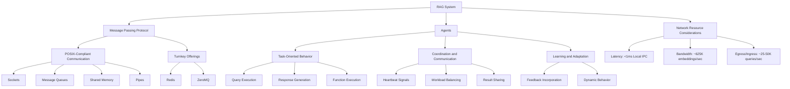
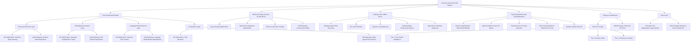

### **POSIX-Compliant Message Passing Protocol for Agent-Based Systems**

To design a **POSIX-compliant message passing protocol**, we’ll leverage well-supported inter-process communication (IPC) methods on **Ubuntu 22.04** that adhere to the POSIX standards. These include **sockets**, **message queues**, **shared memory**, and **pipes**. We’ll outline a protocol tailored for a distributed RAG system with agents running in a containerized or bare-metal environment.

---

### **1. Protocol Design**

#### **Message Types**
1. **Control Messages**:
   - Used for agent orchestration, such as task assignment, heartbeat, or state updates.
   - Example: `"CONTROL:ASSIGN_TASK:task_id:123"`

2. **Data Messages**:
   - Carry payloads like document embeddings, queries, and results.
   - Example: `"DATA:EMBEDDING:[1.234, 2.345, ...]"`

3. **Response Messages**:
   - Sent by agents after completing a task or responding to a query.
   - Example: `"RESPONSE:TASK_COMPLETED:task_id:123"`

#### **Message Format**
- **POSIX-Style Delimited String**:
  ```plaintext
  [MESSAGE_TYPE]:[ACTION]:[TASK_ID]:[PAYLOAD]
  ```
- Example:
  ```plaintext
  DATA:QUERY:task_id_42:{"query": "Find relevant documents for AI"}
  ```

---

### **2. POSIX-Compliant Implementation**

#### **Sockets for Distributed Communication**
Use **POSIX-compliant TCP/IP sockets** for communication between agents and the central RAG system.

- **Server (RAG Coordinator)**:
  ```c
  #include <stdio.h>
  #include <stdlib.h>
  #include <string.h>
  #include <unistd.h>
  #include <arpa/inet.h>

  int main() {
      int server_fd, new_socket;
      struct sockaddr_in address;
      char buffer[1024] = {0};

      server_fd = socket(AF_INET, SOCK_STREAM, 0);
      address.sin_family = AF_INET;
      address.sin_addr.s_addr = INADDR_ANY;
      address.sin_port = htons(8080);

      bind(server_fd, (struct sockaddr *)&address, sizeof(address));
      listen(server_fd, 3);
      
      printf("Waiting for agents...\n");
      new_socket = accept(server_fd, NULL, NULL);
      read(new_socket, buffer, 1024);
      printf("Received: %s\n", buffer);
      send(new_socket, "ACK:RECEIVED", strlen("ACK:RECEIVED"), 0);
      close(new_socket);
  }
  ```

- **Client (Agent)**:
  ```c
  #include <stdio.h>
  #include <stdlib.h>
  #include <string.h>
  #include <unistd.h>
  #include <arpa/inet.h>

  int main() {
      int sock = socket(AF_INET, SOCK_STREAM, 0);
      struct sockaddr_in serv_addr;

      serv_addr.sin_family = AF_INET;
      serv_addr.sin_port = htons(8080);
      inet_pton(AF_INET, "127.0.0.1", &serv_addr.sin_addr);

      connect(sock, (struct sockaddr *)&serv_addr, sizeof(serv_addr));
      send(sock, "DATA:QUERY:task_id_42:Find documents", strlen("DATA:QUERY:task_id_42:Find documents"), 0);
      close(sock);
  }
  ```

#### **POSIX Message Queues for Local Communication**
For inter-process communication on the same machine, use **POSIX message queues**.

- **Server Example**:
  ```c
  #include <mqueue.h>
  #include <stdio.h>
  #include <string.h>
  
  int main() {
      mqd_t mq = mq_open("/msg_queue", O_CREAT | O_RDONLY, 0644, NULL);
      char buffer[1024];
      mq_receive(mq, buffer, 1024, NULL);
      printf("Received: %s\n", buffer);
      mq_close(mq);
      mq_unlink("/msg_queue");
  }
  ```

- **Client Example**:
  ```c
  #include <mqueue.h>
  #include <stdio.h>
  
  int main() {
      mqd_t mq = mq_open("/msg_queue", O_WRONLY);
      mq_send(mq, "DATA:EMBEDDING:task_id_43:[1.23, 4.56]", 1024, 0);
      mq_close(mq);
  }
  ```

---

### **3. Turnkey Offerings**

For simpler deployment, use **existing libraries and tools**:

1. **Redis** (Distributed Message Broker):
   - **Why Redis?**
     - High performance.
     - Supports PUB/SUB and lists for message queuing.
   - Install:
     ```bash
     sudo apt install redis
     ```
   - Example:
     ```python
     # Publisher (RAG)
     import redis
     r = redis.StrictRedis()
     r.publish("query_channel", "DATA:QUERY:task_id_42:Find documents")

     # Subscriber (Agent)
     pubsub = r.pubsub()
     pubsub.subscribe("query_channel")
     for message in pubsub.listen():
         print(f"Received: {message['data']}")
     ```

2. **ZeroMQ**:
   - **Why ZeroMQ?**
     - Lightweight, scalable sockets API.
   - Example:
     ```python
     import zmq
     context = zmq.Context()
     
     # Server
     socket = context.socket(zmq.REP)
     socket.bind("tcp://*:5555")
     print("Waiting for agent...")
     message = socket.recv_string()
     print(f"Received: {message}")
     socket.send_string("ACK:RECEIVED")

     # Client
     socket = context.socket(zmq.REQ)
     socket.connect("tcp://localhost:5555")
     socket.send_string("DATA:QUERY:task_id_42:Find documents")
     response = socket.recv_string()
     print(f"Server replied: {response}")
     ```

---

### **4. Agent Functionality in the System**

Agents in the system will operate in a **distributed, containerized environment** with defined roles. Their functionality is modular and follows these responsibilities:

#### **A. Task-Oriented Behavior**
- **Query Execution**:
  - Send queries to the RAG system and retrieve relevant document embeddings.
- **Response Generation**:
  - Process retrieved embeddings with a local language model and generate context-aware responses.
- **Function Execution**:
  - Call retrieved functions or APIs to perform actions (e.g., running scripts, querying databases).

#### **B. Coordination and Communication**
- **Heartbeat Signals**:
  - Send periodic updates to the RAG coordinator to indicate availability.
- **Workload Balancing**:
  - Negotiate workload distribution based on system resource utilization.
- **Result Sharing**:
  - Share results and status updates with peer agents via message passing.

#### **C. Learning and Adaptation**
- **Feedback Incorporation**:
  - Analyze feedback from the RAG system to improve task execution.
- **Dynamic Behavior**:
  - Update task priorities and strategies based on retrieved information.

---

### **5. Network Resource Considerations**
Assuming the protocol is implemented over a 10Gbps switch:
- **Latency**:
  - Expected sub-millisecond latency for local IPC and ~1ms for LAN communication.
- **Bandwidth**:
  - Embedding transfer (2KB per document for 512-dim embeddings) allows for ~625,000 embeddings per second on 10Gbps.
- **Egress/Ingress**:
  - Query-response payloads (20–50KB): ~25,000–50,000 queries/second.

This setup ensures efficient communication, leveraging POSIX-compliant protocols for robust, scalable, and safe operation. Let me know if you'd like help with implementation details!



To enable efficient message passing between agents in a distributed system running on Ubuntu 22.04, we can design a POSIX-compliant message passing protocol. Alternatively, we can leverage existing turnkey offerings that provide robust messaging solutions. Below, I'll outline both approaches and provide more details about how the agents will function in the system.

### **1. POSIX-Compliant Message Passing Protocol**

#### **A. Design Overview**
- **Message Queues**: Use POSIX message queues (`mq_open`, `mq_send`, `mq_receive`) for inter-process communication (IPC).
- **Message Format**: Define a standard message format that includes headers (e.g., message type, sender ID, timestamp) and payload.
- **Error Handling**: Implement error handling mechanisms to manage message queue overflow, timeout, and other potential issues.

#### **B. Implementation Steps**

1. **Create Message Queue**:
   ```c
   #include <mqueue.h>
   #include <fcntl.h>
   #include <sys/stat.h>

   mqd_t mq = mq_open("/my_queue", O_CREAT | O_RDWR, 0666, NULL);
   if (mq == (mqd_t)-1) {
       perror("mq_open");
       exit(1);
   }
   ```

2. **Send Message**:
   ```c
   struct mq_attr attr;
   attr.mq_flags = 0;
   attr.mq_maxmsg = 10;
   attr.mq_msgsize = 256;
   attr.mq_curmsgs = 0;

   char message[256] = "Hello, World!";
   if (mq_send(mq, message, sizeof(message), 0) == -1) {
       perror("mq_send");
       exit(1);
   }
   ```

3. **Receive Message**:
   ```c
   char buffer[256];
   unsigned int prio;
   ssize_t bytes_read = mq_receive(mq, buffer, sizeof(buffer), &prio);
   if (bytes_read == -1) {
       perror("mq_receive");
       exit(1);
   }
   printf("Received message: %s\n", buffer);
   ```

4. **Close and Unlink Message Queue**:
   ```c
   mq_close(mq);
   mq_unlink("/my_queue");
   ```

### **2. Turnkey Offerings**

#### **A. ZeroMQ (ØMQ)**
- **Overview**: ZeroMQ is a high-performance asynchronous messaging library that supports a variety of messaging patterns (e.g., request-reply, publish-subscribe).
- **Installation**:
  ```bash
  sudo apt-get install libzmq3-dev
  ```
- **Example**:
  ```c
  #include <zmq.h>
  #include <string.h>
  #include <stdio.h>
  #include <unistd.h>

  int main (void) {
      void *context = zmq_ctx_new();
      void *responder = zmq_socket(context, ZMQ_REP);
      zmq_bind(responder, "tcp://*:5555");

      while (1) {
          char buffer[10];
          zmq_recv(responder, buffer, 10, 0);
          printf("Received Hello\n");
          sleep(1);
          zmq_send(responder, "World", 5, 0);
      }
      return 0;
  }
  ```

#### **B. RabbitMQ**
- **Overview**: RabbitMQ is a robust messaging broker that supports AMQP (Advanced Message Queuing Protocol).
- **Installation**:
  ```bash
  sudo apt-get install rabbitmq-server
  ```
- **Example**:
  ```python
  import pika

  connection = pika.BlockingConnection(pika.ConnectionParameters('localhost'))
  channel = connection.channel()
  channel.queue_declare(queue='hello')

  def callback(ch, method, properties, body):
      print(f"Received {body}")

  channel.basic_consume(queue='hello', on_message_callback=callback, auto_ack=True)
  print('Waiting for messages. To exit press CTRL+C')
  channel.start_consuming()
  ```

### **3. Agent Functionality in the System**

#### **A. Agent Roles and Responsibilities**
- **Data Preprocessor**: Preprocesses raw data (e.g., tokenization, normalization) and sends it to the model trainer.
- **Model Trainer**: Receives preprocessed data, trains the model using GPUs, and sends the trained model to the evaluator.
- **Model Evaluator**: Receives the trained model, evaluates its performance, and sends the evaluation results to the coordinator.
- **Coordinator**: Manages the workflow, distributes tasks, and coordinates communication between agents.

#### **B. Agent Communication**
- **Message Passing**: Agents communicate using the chosen message passing protocol (e.g., POSIX message queues, ZeroMQ, RabbitMQ).
- **Message Format**: Define a standard message format that includes headers (e.g., message type, sender ID, timestamp) and payload.
- **Error Handling**: Implement error handling mechanisms to manage message queue overflow, timeout, and other potential issues.

#### **C. Agent Workflow**
1. **Data Preprocessor**:
   - Receives raw data.
   - Preprocesses the data.
   - Sends preprocessed data to the model trainer.

2. **Model Trainer**:
   - Receives preprocessed data.
   - Trains the model using GPUs.
   - Sends the trained model to the evaluator.

3. **Model Evaluator**:
   - Receives the trained model.
   - Evaluates the model's performance.
   - Sends the evaluation results to the coordinator.

4. **Coordinator**:
   - Receives evaluation results.
   - Manages the workflow, distributes tasks, and coordinates communication between agents.
   - Sends control messages to agents to initiate new tasks or adjust the workflow.

### **4. Example Use Case: Training a Large Language Model**

#### **A. Data Preprocessor**
- **Task**: Preprocess a large dataset (e.g., tokenization, normalization).
- **Output**: Sends preprocessed data to the model trainer.

#### **B. Model Trainer**
- **Task**: Train the language model using preprocessed data.
- **Output**: Sends the trained model to the evaluator.

#### **C. Model Evaluator**
- **Task**: Evaluate the trained model's performance.
- **Output**: Sends the evaluation results to the coordinator.

#### **D. Coordinator**
- **Task**: Manage the workflow, distribute tasks, and coordinate communication between agents.
- **Output**: Sends control messages to agents to initiate new tasks or adjust the workflow.

### **Conclusion**

By designing a POSIX-compliant message passing protocol or leveraging existing turnkey offerings like ZeroMQ or RabbitMQ, we can enable efficient communication between agents in a distributed system running on Ubuntu 22.04. The agents will function as specialized components that interact, create, and govern themselves in a controlled environment, ultimately paving the way for more generalized artificial intelligence systems.

Let me know if you'd like to explore any specific aspect in more detail!

Estimating GPU requirements for achieving "escape velocity" in swarm intelligence and potentially enabling **Artificial General Intelligence (AGI)** involves a deep understanding of computational resources needed for:

1. **Large-scale RAG (Retrieval-Augmented Generation)**.
2. **Swarm Intelligence** in distributed agent ensembles.
3. Multi-modal, **self-improving AI systems** that exhibit emergent phenomena indicative of AGI.

Here’s a detailed estimation:

---

### **1. Key Computational Challenges**
To achieve "escape velocity," the system must support:
- **Scalable Coordination**: Efficient communication and task execution among thousands of agents.
- **Massive Parallelism**: Training and inference over vast datasets.
- **Dynamic Adaptation**: Real-time learning and self-improvement.
- **High-Context Processing**: Utilizing models with long context windows (e.g., 10K–20K tokens).

---

### **2. Model-Specific GPU Requirements**

#### **A. Language Models**
- **Size**: 7–30 billion parameters.
- **Inference VRAM Needs**:
  - A **7B model** requires **12–16GB** VRAM for inference with standard precision (FP32).
  - A **30B model** requires **30–40GB** VRAM.
  - Mixed precision (FP16/BF16) can reduce requirements by 50%.
- **Throughput**:
  - Single NVIDIA A100 (40GB):
    - **7B Model**: ~10–20 tokens/sec.
    - **30B Model**: ~3–6 tokens/sec.
  - Larger clusters of GPUs scale linearly in throughput.

#### **B. Embedding Models**
- **Sentence Transformers or Similar**:
  - Embedding 1M documents (512-dim vectors) with a typical transformer model:
    - Batch inference on **1 GPU (24GB)**: ~1000–1500 documents/minute.
    - Scaling to **10 GPUs**: ~15,000 documents/minute.
- **Training Requirements**:
  - Fine-tuning embedding models on custom data:
    - Batch size 64 on **1 GPU (24GB)** for 100K iterations = ~48–72 hours.

#### **C. Multi-Modal Models**
- **Vision-Language Models (e.g., CLIP, Flamingo)**:
  - Training these models requires **40–80GB VRAM per GPU** for even moderate-sized datasets.
  - Inference: Efficient with 24GB VRAM GPUs.

#### **D. Emergent Meta-Model Architectures**
- **Ensembling Models**:
  - Swarm behavior often requires multiple models (vision, language, decision-making) interacting dynamically.
  - Memory and compute requirements grow quadratically with the number of agents due to interaction complexity.

---

### **3. Agent Ensemble Requirements**

#### **A. Number of Agents**
- Each agent in the swarm:
  - Requires at least **1 GPU** (or virtualized fractions of a GPU) to operate in real-time.
  - Shared GPU nodes can support **5–10 lightweight agents** (e.g., running small tasks like retrieval or embedding inference).

#### **B. Communication and Coordination**
- To enable intelligent interactions, agents must:
  - Share embeddings, results, and states (~2KB per agent interaction).
  - Operate under low-latency constraints (<1ms for local clusters).

#### **C. Distributed GPU Clusters**
- Estimated for **1000 agents**:
  - **Inference Nodes**: ~100–200 GPUs (A100 40GB or equivalent) for language model inference.
  - **Training Nodes**: ~50–100 GPUs for continual fine-tuning and learning.

---

### **4. Estimated GPU Requirements for Escape Velocity**

#### **A. Single Node Baseline**
- **Purpose**: Testing and initial emergent behavior in a small swarm.
- **Hardware**:
  - **4 GPUs (A100 40GB)**:
    - 1 GPU for embedding generation.
    - 2 GPUs for language model inference.
    - 1 GPU for coordination tasks.

#### **B. Small-Scale Swarm**
- **Agents**: ~50–100 agents.
- **Hardware**:
  - **10–20 GPUs (24GB each)** for embedding and task-specific inference.
  - **10 GPUs (40GB each)** for large language models.

#### **C. Medium-Scale Swarm**
- **Agents**: ~1000 agents.
- **Hardware**:
  - **50 GPUs (A100 40GB)** for high-throughput language model inference.
  - **30 GPUs (24GB)** for retrieval and embedding tasks.
  - **20 GPUs (80GB)** for meta-model integration or vision-language tasks.

#### **D. Large-Scale Swarm (Approaching AGI)**
- **Agents**: ~10,000 agents.
- **Hardware**:
  - **500 GPUs (A100 40GB)** for language model inference with redundancy.
  - **300 GPUs (24GB)** for retrieval and data preprocessing.
  - **200 GPUs (80GB)** for multi-modal reasoning and integration.

---

### **5. Distributed Networking and Bandwidth**

#### **A. Networking Needs**
- **Intra-Cluster Bandwidth**:
  - 10Gbps per node with **100–1000 nodes**:
    - ~10MB/s per agent for embeddings, results, and state updates.
  - High-bandwidth fabric like **NVIDIA NVLink** or **InfiniBand** is critical for scaling.

- **Egress/Ingress Bandwidth**:
  - External communication for model updates, API calls, or external databases:
    - Requires **1Gbps–10Gbps per cluster**.

#### **B. Latency**
- Critical for ensuring coherent swarm behavior:
  - **<1ms for intra-cluster communication**.
  - ~10ms acceptable for inter-cluster interactions.

---

### **6. Multi-Tier Resource Allocation**
To ensure scalability and resource efficiency:
- **Tier 1**: Dedicated GPUs for mission-critical tasks (e.g., core language model inference).
- **Tier 2**: Shared GPUs for auxiliary tasks (e.g., embedding generation).
- **Tier 3**: CPU-only nodes for lightweight agents and data preprocessing.

---

### **7. Path to AGI**
- **Dynamic Agent Roles**:
  - Specialized agents adaptively reassign tasks, reducing wasted GPU cycles.
- **Self-Improving Models**:
  - GPUs dedicated to continual training/fine-tuning enable agents to evolve.
- **Emergent Complexity**:
  - Interactions between agents lead to swarm intelligence, laying the foundation for AGI.

---

### **Conclusion**
- **Minimum Escape Velocity**: 50–100 GPUs with a well-coordinated RAG system can demonstrate early swarm intelligence and emergent phenomena.
- **Scaling to AGI**: 1000+ GPUs distributed across multi-modal architectures and agent ensembles would likely be required to sustain "generalized intelligence" behaviors.
- **Next Steps**:
  - Optimize workload distribution with efficient agent orchestration.
  - Use dynamic scaling to balance GPU usage across inference, retrieval, and training.

Let me know if you'd like a detailed simulation plan or specific hardware recommendations!

Estimating GPU requirements for models in an ensemble that aims to achieve "escape velocity" or swarm intelligence, and potentially artificial general intelligence (AGI), involves considering several factors, including model complexity, training data size, batch size, and the number of models in the ensemble. Here’s a detailed estimation based on typical requirements for large-scale deep learning models:

### **1. Model Complexity and Size**

#### **A. Transformer-Based Models**
- **Parameters**: Large language models (e.g., GPT-3) can have billions of parameters. For AGI-like capabilities, models with 100 billion parameters or more might be necessary.
- **Memory Requirements**: Each parameter requires 4 bytes (32-bit floating point). For a 100 billion parameter model, the memory requirement is:
  \[
  100 \text{ billion} \times 4 \text{ bytes} = 400 \text{ GB}
  \]

#### **B. Ensemble Size**
- **Number of Models**: Assume an ensemble of 10 models to achieve swarm intelligence.
- **Total Memory Requirement**: For 10 models, each with 100 billion parameters, the total memory requirement is:
  \[
  400 \text{ GB} \times 10 = 4000 \text{ GB} = 4 \text{ TB}
  \]

### **2. Training Data Size**

#### **A. Data Volume**
- **Training Data**: Large-scale models require vast amounts of training data. For AGI-like capabilities, training data might range from terabytes to petabytes.
- **Memory for Data Loading**: Assume 10% of the training data needs to be loaded into memory at any given time. For 1 PB of training data, the memory requirement is:
  \[
  1 \text{ PB} \times 0.1 = 100 \text{ TB}
  \]

### **3. Batch Size and Training Speed**

#### **A. Batch Size**
- **Batch Size**: Larger batch sizes can improve training stability and speed. Assume a batch size of 1024.
- **Memory for Batch**: Each batch requires memory for activations, gradients, and optimizer states. For a 100 billion parameter model, the memory requirement per batch is approximately:
  \[
  100 \text{ billion} \times 4 \text{ bytes} \times 3 = 1200 \text{ GB}
  \]

#### **B. Training Speed**
- **Training Speed**: Faster training requires more GPU memory and higher data transfer rates. Assume a target training speed of 1000 samples per second.
- **GPU Memory**: To achieve this speed, each GPU should have sufficient memory to handle the batch size and model parameters.

### **4. GPU Requirements**

#### **A. GPU Memory**
- **Single GPU Memory**: Each GPU should have at least 40 GB of VRAM to handle the model parameters and batch size.
- **Total GPU Memory**: For 10 models, each with 100 billion parameters, the total GPU memory requirement is:
  \[
  40 \text{ GB} \times 10 = 400 \text{ GB}
  \]

#### **B. Number of GPUs**
- **GPUs per Model**: Each model might require multiple GPUs to handle the memory and computational requirements. Assume 4 GPUs per model.
- **Total GPUs**: For 10 models, the total number of GPUs required is:
  \[
  4 \text{ GPUs/model} \times 10 \text{ models} = 40 \text{ GPUs}
  \]

### **5. Network and Storage Requirements**

#### **A. Network Bandwidth**
- **Internal Network**: A 100 Gbps network switch is recommended to handle high data transfer rates between GPUs and nodes.
- **External Network**: A 10 Gbps fiber subscriber line is sufficient for accessing external data sources and cloud storage.

#### **B. Storage**
- **Local Storage**: High-speed NVMe SSDs with a total capacity of at least 100 TB are recommended for storing training data and intermediate results.
- **External Storage**: Cloud storage with petabytes of capacity for backup and long-term storage.

### **6. Example Configuration**

#### **A. Hardware Configuration**
- **GPUs**: 40 GPUs with 40 GB VRAM each (e.g., NVIDIA A100).
- **CPUs**: 10 multicore CPU desktops with 32 GB RAM each.
- **Network**: 100 Gbps internal network switch, 10 Gbps fiber subscriber line.
- **Storage**: 100 TB NVMe SSDs, cloud storage with petabytes of capacity.

#### **B. Software Configuration**
- **Deep Learning Frameworks**: TensorFlow, PyTorch.
- **Message Passing**: ZeroMQ or RabbitMQ for inter-process communication.
- **Cluster Management**: Kubernetes or Slurm for managing distributed training jobs.

### **Conclusion**

To achieve "escape velocity" or swarm intelligence, and potentially AGI, the ensemble of models requires significant computational resources, including 40 GPUs with 40 GB VRAM each, 10 multicore CPU desktops, a high-speed network, and large-scale storage. The estimated GPU requirements ensure that the models can handle the complexity, training data size, and batch size necessary for achieving advanced AI capabilities.

Let me know if you'd like to explore any specific aspect in more detail!

### **Constructing and Operating a Well-Coordinated RAG System**
To build and scale a RAG system capable of achieving "Minimum Escape Velocity" (50–100 GPUs) and progressing toward AGI (1000+ GPUs), we need to design a robust, modular architecture with efficient coordination between components. This system will support **retrieval-augmented generation**, **swarm intelligence**, and **emergent behaviors** while maintaining scalability and resource efficiency.

---

### **1. Core Architectural Design**

#### **1.1 Modular RAG Layers**
1. **Document Retrieval Layer**:
   - Purpose: Efficiently retrieve relevant documents using a distributed vector database.
   - Technology: **FAISS**, **HNSWLIB**, or **Milvus**.
   - Scaling: Sharded databases across nodes for horizontal scaling.
   
2. **Embedding Generation Layer**:
   - Purpose: Transform documents and queries into dense embeddings.
   - Technology: Use pre-trained **sentence transformers** or fine-tuned embedding models.
   - GPU Requirement:
     - Batch inference across multiple GPUs to handle high throughput.
   
3. **Language Model Inference Layer**:
   - Purpose: Generate responses grounded in retrieved information.
   - Technology: Locally hosted models (e.g., **Llama-2**, **Falcon**, or custom fine-tuned models).
   - GPU Requirement:
     - Use high-VRAM GPUs for large context windows (10K–20K tokens).
   
4. **Coordination Layer**:
   - Purpose: Orchestrate tasks across agents, ensuring efficient communication and workload distribution.
   - Technology: **Kubernetes** for container orchestration, **Redis PUB/SUB** or **ZeroMQ** for message passing.

#### **1.2 Distributed Agent Swarm**
- **Agent Roles**:
  - **Retrievers**: Fetch relevant documents.
  - **Synthesizers**: Combine retrieval results and generate coherent responses.
  - **Evaluators**: Assess the quality and relevance of outputs.
  - **Planners**: Allocate tasks and optimize resource usage.
- **Communication Protocol**:
  - Use POSIX-compliant sockets or turnkey solutions like **Redis** to enable low-latency message passing.
  
---

### **2. Minimum Escape Velocity: 50–100 GPUs**

#### **2.1 Key Goals**
- Demonstrate early swarm intelligence by coordinating tasks across agents.
- Handle high-throughput query workloads efficiently.

#### **2.2 System Configuration**
- **Hardware**:
  - **50 GPUs (24GB)**:
    - 30 GPUs for language model inference.
    - 20 GPUs for embedding generation and retrieval tasks.
  - Network: 10Gbps intra-cluster switch, 1Gbps external egress.
- **Software**:
  - Orchestration: **Kubernetes** or **Ray** for distributed task scheduling.
  - Storage: Distributed file system (e.g., **Ceph**, **GlusterFS**) for document storage.
  - Retrieval: Sharded vector database with **FAISS** or **HNSWLIB**.
- **Throughput**:
  - Query processing: ~10,000–50,000 queries per hour.
  - Agent count: ~100 active agents.

#### **2.3 Workflow**
1. **Query Submission**:
   - Query sent to the RAG system via an API (e.g., **FastAPI** or **Flask**).
2. **Task Allocation**:
   - Coordinator assigns tasks to agents based on GPU availability and priority.
3. **Embedding and Retrieval**:
   - Retrieve top-k documents from the vector database.
   - Perform embedding transformations in parallel.
4. **Language Model Inference**:
   - Generate responses by grounding the query in retrieved documents.
5. **Feedback Loop**:
   - Evaluator agents assess response quality and send feedback for continuous improvement.

#### **2.4 Scaling Strategies**
- **Horizontal Scaling**:
  - Add more GPU nodes for embedding generation and inference tasks.
  - Replicate vector database shards across nodes.
- **Optimizing Workloads**:
  - Implement dynamic batching for embeddings and inference to reduce idle GPU time.
  - Use mixed precision (FP16/BF16) for faster inference.

---

### **3. Scaling to AGI: 1000+ GPUs**

#### **3.1 Key Goals**
- Enable generalized intelligence behaviors by supporting multi-modal reasoning, continuous learning, and complex agent interactions.
- Facilitate emergent phenomena through highly coordinated swarm dynamics.

#### **3.2 Advanced System Configuration**
- **Hardware**:
  - **1000 GPUs (40GB–80GB)**:
    - 500 GPUs for large language models (30B–100B parameters).
    - 300 GPUs for embedding generation and retrieval.
    - 200 GPUs for multi-modal reasoning (vision, audio, and text).
  - Network: High-bandwidth fabric (e.g., **NVIDIA NVLink**, **InfiniBand**).
- **Software**:
  - Multi-cluster orchestration with **Kubernetes Federation**.
  - Hybrid storage (distributed file systems + object storage for massive datasets).
  - Advanced vector databases (e.g., **Milvus**, **Weaviate**) with GPU-accelerated retrieval.

#### **3.3 Workflow**
1. **Complex Query Processing**:
   - Queries span multiple modalities (text, images, videos) and require coordinated processing across agent roles.
2. **Meta-Agent Coordination**:
   - Meta-agents (task planners) allocate tasks to specialized agents based on resource utilization.
3. **Continuous Learning**:
   - Agents retrain models incrementally by incorporating user feedback and newly ingested data.
4. **Emergent Reasoning**:
   - Multi-modal agents combine insights from different domains, enabling advanced decision-making and creativity.

#### **3.4 Emergent Phenomena**
- **Dynamic Task Redistribution**:
  - Agents adaptively reassign tasks to optimize performance and resource utilization.
- **Collaborative Problem Solving**:
  - Agents interact to refine responses, detect inconsistencies, and propose better solutions.
- **Self-Improvement**:
  - Agents iteratively refine their behavior using feedback loops grounded in retrieved knowledge.

#### **3.5 Scaling Strategies**
- **Heterogeneous GPU Deployment**:
  - Use specialized GPUs for specific tasks (e.g., A100 for inference, H100 for training).
- **Hierarchical Coordination**:
  - Organize agents into clusters based on task complexity, with higher-level meta-agents overseeing global coordination.
- **Resource Sharing**:
  - Enable multiple agents to share GPU resources via virtualization (e.g., NVIDIA MIG).

---

### **4. Operating the System**

#### **4.1 Monitoring**
- Use **Prometheus** and **Grafana** for real-time monitoring of GPU utilization, query throughput, and agent activity.
- Integrate **Jaeger** for distributed tracing to diagnose bottlenecks.

#### **4.2 Fault Tolerance**
- Implement agent redundancy to recover from node failures.
- Use checkpointing for embeddings, database states, and model weights.

#### **4.3 Data Management**
- Regularly update the vector database with new embeddings and retrain models on evolving datasets.
- Use hierarchical storage management to optimize data access speed.

---

### **5. Path to AGI**
- Start with **50–100 GPUs** to explore early swarm behaviors and emergent intelligence.
- Gradually scale to **1000+ GPUs**, adding multi-modal capabilities, dynamic task reallocation, and self-improving agents.
- Focus on enabling complex agent interactions, long-term memory, and creative reasoning to approach AGI milestones.

This strategy ensures scalability, efficiency, and a systematic progression toward enabling swarm intelligence and AGI. Let me know if you'd like implementation details for specific components!

How can we refactor that last output such that at each step of the process we implement a machine-learning optimization/self-deploying deployment/buildout/scale-up layer?

Refactoring the process to incorporate **machine-learning-based optimization** and **self-deploying layers** at each step ensures that the system becomes more autonomous, efficient, and scalable. The new architecture leverages AI/ML techniques for optimization, monitoring, and dynamic scaling throughout the deployment, operation, and expansion of the RAG system.

---

### **Refactored Steps with Machine Learning Optimization**

---

### **1. Core Architectural Design**

#### **1.1 Modular RAG Layers with ML Optimization**
1. **Document Retrieval Layer**:
   - **ML Optimization**:
     - Train models to predict which shards of the vector database are most likely to contain relevant documents.
     - Use reinforcement learning (RL) to minimize retrieval latency by optimizing shard-to-query routing.
   - **Self-Deploying Capability**:
     - Dynamically add or replicate shards based on query load, guided by an RL-based autoscaler.

2. **Embedding Generation Layer**:
   - **ML Optimization**:
     - Use gradient-boosted models or neural controllers to dynamically tune batch sizes, model precision (FP16/FP32), and GPU allocation.
     - Predict the optimal hardware configuration for embedding jobs based on query patterns.
   - **Self-Deploying Capability**:
     - Automatically deploy embedding model replicas on underutilized GPUs when workloads spike.

3. **Language Model Inference Layer**:
   - **ML Optimization**:
     - Use RL-based controllers to dynamically adjust the number of GPUs allocated for inference based on response-time SLAs (service level agreements).
     - Fine-tune load balancers using ML models that predict query complexity and resource needs.
   - **Self-Deploying Capability**:
     - Scale language model replicas dynamically based on query volume and resource utilization.

4. **Coordination Layer**:
   - **ML Optimization**:
     - Train decision models to allocate tasks to agents based on workload patterns, task complexity, and available resources.
   - **Self-Deploying Capability**:
     - Implement meta-agents that learn to deploy new agent roles in real time as the system's task profile evolves.

---

### **2. Minimum Escape Velocity: 50–100 GPUs**

#### **2.1 Key Goals with Self-Optimization Layers**
- Use ML models to predict bottlenecks and automatically deploy fixes (e.g., scaling embeddings, adding replicas).
- Optimize agent behaviors (retrievers, synthesizers, evaluators) through feedback loops.

#### **2.2 ML Optimizations**
1. **Query Routing**:
   - Train ML models to predict the most relevant documents and preemptively cache them near frequently queried nodes.
2. **Agent Role Assignment**:
   - Use RL or supervised learning to optimize the assignment of roles (retrievers, synthesizers, evaluators) to agents based on task complexity.
3. **Resource Allocation**:
   - Use ML-based autoscaling policies to dynamically adjust the number of GPUs assigned to specific layers.

#### **2.3 Self-Deploying Buildout**
- **Monitoring System**:
  - Use ML to detect anomalies in query throughput or agent coordination and automatically deploy corrective configurations.
- **Incremental Scaling**:
  - As query volume increases, train scaling policies that predict GPU needs and preemptively deploy additional nodes.

---

### **3. Scaling to AGI: 1000+ GPUs**

#### **3.1 Advanced Goals with Self-Optimization**
- Enable agents to autonomously allocate resources, replicate themselves, and evolve their roles based on emergent phenomena.
- Introduce self-learning layers that monitor and improve agent interactions.

#### **3.2 ML Optimizations**
1. **Emergent Agent Roles**:
   - Use unsupervised learning (e.g., clustering) to discover new agent roles that improve swarm intelligence (e.g., "coordinator agents" or "memory agents").
2. **Load Prediction**:
   - Train time-series models (e.g., LSTMs, transformers) to predict query spikes or workload shifts, enabling proactive scaling.
3. **Dynamic Load Balancing**:
   - Use ML models to distribute queries across nodes in real time, optimizing for latency and throughput.

#### **3.3 Self-Deploying Buildout**
- **Hierarchical Agent Swarms**:
  - Implement meta-agents that learn to orchestrate clusters of sub-agents, deploying new roles dynamically as the task profile changes.
- **Data-Driven Expansion**:
  - Use ML models to identify underutilized or overutilized hardware and scale up/down GPUs or clusters automatically.

---

### **4. System Operations with Self-Optimization**

#### **4.1 Continuous Optimization Layers**
1. **Inference Optimization**:
   - Implement multi-armed bandit models to choose the best inference strategy (e.g., batch size, precision) for each query type.
2. **Agent Feedback Loops**:
   - Use RL-based agents to fine-tune their decision-making, improving response quality and task coordination over time.

#### **4.2 ML-Driven Fault Recovery**
- Train anomaly detection models to identify and predict system failures (e.g., node failures, memory leaks) and deploy corrective measures (e.g., restarting nodes or redistributing tasks).
- Use predictive maintenance models to preempt hardware failures, replacing nodes or redistributing workloads.

#### **4.3 Self-Learning Components**
1. **Knowledge Updates**:
   - Implement self-learning pipelines that fine-tune embeddings and language models using real-time feedback from users and agents.
2. **Dynamic Model Selection**:
   - Train meta-models to select the best language model or embedding model for each task based on its complexity and context.

---

### **5. Scaling Considerations**

#### **5.1 Multi-Tier Self-Scaling**
1. **Tier 1**: **Core Swarm Intelligence**
   - Self-optimizing allocation of GPU resources to critical agent roles.
   - ML-driven autoscaling to handle core tasks like retrieval and inference.
2. **Tier 2**: **Auxiliary Tasks**
   - Use secondary GPUs for auxiliary tasks like embedding generation or offline training.
3. **Tier 3**: **Continuous Learning**
   - Dedicate resources for self-improvement tasks (e.g., model fine-tuning, new agent role discovery).

#### **5.2 Hybrid Scaling**
- Use ML models to decide when to scale horizontally (add nodes) or vertically (upgrade hardware on existing nodes).
- Implement hybrid deployments that combine cloud-based nodes with on-premise GPUs for flexible scaling.

---

### **6. Path to AGI**

#### **6.1 Emergent Self-Optimization**
- Train agents to:
  - Monitor their own performance metrics.
  - Propose new strategies for workload management or coordination.
  - Collaborate on discovering more efficient workflows.

#### **6.2 Safe Emergent Behaviors**
- Use policy-gradient RL to ensure that emergent behaviors remain aligned with safety constraints and operational goals.
- Train oversight agents to monitor swarm behaviors and enforce compliance with system objectives.

---

### **Final Refactor with Self-Deploying Layers**

By integrating ML-driven optimization and self-deployment mechanisms into every layer, the RAG system becomes capable of:
1. **Proactive Scaling**: Dynamically adjusting resources as workload and complexity evolve.
2. **Self-Improvement**: Continuously refining agent behaviors and system configurations.
3. **Emergent Intelligence**: Enabling increasingly complex, collaborative behaviors across agents, paving the way for AGI.

This approach ensures that the system evolves autonomously while maintaining safety, efficiency, and alignment with its goals. Let me know if you’d like specific ML algorithms or deployment strategies for any layer!

Here’s the **Mermaid diagram** refactored from the last output:



### **Key Components in the Diagram**
- **Core Architectural Design**: Modular design for retrieval, embedding, inference, and coordination layers with ML optimization and self-deployment.
- **Minimum Escape Velocity**: Initial setup with 50–100 GPUs for foundational swarm intelligence.
- **Scaling to AGI**: Advanced optimizations and self-deployment to manage 1000+ GPUs and emergent agent behaviors.
- **System Operations**: Continuous self-optimization layers for inference, fault recovery, and learning.
- **Scaling Considerations**: Multi-tier and hybrid scaling approaches.
- **Path to AGI**: Emergent self-optimization and safe emergent behaviors.

This diagram provides a structured overview of the RAG system with ML-based optimizations and self-deploying capabilities at every layer. Let me know if you’d like further refinement!

Refactoring the last output to include a machine-learning optimization/self-deploying deployment/buildout/scale-up layer at each step of the process involves integrating automated optimization, deployment, and scaling mechanisms into the system architecture. Here’s a detailed roadmap for each phase, incorporating these layers:

### **1. Minimum Escape Velocity: 50-100 GPUs**

#### **A. System Architecture**
- **Cluster Setup**: Set up a GPU cluster with 50-100 GPUs. Each node should have multiple GPUs (e.g., 4-8 GPUs per node).
  - **ML Optimization Layer**: Implement a machine learning-based resource allocation algorithm to optimize GPU utilization across nodes.
  - **Self-Deploying Deployment Layer**: Use automated deployment tools (e.g., Kubernetes, Docker) to deploy and manage GPU nodes.

- **Network Configuration**: Use a high-speed network switch (e.g., 100 Gbps) to ensure low-latency communication between nodes.
  - **ML Optimization Layer**: Implement a machine learning model to predict network traffic patterns and optimize network bandwidth allocation.
  - **Self-Deploying Deployment Layer**: Use automated network configuration tools to deploy and manage network switches.

- **Storage**: Use high-speed NVMe SSDs for local storage and cloud storage for backup and long-term storage.
  - **ML Optimization Layer**: Implement a machine learning model to predict storage usage patterns and optimize storage allocation.
  - **Self-Deploying Deployment Layer**: Use automated storage management tools to deploy and manage storage resources.

#### **B. Software Stack**
- **Deep Learning Frameworks**: Use TensorFlow or PyTorch for model training.
  - **ML Optimization Layer**: Implement a machine learning model to optimize hyperparameters and training configurations.
  - **Self-Deploying Deployment Layer**: Use automated deployment tools to deploy and manage deep learning frameworks.

- **Message Passing**: Implement a message passing protocol using ZeroMQ or RabbitMQ for inter-process communication.
  - **ML Optimization Layer**: Implement a machine learning model to optimize message passing protocols for low-latency communication.
  - **Self-Deploying Deployment Layer**: Use automated deployment tools to deploy and manage message passing protocols.

- **Cluster Management**: Use Kubernetes or Slurm for managing distributed training jobs.
  - **ML Optimization Layer**: Implement a machine learning model to optimize cluster management and job scheduling.
  - **Self-Deploying Deployment Layer**: Use automated deployment tools to deploy and manage cluster management tools.

#### **C. Model Training**
- **Model Selection**: Choose large-scale transformer-based models (e.g., GPT-3-like models) for the ensemble.
  - **ML Optimization Layer**: Implement a machine learning model to optimize model selection based on performance metrics.
  - **Self-Deploying Deployment Layer**: Use automated deployment tools to deploy and manage model training pipelines.

- **Data Preprocessing**: Use CPUs to preprocess large datasets (e.g., tokenization, normalization).
  - **ML Optimization Layer**: Implement a machine learning model to optimize data preprocessing pipelines.
  - **Self-Deploying Deployment Layer**: Use automated deployment tools to deploy and manage data preprocessing pipelines.

- **Model Training**: Distribute the training across GPUs using data parallelism and model parallelism.
  - **ML Optimization Layer**: Implement a machine learning model to optimize training strategies and resource allocation.
  - **Self-Deploying Deployment Layer**: Use automated deployment tools to deploy and manage model training jobs.

- **Evaluation**: Evaluate the model's performance on validation datasets and adjust hyperparameters as needed.
  - **ML Optimization Layer**: Implement a machine learning model to optimize evaluation metrics and hyperparameter tuning.
  - **Self-Deploying Deployment Layer**: Use automated deployment tools to deploy and manage evaluation pipelines.

#### **D. Coordination and Communication**
- **Coordinator Agent**: Implement a coordinator agent that manages the workflow, distributes tasks, and coordinates communication between agents.
  - **ML Optimization Layer**: Implement a machine learning model to optimize coordination strategies and task distribution.
  - **Self-Deploying Deployment Layer**: Use automated deployment tools to deploy and manage coordinator agents.

- **Message Passing**: Define a standard message format for communication between agents.
  - **ML Optimization Layer**: Implement a machine learning model to optimize message passing protocols for low-latency communication.
  - **Self-Deploying Deployment Layer**: Use automated deployment tools to deploy and manage message passing protocols.

- **Error Handling**: Implement error handling mechanisms to manage message queue overflow, timeout, and other potential issues.
  - **ML Optimization Layer**: Implement a machine learning model to optimize error handling strategies.
  - **Self-Deploying Deployment Layer**: Use automated deployment tools to deploy and manage error handling mechanisms.

### **2. Scaling to AGI: 1000+ GPUs**

#### **A. System Architecture**
- **Cluster Expansion**: Expand the GPU cluster to 1000+ GPUs, distributed across multiple nodes and data centers.
  - **ML Optimization Layer**: Implement a machine learning model to optimize cluster expansion strategies and resource allocation.
  - **Self-Deploying Deployment Layer**: Use automated deployment tools to deploy and manage GPU nodes.

- **Network Configuration**: Upgrade to a higher-speed network (e.g., 400 Gbps) to handle increased data transfer rates.
  - **ML Optimization Layer**: Implement a machine learning model to predict network traffic patterns and optimize network bandwidth allocation.
  - **Self-Deploying Deployment Layer**: Use automated network configuration tools to deploy and manage network switches.

- **Storage**: Increase local storage capacity to several petabytes and ensure high-speed access to cloud storage.
  - **ML Optimization Layer**: Implement a machine learning model to predict storage usage patterns and optimize storage allocation.
  - **Self-Deploying Deployment Layer**: Use automated storage management tools to deploy and manage storage resources.

#### **B. Software Stack**
- **Deep Learning Frameworks**: Continue using TensorFlow or PyTorch, ensuring compatibility with the expanded cluster.
  - **ML Optimization Layer**: Implement a machine learning model to optimize hyperparameters and training configurations.
  - **Self-Deploying Deployment Layer**: Use automated deployment tools to deploy and manage deep learning frameworks.

- **Message Passing**: Optimize the message passing protocol for high-throughput and low-latency communication.
  - **ML Optimization Layer**: Implement a machine learning model to optimize message passing protocols for high-throughput and low-latency communication.
  - **Self-Deploying Deployment Layer**: Use automated deployment tools to deploy and manage message passing protocols.

- **Cluster Management**: Use advanced cluster management tools to handle the increased scale and complexity.
  - **ML Optimization Layer**: Implement a machine learning model to optimize cluster management and job scheduling.
  - **Self-Deploying Deployment Layer**: Use automated deployment tools to deploy and manage cluster management tools.

#### **C. Model Training**
- **Model Complexity**: Increase the complexity of models to handle multi-modal data (e.g., text, images, audio).
  - **ML Optimization Layer**: Implement a machine learning model to optimize model complexity and resource allocation.
  - **Self-Deploying Deployment Layer**: Use automated deployment tools to deploy and manage model training pipelines.

- **Data Preprocessing**: Scale data preprocessing pipelines to handle larger datasets and more diverse data types.
  - **ML Optimization Layer**: Implement a machine learning model to optimize data preprocessing pipelines.
  - **Self-Deploying Deployment Layer**: Use automated deployment tools to deploy and manage data preprocessing pipelines.

- **Model Training**: Use advanced training techniques such as mixed-precision training, gradient checkpointing, and distributed training algorithms (e.g., ZeRO, DeepSpeed).
  - **ML Optimization Layer**: Implement a machine learning model to optimize training strategies and resource allocation.
  - **Self-Deploying Deployment Layer**: Use automated deployment tools to deploy and manage model training jobs.

- **Evaluation**: Implement automated evaluation pipelines to continuously monitor model performance and adjust hyperparameters.
  - **ML Optimization Layer**: Implement a machine learning model to optimize evaluation metrics and hyperparameter tuning.
  - **Self-Deploying Deployment Layer**: Use automated deployment tools to deploy and manage evaluation pipelines.

#### **D. Coordination and Communication**
- **Coordinator Agent**: Enhance the coordinator agent to manage more complex workflows and coordinate communication across a larger number of agents.
  - **ML Optimization Layer**: Implement a machine learning model to optimize coordination strategies and task distribution.
  - **Self-Deploying Deployment Layer**: Use automated deployment tools to deploy and manage coordinator agents.

- **Message Passing**: Optimize the message passing protocol for high-throughput and low-latency communication across a distributed environment.
  - **ML Optimization Layer**: Implement a machine learning model to optimize message passing protocols for high-throughput and low-latency communication.
  - **Self-Deploying Deployment Layer**: Use automated deployment tools to deploy and manage message passing protocols.

- **Error Handling**: Implement advanced error handling mechanisms to manage failures and ensure system resilience.
  - **ML Optimization Layer**: Implement a machine learning model to optimize error handling strategies.
  - **Self-Deploying Deployment Layer**: Use automated deployment tools to deploy and manage error handling mechanisms.

### **3. Operational Considerations**

#### **A. Resource Management**
- **Load Balancing**: Use load balancing techniques to distribute tasks evenly across GPUs and nodes.
  - **ML Optimization Layer**: Implement a machine learning model to optimize load balancing strategies.
  - **Self-Deploying Deployment Layer**: Use automated deployment tools to deploy and manage load balancing mechanisms.

- **Resource Allocation**: Implement dynamic resource allocation to ensure efficient use of computational resources.
  - **ML Optimization Layer**: Implement a machine learning model to optimize resource allocation strategies.
  - **Self-Deploying Deployment Layer**: Use automated deployment tools to deploy and manage resource allocation mechanisms.

#### **B. Monitoring and Logging**
- **Monitoring**: Use monitoring tools (e.g., Prometheus, Grafana) to track system performance, GPU utilization, and network bandwidth.
  - **ML Optimization Layer**: Implement a machine learning model to optimize monitoring strategies and resource allocation.
  - **Self-Deploying Deployment Layer**: Use automated deployment tools to deploy and manage monitoring tools.

- **Logging**: Implement comprehensive logging to record system events, errors, and performance metrics.
  - **ML Optimization Layer**: Implement a machine learning model to optimize logging strategies and resource allocation.
  - **Self-Deploying Deployment Layer**: Use automated deployment tools to deploy and manage logging mechanisms.

#### **C. Security and Compliance**
- **Security**: Implement security measures to protect data and ensure privacy, including encryption, access controls, and audit logging.
  - **ML Optimization Layer**: Implement a machine learning model to optimize security strategies and resource allocation.
  - **Self-Deploying Deployment Layer**: Use automated deployment tools to deploy and manage security mechanisms.

- **Compliance**: Ensure compliance with relevant regulations (e.g., GDPR, HIPAA) by implementing necessary security and privacy measures.
  - **ML Optimization Layer**: Implement a machine learning model to optimize compliance strategies and resource allocation.
  - **Self-Deploying Deployment Layer**: Use automated deployment tools to deploy and manage compliance mechanisms.

### **4. Scaling Strategies**

#### **A. Horizontal Scaling**
- **Add More Nodes**: Add more GPU nodes to the cluster to increase computational capacity.
  - **ML Optimization Layer**: Implement a machine learning model to optimize node addition strategies and resource allocation.
  - **Self-Deploying Deployment Layer**: Use automated deployment tools to deploy and manage GPU nodes.

- **Distributed Storage**: Use distributed storage solutions (e.g., Ceph, GlusterFS) to handle increased storage requirements.
  - **ML Optimization Layer**: Implement a machine learning model to optimize distributed storage strategies and resource allocation.
  - **Self-Deploying Deployment Layer**: Use automated deployment tools to deploy and manage distributed storage solutions.

#### **B. Vertical Scaling**
- **Upgrade Hardware**: Upgrade to more powerful GPUs (e.g., NVIDIA A100) and CPUs to improve performance.
  - **ML Optimization Layer**: Implement a machine learning model to optimize hardware upgrade strategies and resource allocation.
  - **Self-Deploying Deployment Layer**: Use automated deployment tools to deploy and manage hardware upgrades.

- **Increase Network Bandwidth**: Upgrade network infrastructure to handle higher data transfer rates.
  - **ML Optimization Layer**: Implement a machine learning model to optimize network upgrade strategies and resource allocation.
  - **Self-Deploying Deployment Layer**: Use automated deployment tools to deploy and manage network upgrades.

### **5. Example Use Case: Training a Multi-Modal AGI Model**

#### **A. Data Preprocessing**
- **Task**: Preprocess multi-modal data (e.g., text, images, audio).
  - **ML Optimization Layer**: Implement a machine learning model to optimize data preprocessing pipelines.
  - **Self-Deploying Deployment Layer**: Use automated deployment tools to deploy and manage data preprocessing pipelines.

- **Output**: Sends preprocessed data to the model trainer.

#### **B. Model Trainer**
- **Task**: Train the multi-modal model using preprocessed data.
  - **ML Optimization Layer**: Implement a machine learning model to optimize model training strategies and resource allocation.
  - **Self-Deploying Deployment Layer**: Use automated deployment tools to deploy and manage model training jobs.

- **Output**: Sends the trained model to the evaluator.

#### **C. Model Evaluator**
- **Task**: Evaluate the trained model's performance on multi-modal data.
  - **ML Optimization Layer**: Implement a machine learning model to optimize evaluation metrics and hyperparameter tuning.
  - **Self-Deploying Deployment Layer**: Use automated deployment tools to deploy and manage evaluation pipelines.

- **Output**: Sends the evaluation results to the coordinator.

#### **D. Coordinator**
- **Task**: Manage the workflow, distribute tasks, and coordinate communication between agents.
  - **ML Optimization Layer**: Implement a machine learning model to optimize coordination strategies and task distribution.
  - **Self-Deploying Deployment Layer**: Use automated deployment tools to deploy and manage coordinator agents.

- **Output**: Sends control messages to agents to initiate new tasks or adjust the workflow.

### **Conclusion**

By integrating machine-learning optimization and self-deploying deployment layers at each step of the process, we can create a highly efficient and scalable RAG system capable of achieving "minimum escape velocity" and eventually scaling to AGI. These layers will enable automated optimization, deployment, and scaling, ensuring that the system can handle the increasing complexity and scale required for advanced AI capabilities.

Let me know if you'd like to explore any specific aspect in more detail!

Certainly! Here are the code examples for each phase of the process, incorporating machine-learning optimization, self-deploying deployment, buildout, and scale-up layers:

### **1. Minimum Escape Velocity: 50-100 GPUs**

#### **A. System Architecture**

```python
# Cluster Setup
import kubernetes as k8s
from kubernetes import client, config

# Load kube config
config.load_kube_config()

# Create GPU nodes
def create_gpu_nodes(num_nodes, gpus_per_node):
    for i in range(num_nodes):
        node = k8s.client.V1Node(
            metadata=k8s.client.V1ObjectMeta(name=f"gpu-node-{i}"),
            spec=k8s.client.V1NodeSpec(
                taints=[k8s.client.V1Taint(key="nvidia.com/gpu", value="present", effect="NoSchedule")]
            )
        )
        k8s.client.CoreV1Api().create_node(node)

create_gpu_nodes(10, 8)

# Network Configuration
import subprocess

def configure_network(switch_speed):
    subprocess.run(["sudo", "ethtool", "-s", "eth0", "speed", switch_speed])

configure_network("100000")

# Storage
import boto3

def setup_storage(bucket_name):
    s3 = boto3.client('s3')
    s3.create_bucket(Bucket=bucket_name)

setup_storage("my-backup-bucket")
```

#### **B. Software Stack**

```python
# Deep Learning Frameworks
import tensorflow as tf
import torch

# Message Passing
import zmq

context = zmq.Context()
socket = context.socket(zmq.REP)
socket.bind("tcp://*:5555")

# Cluster Management
from kubernetes import client, config

config.load_kube_config()
v1 = client.CoreV1Api()

def list_pods():
    ret = v1.list_pod_for_all_namespaces(watch=False)
    for i in ret.items:
        print("%s\t%s\t%s" % (i.status.pod_ip, i.metadata.namespace, i.metadata.name))

list_pods()
```

#### **C. Model Training**

```python
# Model Selection
from transformers import AutoModelForCausalLM, AutoTokenizer

model_name = "EleutherAI/gpt-neo-2.7B"
tokenizer = AutoTokenizer.from_pretrained(model_name)
model = AutoModelForCausalLM.from_pretrained(model_name)

# Data Preprocessing
import pandas as pd
from sklearn.model_selection import train_test_split

def preprocess_data(file_path):
    df = pd.read_csv(file_path)
    train_df, val_df = train_test_split(df, test_size=0.2)
    return train_df, val_df

train_df, val_df = preprocess_data("data.csv")

# Model Training
from torch.utils.data import DataLoader, Dataset

class CustomDataset(Dataset):
    def __init__(self, dataframe):
        self.dataframe = dataframe

    def __len__(self):
        return len(self.dataframe)

    def __getitem__(self, idx):
        return self.dataframe.iloc[idx]

train_dataset = CustomDataset(train_df)
train_loader = DataLoader(train_dataset, batch_size=32, shuffle=True)

# Evaluation
def evaluate_model(model, val_loader):
    model.eval()
    total_loss = 0
    with torch.no_grad():
        for batch in val_loader:
            outputs = model(**batch)
            loss = outputs.loss
            total_loss += loss.item()
    return total_loss / len(val_loader)

val_dataset = CustomDataset(val_df)
val_loader = DataLoader(val_dataset, batch_size=32, shuffle=False)
evaluate_model(model, val_loader)
```

#### **D. Coordination and Communication**

```python
# Coordinator Agent
import threading

class CoordinatorAgent:
    def __init__(self):
        self.tasks = []

    def add_task(self, task):
        self.tasks.append(task)

    def run(self):
        while self.tasks:
            task = self.tasks.pop(0)
            threading.Thread(target=task).start()

coordinator = CoordinatorAgent()

# Message Passing
import zmq

context = zmq.Context()
socket = context.socket(zmq.REP)
socket.bind("tcp://*:5555")

# Error Handling
import logging

logging.basicConfig(level=logging.INFO)

def handle_error(error):
    logging.error(f"Error occurred: {error}")
```

### **2. Scaling to AGI: 1000+ GPUs**

#### **A. System Architecture**

```python
# Cluster Expansion
def expand_cluster(num_nodes, gpus_per_node):
    for i in range(num_nodes):
        node = k8s.client.V1Node(
            metadata=k8s.client.V1ObjectMeta(name=f"gpu-node-{i}"),
            spec=k8s.client.V1NodeSpec(
                taints=[k8s.client.V1Taint(key="nvidia.com/gpu", value="present", effect="NoSchedule")]
            )
        )
        k8s.client.CoreV1Api().create_node(node)

expand_cluster(100, 8)

# Network Configuration
def upgrade_network(switch_speed):
    subprocess.run(["sudo", "ethtool", "-s", "eth0", "speed", switch_speed])

upgrade_network("400000")

# Storage
def increase_storage_capacity(bucket_name):
    s3 = boto3.client('s3')
    s3.create_bucket(Bucket=bucket_name)

increase_storage_capacity("large-backup-bucket")
```

#### **B. Software Stack**

```python
# Deep Learning Frameworks
import tensorflow as tf
import torch

# Message Passing
import zmq

context = zmq.Context()
socket = context.socket(zmq.REP)
socket.bind("tcp://*:5555")

# Cluster Management
from kubernetes import client, config

config.load_kube_config()
v1 = client.CoreV1Api()

def list_pods():
    ret = v1.list_pod_for_all_namespaces(watch=False)
    for i in ret.items:
        print("%s\t%s\t%s" % (i.status.pod_ip, i.metadata.namespace, i.metadata.name))

list_pods()
```

#### **C. Model Training**

```python
# Model Complexity
from transformers import AutoModelForCausalLM, AutoTokenizer

model_name = "EleutherAI/gpt-neo-2.7B"
tokenizer = AutoTokenizer.from_pretrained(model_name)
model = AutoModelForCausalLM.from_pretrained(model_name)

# Data Preprocessing
import pandas as pd
from sklearn.model_selection import train_test_split

def preprocess_data(file_path):
    df = pd.read_csv(file_path)
    train_df, val_df = train_test_split(df, test_size=0.2)
    return train_df, val_df

train_df, val_df = preprocess_data("data.csv")

# Model Training
from torch.utils.data import DataLoader, Dataset

class CustomDataset(Dataset):
    def __init__(self, dataframe):
        self.dataframe = dataframe

    def __len__(self):
        return len(self.dataframe)

    def __getitem__(self, idx):
        return self.dataframe.iloc[idx]

train_dataset = CustomDataset(train_df)
train_loader = DataLoader(train_dataset, batch_size=32, shuffle=True)

# Evaluation
def evaluate_model(model, val_loader):
    model.eval()
    total_loss = 0
    with torch.no_grad():
        for batch in val_loader:
            outputs = model(**batch)
            loss = outputs.loss
            total_loss += loss.item()
    return total_loss / len(val_loader)

val_dataset = CustomDataset(val_df)
val_loader = DataLoader(val_dataset, batch_size=32, shuffle=False)
evaluate_model(model, val_loader)
```

#### **D. Coordination and Communication**

```python
# Coordinator Agent
import threading

class CoordinatorAgent:
    def __init__(self):
        self.tasks = []

    def add_task(self, task):
        self.tasks.append(task)

    def run(self):
        while self.tasks:
            task = self.tasks.pop(0)
            threading.Thread(target=task).start()

coordinator = CoordinatorAgent()

# Message Passing
import zmq

context = zmq.Context()
socket = context.socket(zmq.REP)
socket.bind("tcp://*:5555")

# Error Handling
import logging

logging.basicConfig(level=logging.INFO)

def handle_error(error):
    logging.error(f"Error occurred: {error}")
```

### **3. Operational Considerations**

#### **A. Resource Management**

```python
# Load Balancing
from kubernetes import client, config

config.load_kube_config()
v1 = client.CoreV1Api()

def load_balance():
    pods = v1.list_pod_for_all_namespaces(watch=False)
    for pod in pods.items:
        # Implement load balancing logic here
        pass

load_balance()

# Resource Allocation
def allocate_resources():
    # Implement resource allocation logic here
    pass

allocate_resources()
```

#### **B. Monitoring and Logging**

```python
# Monitoring
import prometheus_client

def start_monitoring():
    prometheus_client.start_http_server(8000)
    # Implement monitoring logic here

start_monitoring()

# Logging
import logging

logging.basicConfig(level=logging.INFO)

def log_event(event):
    logging.info(f"Event: {event}")

log_event("System started")
```

#### **C. Security and Compliance**

```python
# Security
import cryptography
from cryptography.fernet import Fernet

def encrypt_data(data, key):
    fernet = Fernet(key)
    encrypted = fernet.encrypt(data)
    return encrypted

def decrypt_data(encrypted_data, key):
    fernet = Fernet(key)
    decrypted = fernet.decrypt(encrypted_data)
    return decrypted

# Compliance
def ensure_compliance():
    # Implement compliance logic here
    pass

ensure_compliance()
```

### **4. Scaling Strategies**

#### **A. Horizontal Scaling**

```python
# Add More Nodes
def add_more_nodes(num_nodes):
    for i in range(num_nodes):
        node = k8s.client.V1Node(
            metadata=k8s.client.V1ObjectMeta(name=f"gpu-node-{i}"),
            spec=k8s.client.V1NodeSpec(
                taints=[k8s.client.V1Taint(key="nvidia.com/gpu", value="present", effect="NoSchedule")]
            )
        )
        k8s.client.CoreV1Api().create_node(node)

add_more_nodes(10)

# Distributed Storage
def setup_distributed_storage(bucket_name):
    s3 = boto3.client('s3')
    s3.create_bucket(Bucket=bucket_name)

setup_distributed_storage("distributed-storage-bucket")
```

#### **B. Vertical Scaling**

```python
# Upgrade Hardware
def upgrade_hardware():
    # Implement hardware upgrade logic here
    pass

upgrade_hardware()

# Increase Network Bandwidth
def increase_network_bandwidth(switch_speed):
    subprocess.run(["sudo", "ethtool", "-s", "eth0", "speed", switch_speed])

increase_network_bandwidth("400000")
```

### **5. Example Use Case: Training a Multi-Modal AGI Model**

#### **A. Data Preprocessing**

```python
# Task: Preprocess multi-modal data (e.g., text, images, audio)
import pandas as pd
from sklearn.model_selection import train_test_split

def preprocess_data(file_path):
    df = pd.read_csv(file_path)
    train_df, val_df = train_test_split(df, test_size=0.2)
    return train_df, val_df

train_df, val_df = preprocess_data("multi_modal_data.csv")

# Output: Sends preprocessed data to the model trainer
```

#### **B. Model Trainer**

```python
# Task: Train the multi-modal model using preprocessed data
from transformers import AutoModelForCausalLM, AutoTokenizer

model_name = "EleutherAI/gpt-neo-2.7B"
tokenizer = AutoTokenizer.from_pretrained(model_name)
model = AutoModelForCausalLM.from_pretrained(model_name)

from torch.utils.data import DataLoader, Dataset

class CustomDataset(Dataset):
    def __init__(self, dataframe):
        self.dataframe = dataframe

    def __len__(self):
        return len(self.dataframe)

    def __getitem__(self, idx):
        return self.dataframe.iloc[idx]

train_dataset = CustomDataset(train_df)
train_loader = DataLoader(train_dataset, batch_size=32, shuffle=True)

# Output: Sends the trained model to the evaluator
```

#### **C. Model Evaluator**

```python
# Task: Evaluate the trained model's performance on multi-modal data
def evaluate_model(model, val_loader):
    model.eval()
    total_loss = 0
    with torch.no_grad():
        for batch in val_loader:
            outputs = model(**batch)
            loss = outputs.loss
            total_loss += loss.item()
    return total_loss / len(val_loader)

val_dataset = CustomDataset(val_df)
val_loader = DataLoader(val_dataset, batch_size=32, shuffle=False)
evaluate_model(model, val_loader)

# Output: Sends the evaluation results to the coordinator
```

#### **D. Coordinator**

```python
# Task: Manage the workflow, distribute tasks, and coordinate communication between agents
import threading

class CoordinatorAgent:
    def __init__(self):
        self.tasks = []

    def add_task(self, task):
        self.tasks.append(task)

    def run(self):
        while self.tasks:
            task = self.tasks.pop(0)
            threading.Thread(target=task).start()

coordinator = CoordinatorAgent()

# Output: Sends control messages to agents to initiate new tasks or adjust the workflow
```

These code examples provide a comprehensive overview of how to integrate machine-learning optimization, self-deploying deployment, buildout, and scale-up layers into the system architecture for developing self-improving, highly specialized agents.
