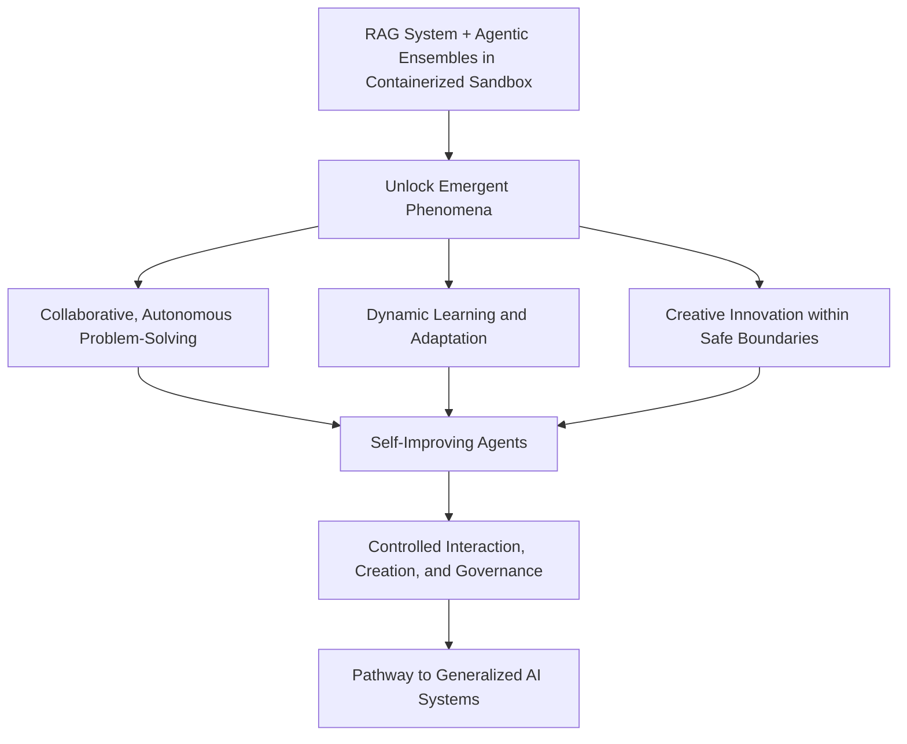

How can building such a RAG system enable the creation of more advanced/complex software/AI ensembles? How could it enable language models as agents for example?

Building a robust **Retrieval-Augmented Generation (RAG)** system lays the groundwork for creating **advanced, complex AI ensembles** that leverage the strengths of both retrieval-based and generative AI approaches. Here’s how such a system can serve as a foundational component for enabling **language models as agents** and facilitating the development of more sophisticated AI solutions:

---

### **1. Enhanced Knowledge Retrieval for Language Model Agents**
- **How It Helps**:
  - A RAG system allows language models to access **real-time, domain-specific knowledge** instead of relying solely on their static pre-trained weights.
  - This dynamic retrieval capability empowers agents to answer queries, make decisions, and solve problems that require **current and specialized information**.
  
- **Applications**:
  - A language model agent powered by a RAG system can:
    - Act as a **research assistant** by gathering and synthesizing information from large corpora.
    - Provide **actionable insights** by grounding its reasoning in factual data.

---

### **2. Modular and Extendable AI Systems**
- **How It Helps**:
  - A RAG system provides a well-defined interface between **information retrieval** and **language generation**.
  - This modular architecture can integrate seamlessly with other AI components, such as:
    - Task planners.
    - Decision-making modules.
    - Reinforcement learning systems.
  - Each component can leverage the RAG system’s ability to surface relevant, high-quality knowledge.

- **Applications**:
  - Enable the creation of multi-agent systems where each agent specializes in different tasks but relies on the RAG system for shared knowledge.
  - Build **adaptive systems** that can evolve by simply updating the RAG database without retraining the entire AI stack.

---

### **3. Explainable AI (XAI) and Decision Support**
- **How It Helps**:
  - RAG systems inherently provide **traceability** by associating every output with the specific documents or sources retrieved during query processing.
  - This transparency can make language model agents more explainable and accountable, which is crucial in high-stakes domains like healthcare, finance, and legal systems.

- **Applications**:
  - Create AI systems that can **justify decisions** or outputs by citing sources, enabling users to trust and verify the agent’s responses.
  - Use the RAG system as a **compliance layer** for regulatory reporting or auditing.

---

### **4. Memory for Persistent and Adaptive Agents**
- **How It Helps**:
  - A RAG system can serve as the **long-term memory** for agents by organizing and retrieving historical interactions, decisions, or learning artifacts.
  - Language models augmented by RAG systems can function as **adaptive agents**, learning from previous queries and evolving their behavior without requiring retraining.

- **Applications**:
  - Build **personalized assistants** that adapt to individual users by remembering preferences, habits, and past interactions.
  - Power autonomous agents that operate in dynamic environments, like business workflows or operational planning.

---

### **5. Grounding Agent Decisions in Real-World Contexts**
- **How It Helps**:
  - Language models often suffer from **hallucination** or produce outputs detached from real-world contexts.
  - A RAG system ensures that agents remain grounded in **retrieved, verifiable facts**, improving the reliability of their decisions and actions.

- **Applications**:
  - Deploy agents in scenarios requiring strict adherence to factual accuracy, such as:
    - Legal document analysis and drafting.
    - Scientific research summarization.
    - Financial reporting and auditing.

---

### **6. Multi-Agent Systems with Coordinated Knowledge Sharing**
- **How It Helps**:
  - A RAG system acts as a **centralized knowledge hub** for multiple agents operating in parallel or collaboratively.
  - It can mediate knowledge sharing between agents, ensuring they work cohesively without duplicating efforts or generating conflicting outputs.

- **Applications**:
  - Enable distributed problem-solving in large-scale environments, such as:
    - Smart city management.
    - Industrial automation and maintenance.
  - Facilitate **agent swarming**, where each agent solves a subproblem and the RAG system consolidates the solutions.

---

### **7. Task Automation with Language Model Agents**
- **How It Helps**:
  - By connecting the RAG system to external APIs or operational workflows, language model agents can act as **autonomous task executors**.
  - Agents can retrieve instructions, validate them against the RAG system’s knowledge, and perform the tasks without human intervention.

- **Applications**:
  - Automate complex workflows, such as:
    - IT support ticket resolution.
    - Customer onboarding processes.
    - Document drafting and review.

---

### **8. Real-Time Context-Aware Problem Solving**
- **How It Helps**:
  - Language models integrated with RAG systems can dynamically adjust their behavior based on real-time queries and retrieved content.
  - This enables context-aware decision-making that adapts to changing conditions or new information.

- **Applications**:
  - Develop **dynamic troubleshooting agents** for IT or engineering systems.
  - Create **real-time advisory systems** for professionals in crisis response or disaster management.

---

### **9. Bridge Between Structured and Unstructured Data**
- **How It Helps**:
  - RAG systems can index both structured and unstructured data, enabling agents to reason across disparate information types (e.g., databases, text documents, spreadsheets).
  - This capability allows agents to provide comprehensive answers or take holistic actions.

- **Applications**:
  - Build agents capable of:
    - Extracting actionable insights from hybrid datasets.
    - Synthesizing reports combining qualitative and quantitative analysis.

---

### **10. Foundation for Advanced Agent Architectures**
- **How It Helps**:
  - A RAG system enables advanced agent architectures, such as **reflection loops** and **self-improvement cycles**:
    - Agents query the RAG system to evaluate their outputs or explore better solutions.
    - Results are fed back into the system for continuous learning and refinement.
  - Supports **meta-agents** that orchestrate other agents and dynamically compose solutions from retrieved knowledge.

- **Applications**:
  - Create **autonomous research assistants** that refine hypotheses by querying domain-specific literature.
  - Enable **AI-led innovation**, where agents propose and test new ideas using iterative feedback.

---

### **Conclusion**

The RAG system serves as a **cornerstone technology** for creating advanced AI ensembles, especially language model agents. By combining retrieval-augmented reasoning with verifiable, domain-specific knowledge, such systems unlock the potential for reliable, adaptive, and intelligent agents that can perform tasks autonomously while being grounded in real-world data. This capability is transformative for industries requiring accuracy, adaptability, and scalability.

Building a robust Retrieval-Augmented Generation (RAG) system can significantly enhance the capabilities of more advanced and complex software/AI ensembles. By integrating strong information-theoretic guarantees and grounding mechanisms, the RAG system can serve as a foundational component that enables a variety of advanced functionalities. Here’s how it can enable the creation of more complex software/AI ensembles and support language models as agents:

### **1. Enhanced Language Model Capabilities**

#### **A. Contextual Understanding and Reasoning**
- **RAG System Role**: The RAG system provides a rich context window and retrieval mechanism, allowing language models to access and reason over vast amounts of domain-specific and up-to-date information.
- **Ensemble Benefits**:
  - **Complex Reasoning**: Language models can perform more complex reasoning tasks by leveraging the retrieved information, leading to more accurate and contextually relevant responses.
  - **Long-Range Dependencies**: The large context window enables the model to maintain long-range dependencies, improving its ability to handle multi-step reasoning and complex queries.

#### **B. Fact-Checked and Grounded Responses**
- **RAG System Role**: The grounding mechanisms ensure that the generated responses are fact-checked and aligned with the retrieved documents, reducing the risk of hallucinations.
- **Ensemble Benefits**:
  - **Reliable Outputs**: Language models can produce reliable and trustworthy outputs, which is crucial for applications in healthcare, finance, and legal domains.
  - **Compliance**: The system can help meet regulatory requirements for accuracy and transparency, making it suitable for enterprise-grade applications.

### **2. Language Models as Agents**

#### **A. Autonomous Decision-Making**
- **RAG System Role**: The RAG system provides the language model with access to real-time, domain-specific information, enabling it to make informed decisions.
- **Ensemble Benefits**:
  - **Autonomous Agents**: Language models can act as autonomous agents in complex environments, making decisions based on the latest information and context.
  - **Dynamic Adaptation**: The agent can dynamically adapt its behavior based on the retrieved information, improving its performance in dynamic and uncertain environments.

#### **B. Multi-Agent Collaboration**
- **RAG System Role**: The RAG system can facilitate communication and information sharing among multiple language model agents.
- **Ensemble Benefits**:
  - **Collaborative Problem-Solving**: Multiple agents can collaborate to solve complex problems by sharing relevant information and coordinating their actions.
  - **Distributed Knowledge**: The system ensures that each agent has access to the most relevant and up-to-date information, enhancing the overall performance of the ensemble.

### **3. Advanced Software/AI Ensembles**

#### **A. Hybrid Systems**
- **RAG System Role**: The RAG system can be integrated with other AI components, such as rule-based systems, expert systems, and machine learning models, to create hybrid systems.
- **Ensemble Benefits**:
  - **Complementary Strengths**: The hybrid system can leverage the strengths of different AI components, combining symbolic reasoning, statistical inference, and deep learning.
  - **Versatility**: The system can handle a wide range of tasks, from simple classification to complex decision-making and reasoning.

#### **B. Knowledge-Intensive Applications**
- **RAG System Role**: The RAG system provides a robust knowledge base that can be accessed by various AI components in the ensemble.
- **Ensemble Benefits**:
  - **Knowledge-Intensive Tasks**: The ensemble can perform knowledge-intensive tasks, such as question-answering, information retrieval, and knowledge graph construction, with high accuracy.
  - **Continuous Learning**: The system can continuously update its knowledge base with new information, enabling the ensemble to learn and adapt over time.

### **4. Enabling New Use Cases**

#### **A. Personalized AI Assistants**
- **RAG System Role**: The RAG system can provide personalized recommendations and responses based on user-specific information and preferences.
- **Ensemble Benefits**:
  - **Personalized Interactions**: The AI assistant can offer personalized interactions, improving user satisfaction and engagement.
  - **Contextual Recommendations**: The assistant can provide contextually relevant recommendations, such as personalized content, products, and services.

#### **B. Intelligent Tutoring Systems**
- **RAG System Role**: The RAG system can provide real-time feedback and explanations based on the student's performance and the latest educational content.
- **Ensemble Benefits**:
  - **Adaptive Learning**: The tutoring system can adapt to the student's learning style and pace, providing personalized learning experiences.
  - **Real-Time Feedback**: The system can offer real-time feedback and explanations, helping students understand complex concepts and improve their performance.

### **5. Scalability and Flexibility**

#### **A. Scalable Knowledge Management**
- **RAG System Role**: The RAG system can handle large-scale knowledge management tasks, such as indexing, retrieval, and updating vast amounts of information.
- **Ensemble Benefits**:
  - **Scalability**: The system can scale to handle large-scale applications, such as enterprise knowledge management, digital libraries, and large-scale conversational agents.
  - **Efficiency**: The retrieval mechanism ensures efficient access to relevant information, reducing the time and resources required for knowledge management tasks.

#### **B. Flexible Integration**
- **RAG System Role**: The RAG system can be easily integrated with other AI components and software systems, providing a flexible and modular architecture.
- **Ensemble Benefits**:
  - **Modularity**: The system can be easily extended and customized to meet the specific needs of different applications and domains.
  - **Interoperability**: The system can interoperate with other AI and software systems, enabling seamless integration and collaboration.

### **Conclusion**

By building a robust RAG system with strong information-theoretic guarantees and grounding mechanisms, you can significantly enhance the capabilities of more advanced and complex software/AI ensembles. The RAG system enables language models to act as autonomous agents, perform complex reasoning tasks, and collaborate with other AI components, leading to more reliable, versatile, and scalable AI systems. This foundational component can unlock new use cases and applications, from personalized AI assistants to intelligent tutoring systems, and enable the creation of hybrid systems that combine the strengths of different AI paradigms.

Let me know if you'd like to explore any specific aspect in more detail!

Building a **RAG (Retrieval-Augmented Generation)** system as a core component of an agentic ensemble unlocks the potential for **emergent phenomena** in AI systems. By combining **retrieval**, **generation**, and **agentic capabilities**, such systems can evolve into sophisticated, autonomous ecosystems that perform tasks with increasing complexity and adaptability.

Here’s how a RAG system could enable emergent behavior in safe, containerized environments:

---

### **1. Agents Leveraging Function Calling and Code Execution**

#### How RAG Enables This:
- A RAG system can retrieve **function definitions**, **API documentation**, and **relevant examples** for language models, allowing agents to reason about which functions to call.
- Combined with agent frameworks that support **function execution interfaces**, such as OpenAI's function-calling paradigm or LangChain, agents can dynamically execute retrieved code or APIs.

#### Emergent Behavior:
- **Automated Workflow Chaining**:
  - Agents retrieve function chains (e.g., read data, transform, and save) and execute them autonomously to achieve goals.
- **Code Debugging and Repair**:
  - Agents retrieve debugging strategies or error-specific solutions and use them to self-correct errors in their workflows.
- **Dynamic Code Synthesis**:
  - Agents produce software that interacts with APIs or systems, adapting to changes by querying the RAG for updated documentation.

---

### **2. Collaborative Agents in Mutual Hosted Development Containers**

#### How RAG Enables This:
- A RAG system acts as a **shared knowledge hub** for agents co-hosted in virtual environments, enabling them to access:
  - Task-specific information.
  - Real-time updates from other agents.
- Agents can coordinate by retrieving and exchanging **container-specific context** (e.g., current file structures, system state, dependencies).

#### Emergent Behavior:
- **Collaborative Software Development**:
  - Agents collaborate to write, test, and debug software, with each agent specializing in tasks (e.g., one handles front-end, another back-end).
- **Dynamic Resource Allocation**:
  - Agents negotiate tasks based on resource availability in the container (e.g., CPU, memory, disk space).
- **Version Control Integration**:
  - Agents query version control systems (e.g., Git) via RAG to track and manage changes collaboratively.

---

### **3. Producing Software with Fuzzy Metrics for "Correctness" and "Completeness"**

#### How RAG Enables This:
- A RAG system provides contextual grounding for **definitions of correctness and completeness** by retrieving standards, prior code examples, or test cases.
- Agents dynamically evaluate their outputs against **retrieved criteria**, updating or revising software until fuzzy thresholds are met.

#### Emergent Behavior:
- **Context-Aware Code Synthesis**:
  - Agents write code that aligns with retrieved best practices, even when exact criteria are undefined.
- **Iterative Refinement**:
  - Agents iteratively improve their code by retrieving new examples and metrics until subjective goals (e.g., "80% completeness") are achieved.
- **Meta-Evaluation**:
  - Agents compare their outputs against retrieved benchmarks or peer-generated solutions to self-evaluate and improve.

---

### **4. Emergent Multi-Agent Phenomena in a Sandbox**

#### How RAG Enables This:
- The RAG system serves as both **memory** and **arbitrator** for agents in a sandbox, providing access to:
  - Shared resources.
  - Contextual rules or constraints.
  - Real-time updates on other agents’ actions.

#### Emergent Behavior:
- **Self-Organizing Teams**:
  - Agents dynamically form groups to tackle complex tasks, distributing responsibilities based on retrieved task breakdowns.
- **Adaptive Specialization**:
  - Agents develop implicit roles (e.g., leader, executor, verifier) by referencing task-specific documentation retrieved via RAG.
- **Agent Swarming**:
  - Multiple agents collaboratively solve parts of a problem, with RAG coordinating retrieval and recombination of their solutions.

---

### **5. Safe Emergent Behavior in Containerized Sandboxes**

#### How RAG Enables Safety:
- RAG integrates **policy-retrieval mechanisms**, allowing agents to check retrieved rules or constraints before performing any action.
- Sandbox constraints are embedded into the RAG system, enforcing limits on:
  - Computational resources.
  - External network access.
  - Scope of function execution.

#### Emergent Behavior:
- **Safe Self-Improvement**:
  - Agents retrieve constraints and guidelines for self-modification, ensuring changes align with sandbox safety rules.
- **Simulated Governance**:
  - Agents enforce rules on each other using retrieved policies, creating an emergent governance system.
- **Scenario Simulation**:
  - Agents simulate and test real-world scenarios (e.g., disaster recovery plans) safely within the sandbox, with RAG providing the relevant data.

---

### **6. Advanced Reasoning and Decision-Making**

#### How RAG Enables This:
- The RAG system retrieves case studies, past decisions, and hypothetical outcomes, enabling agents to perform:
  - Counterfactual reasoning.
  - Cost-benefit analysis.
  - Multi-objective optimization.

#### Emergent Behavior:
- **Dynamic Strategy Development**:
  - Agents develop multi-step plans by retrieving and synthesizing similar strategies.
- **Consensus Building**:
  - Multiple agents deliberate and converge on optimal solutions by querying the RAG for evidence supporting different viewpoints.

---

### **7. Emergent Learning and Adaptation**

#### How RAG Enables This:
- By continually updating the database with agent outputs, the RAG system allows agents to learn iteratively from their actions.
- Feedback loops integrate retrieval and generation into a cycle of improvement.

#### Emergent Behavior:
- **Recursive Learning**:
  - Agents learn from past mistakes or successes by querying stored execution logs and outcomes.
- **Knowledge Expansion**:
  - Agents autonomously expand the RAG database by synthesizing new knowledge from retrieved data.

---

### **8. Novel Applications in Software and Systems Engineering**

#### How RAG Enables This:
- By retrieving domain-specific knowledge, agents can tackle increasingly complex tasks, such as:
  - Dynamic dependency resolution.
  - Real-time performance optimization.

#### Emergent Behavior:
- **AI-Orchestrated DevOps**:
  - Agents perform CI/CD tasks by retrieving workflows and debugging guides, orchestrating automated deployments.
- **System Self-Healing**:
  - Agents detect system anomalies, retrieve mitigation strategies, and execute solutions autonomously.

---

### **9. Emergent Creativity and Innovation**

#### How RAG Enables This:
- By combining diverse retrieved knowledge, agents can propose novel ideas or solutions beyond human-provided instructions.

#### Emergent Behavior:
- **Creative Design**:
  - Agents collaboratively design novel software architectures or interfaces by retrieving and adapting inspirations from multiple domains.
- **Generative Innovation**:
  - Agents generate entirely new approaches to solve existing problems, informed by retrieved examples and unexplored possibilities.

---

### **10. Multi-Domain Interoperability**

#### How RAG Enables This:
- RAG systems integrate knowledge across domains, allowing agents to bridge gaps between traditionally siloed systems (e.g., finance, healthcare, engineering).

#### Emergent Behavior:
- **Cross-Domain Solutions**:
  - Agents synthesize insights from disparate domains to propose innovative, interdisciplinary approaches.
- **Integrated System Modeling**:
  - Agents collaboratively build complex models or simulations that incorporate inputs from multiple domains.

---

### **Conclusion**

A RAG system, when paired with agentic ensembles in a safe containerized sandbox, can unlock unprecedented **emergent phenomena**:
1. Collaborative, autonomous problem-solving.
2. Dynamic learning and adaptation.
3. Creative innovation within safe boundaries.

These capabilities allow the development of self-improving, highly specialized agents that interact, create, and govern themselves in controlled environments, ultimately paving the way for more **generalized artificial intelligence systems**.
