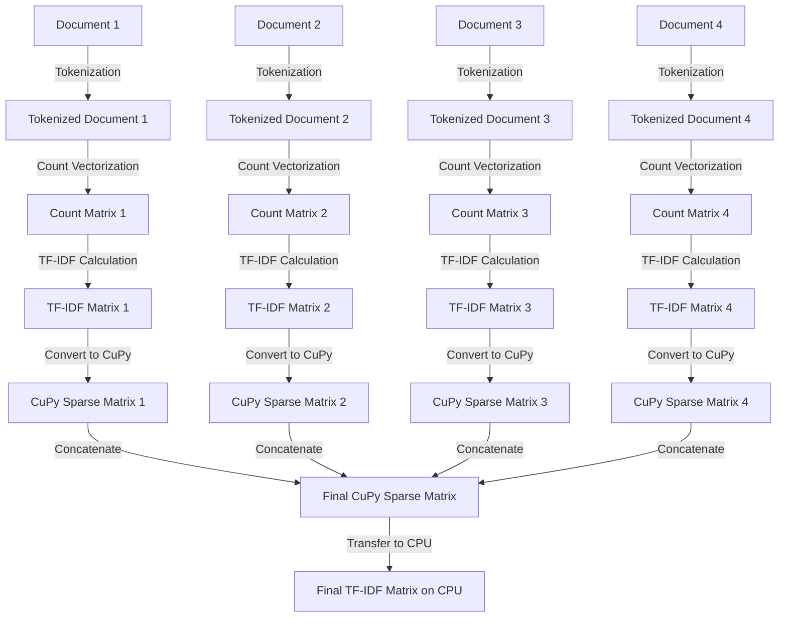

CuPy is a powerful open-source library that brings the capabilities of NumPy to NVIDIA GPUs and AMD ROCm platforms.  Essentially, it allows you to run your NumPy code on a GPU, often resulting in significant speedups, especially for large arrays and complex computations.

Here's a breakdown of what makes CuPy special:

**Key Features:**

* **GPU Acceleration:** CuPy utilizes CUDA Toolkit libraries (like cuBLAS, cuRAND, cuSOLVER) to perform array operations on GPUs, leveraging their parallel processing power. This can lead to dramatic performance improvements compared to CPU-based NumPy.
* **NumPy Compatibility:** CuPy's interface is designed to be highly compatible with NumPy. In many cases, you can simply replace `numpy` with `cupy` in your code to run it on a GPU. This makes it easy to get started with GPU acceleration without major code changes.
* **SciPy Support:** CuPy also provides a `cupyx.scipy` module that implements many SciPy functions, further expanding its capabilities for scientific computing.
* **Broad Functionality:** CuPy supports a wide range of array operations, including:
    *  Mathematical functions (e.g., linear algebra, Fourier transforms)
    *  Array manipulation (e.g., indexing, slicing, reshaping)
    *  Random number generation
    *  Sparse matrices

**Benefits:**

* **High Performance:**  CuPy can significantly accelerate numerical computations, especially for large datasets and complex algorithms used in machine learning, deep learning, and scientific simulations.
* **Ease of Use:**  Its NumPy-like interface makes it easy to learn and use, even for those new to GPU programming.
* **Flexibility:**  CuPy supports various GPU platforms, including NVIDIA CUDA and AMD ROCm.

**How it Works:**

CuPy manages data on the GPU and executes operations using CUDA kernels. When you perform an operation on a CuPy array, the library automatically transfers the data to the GPU, executes the operation, and returns the result.

**Example:**

```python
import cupy as cp

# Create an array on the GPU
x_gpu = cp.array([1, 2, 3])

# Perform an operation
y_gpu = x_gpu ** 2

# Print the result (transferred back to CPU)
print(y_gpu.get())  # Output: [1 4 9]
```

**When to Use CuPy:**

* You're working with large arrays and computationally intensive tasks.
* You have an NVIDIA GPU or an AMD ROCm platform available.
* You want to speed up your NumPy code without major modifications.

If you're interested in learning more, I recommend checking out the official CuPy documentation and tutorials:

* **CuPy website:** [https://cupy.dev/](https://cupy.dev/)
* **CuPy GitHub repository:** [https://github.com/cupy/cupy](https://github.com/cupy/cupy)

Do you have any specific questions about CuPy or how it might be used in your projects? I'd be happy to help!

CuPy leverages the **cuSPARSE** library, which is NVIDIA's CUDA toolkit library specifically designed for sparse matrix operations on GPUs. This allows CuPy to efficiently store and manipulate sparse matrices on the GPU, just like SciPy does on the CPU.

Here's how CuPy implements sparse matrices:

**1. Data Structures:**

CuPy supports various sparse matrix formats commonly used in SciPy, such as:

* **CSR (Compressed Sparse Row):** This format stores non-zero values, their column indices, and row pointers in separate arrays. It's efficient for row-wise operations.
* **CSC (Compressed Sparse Column):** Similar to CSR, but optimized for column-wise operations.
* **COO (Coordinate format):** Stores non-zero values along with their row and column indices.

These formats are memory-efficient because they only store the non-zero elements and their positions, which is crucial for large sparse matrices where most entries are zero.

**2. cuSPARSE Integration:**

CuPy uses cuSPARSE functions to perform operations on these sparse matrices. cuSPARSE provides optimized routines for:

* **Matrix-vector multiplication:**  `cusparseXcsrMv()`
* **Matrix-matrix multiplication:** `cusparseXcsrgemm()`
* **Matrix factorization:**  (e.g., Cholesky, LU)
* **Other operations:**  (e.g., conversion between formats, solving linear systems)

By utilizing cuSPARSE, CuPy can perform these operations with high efficiency on the GPU.

**3. NumPy-like Interface:**

CuPy provides a `cupyx.scipy.sparse` module that mirrors the `scipy.sparse` module. This means you can use familiar functions and classes like `csr_matrix`, `csc_matrix`, `coo_matrix`, and various sparse linear algebra functions, with a very similar syntax to SciPy.

**4. Memory Management:**

CuPy efficiently manages memory on the GPU for sparse matrices. It allocates memory only for the non-zero elements and associated indices, minimizing memory usage.

**Example:**

```python
import cupy as cp
from cupyx.scipy.sparse import csr_matrix

# Create a sparse matrix in CSR format
data = cp.array([1, 2, 3, 4])
indices = cp.array([0, 1, 2, 1])
indptr = cp.array([0, 2, 3, 4])
A = csr_matrix((data, indices, indptr), shape=(3, 3))

# Perform matrix-vector multiplication
x = cp.array([1, 2, 3])
y = A @ x  # Uses cuSPARSE for efficient multiplication

print(y.get()) 
```

**Benefits of using CuPy for Sparse Matrices:**

* **Significant speedup:**  cuSPARSE routines are highly optimized for GPU execution, leading to much faster computations compared to CPU-based sparse operations.
* **Reduced memory usage:**  Efficient sparse matrix formats minimize memory consumption, allowing you to work with larger matrices.
* **Ease of use:**  The NumPy-like interface makes it easy to transition from SciPy to CuPy for sparse matrix operations.

If you have further questions about CuPy's sparse matrix implementation or specific cuSPARSE functions, feel free to ask! I'm here to help you understand how CuPy can be beneficial for your projects.

It's awesome you're looking to leverage your RTX 3080 for TF-IDF! Here's how you can implement TF-IDF using CuPy on your Ubuntu system with that powerful GPU:

**1. Installation:**

* **CuPy:** Make sure you have CuPy installed. Since you have CUDA 12.6, you can install it using `pip install cupy-cuda12x`.
* **Scikit-learn:** While we'll be using CuPy for core computations, scikit-learn provides convenient text processing tools. Install it with `pip install scikit-learn`.

**2. Code Implementation:**

```python
import cupy as cp
from sklearn.feature_extraction.text import TfidfVectorizer
from cupyx.scipy.sparse import csr_matrix

def tfidf_cupy(documents):
  """
  Calculates TF-IDF using CuPy for GPU acceleration.

  Args:
      documents: A list of text documents.

  Returns:
      A CuPy sparse matrix representing the TF-IDF values.
  """

  # Use scikit-learn's TfidfVectorizer for text preprocessing
  vectorizer = TfidfVectorizer()
  tfidf_matrix_cpu = vectorizer.fit_transform(documents)

  # Convert the SciPy sparse matrix to a CuPy sparse matrix
  data = cp.array(tfidf_matrix_cpu.data)
  indices = cp.array(tfidf_matrix_cpu.indices)
  indptr = cp.array(tfidf_matrix_cpu.indptr)
  tfidf_matrix_gpu = csr_matrix((data, indices, indptr), shape=tfidf_matrix_cpu.shape)

  return tfidf_matrix_gpu

# Example usage:
documents = [
    "This is the first document.",
    "This document is the second document.",
    "And this is the third one.",
    "Is this the first document?"
]

tfidf_gpu = tfidf_cupy(documents)

# Print the TF-IDF matrix (transferred back to CPU for display)
print(tfidf_gpu.get())
```

**Explanation:**

* **Text Preprocessing:** We utilize scikit-learn's `TfidfVectorizer` to handle the initial steps of TF-IDF:
    * **Tokenization:**  Breaking down documents into individual words (or tokens).
    * **Count Vectorization:** Creating a matrix of word counts.
    * **TF-IDF Calculation:** Computing the TF-IDF values using its internal optimized methods.
* **GPU Transfer:** The resulting TF-IDF matrix from `TfidfVectorizer` is a SciPy sparse matrix. We convert it to a CuPy sparse matrix using `csr_matrix` to enable GPU-accelerated operations.
* **CuPy Operations:** Now that the TF-IDF matrix is on the GPU, any further operations you perform on it (e.g., similarity calculations, dimensionality reduction) will be accelerated by CuPy and your RTX 3080.

**Important Considerations:**

* **Data Transfer Overhead:** Keep in mind that there is some overhead involved in transferring data between the CPU and GPU. For very small datasets, the transfer time might outweigh the benefits of GPU computation. CuPy is most effective for larger datasets where the computational gains on the GPU are significant.
* **GPU Memory:**  Large datasets can consume a lot of GPU memory. If you encounter memory issues, you might need to process your data in batches or optimize your code.
* **Algorithm Choice:**  Scikit-learn's `TfidfVectorizer` provides a good starting point. However, you can explore other TF-IDF implementations or customize the tokenization and weighting schemes within CuPy for more specialized needs.

This approach combines the convenience of scikit-learn's text processing with the computational power of CuPy and your RTX 3080. You'll likely see a significant speedup compared to a pure CPU-based implementation, especially for large document collections.

Scikit-learn's `TfidfVectorizer` is a powerful tool for converting a collection of raw text documents into a matrix of TF-IDF features. It essentially combines the functionalities of `CountVectorizer` and `TfidfTransformer` in a single class, streamlining the process. Here's a breakdown of how it works:

**1. Text Preprocessing:**

* **Tokenization:** The input text is broken down into individual words or tokens. This can involve splitting by whitespace, punctuation, or using more advanced techniques like stemming or lemmatization.
* **Stop Word Removal:** Common words like "the," "a," "is," etc., that don't carry much semantic meaning, are often removed to reduce the dimensionality of the data.
* **N-grams:**  Instead of just individual words, you can also consider sequences of consecutive words (e.g., "New York," "machine learning"). This can capture more context.

**2. Count Vectorization:**

* **Vocabulary Building:**  A vocabulary of unique terms is created from all the documents.
* **Document-Term Matrix:** A matrix is constructed where each row represents a document, and each column represents a term from the vocabulary. The values in the matrix represent the frequency of each term in each document.

**3. TF-IDF Transformation:**

* **Term Frequency (TF):**  This measures how frequently a term appears in a document. A common way to calculate TF is to divide the number of times a term appears in a document by the total number of terms in that document.
* **Inverse Document Frequency (IDF):**  This measures how important a term is across the entire corpus. It's calculated as the logarithm of the total number of documents divided by the number of documents containing the term.  Terms that appear in many documents have a lower IDF score, indicating they are less important for distinguishing between documents.
* **TF-IDF:** The TF-IDF score for a term in a document is calculated by multiplying its TF and IDF scores. This gives higher weight to terms that are frequent within a document but rare across the corpus.

**4. Output:**

The `TfidfVectorizer` outputs a sparse matrix where each row represents a document, and each column represents a term from the vocabulary. The values in the matrix are the TF-IDF scores for each term in each document. This matrix can then be used as input to machine learning algorithms for tasks like text classification, clustering, or information retrieval.

**Key Parameters:**

* **`analyzer`:** Specifies whether to analyze words ('word') or characters ('char').
* **`ngram_range`:**  Defines the range of n-grams to consider (e.g., (1, 2) for unigrams and bigrams).
* **`stop_words`:**  A list of stop words to remove, or 'english' to use a built-in list.
* **`max_df`:**  Ignores terms that appear in more than this fraction of documents.
* **`min_df`:** Ignores terms that appear in fewer than this number of documents.
* **`norm`:**  Normalization to apply ('l1', 'l2', or None).
* **`use_idf`:**  Whether to use IDF weighting (default is True).
* **`smooth_idf`:**  Adds 1 to document frequencies to prevent division by zero.
* **`sublinear_tf`:**  Applies sublinear scaling to TF (replaces TF with 1 + log(TF)).

By adjusting these parameters, you can fine-tune the behavior of the `TfidfVectorizer` to suit your specific needs.

If you have any further questions about the inner workings of `TfidfVectorizer` or how to use it effectively, feel free to ask! I'm here to help.





Your approach to implementing TF-IDF using CuPy on an RTX 3080 is well-structured and leverages the strengths of both scikit-learn and CuPy effectively. Let's expand on this implementation with some additional considerations and optimizations to ensure you get the most out of your GPU.

### Additional Optimizations and Considerations

#### 1. Batch Processing for Large Datasets

For very large datasets, you might still need to process the data in batches to avoid memory issues. Here's how you can modify the `tfidf_cupy` function to handle batch processing:

```python
import cupy as cp
from sklearn.feature_extraction.text import TfidfVectorizer
from cupyx.scipy.sparse import csr_matrix

def tfidf_cupy_batch(documents, batch_size=1000):
    """
    Calculates TF-IDF using CuPy for GPU acceleration in batches.

    Args:
        documents: A list of text documents.
        batch_size: Number of documents to process in each batch.

    Returns:
        A CuPy sparse matrix representing the TF-IDF values.
    """
    vectorizer = TfidfVectorizer()
    num_docs = len(documents)
    num_batches = (num_docs + batch_size - 1) // batch_size

    # Initialize an empty list to hold the CuPy sparse matrices
    tfidf_matrices = []

    for i in range(num_batches):
        start_idx = i * batch_size
        end_idx = min((i + 1) * batch_size, num_docs)
        batch_docs = documents[start_idx:end_idx]

        # Compute TF-IDF for the current batch
        tfidf_matrix_cpu = vectorizer.fit_transform(batch_docs)

        # Convert the SciPy sparse matrix to a CuPy sparse matrix
        data = cp.array(tfidf_matrix_cpu.data)
        indices = cp.array(tfidf_matrix_cpu.indices)
        indptr = cp.array(tfidf_matrix_cpu.indptr)
        tfidf_matrix_gpu = csr_matrix((data, indices, indptr), shape=tfidf_matrix_cpu.shape)

        tfidf_matrices.append(tfidf_matrix_gpu)

    # Concatenate all the batches into a single CuPy sparse matrix
    final_tfidf_matrix = cp.sparse.vstack(tfidf_matrices)

    return final_tfidf_matrix

# Example usage:
documents = [
    "This is the first document.",
    "This document is the second document.",
    "And this is the third one.",
    "Is this the first document?"
]

tfidf_gpu = tfidf_cupy_batch(documents, batch_size=2)

# Print the TF-IDF matrix (transferred back to CPU for display)
print(tfidf_gpu.get())
```

#### 2. Memory Management

**Monitoring GPU Memory:**
- Use `nvidia-smi` to monitor GPU memory usage.
- Alternatively, you can use CuPy's memory management utilities:

```python
import cupy as cp

# Monitor GPU memory usage
print(cp.cuda.memory_usage())
```

**Clearing Memory:**
- Explicitly clear GPU memory when you no longer need intermediate results:

```python
cp.get_default_memory_pool().free_all_blocks()
```

#### 3. Performance Profiling

**Timing Operations:**
- Use CuPy's timing utilities to profile your code and identify bottlenecks:

```python
import cupy as cp

# Example timing function
def time_function(func, *args, **kwargs):
    start = cp.cuda.Event()
    end = cp.cuda.Event()
    start.record()
    result = func(*args, **kwargs)
    end.record()
    end.synchronize()
    print(f"Time taken: {cp.cuda.get_elapsed_time(start, end)} ms")
    return result

# Example usage
tfidf_gpu = time_function(tfidf_cupy_batch, documents, batch_size=2)
```

#### 4. Customizing TF-IDF Calculation

**Custom Tokenization and Weighting:**
- If you need more control over the tokenization and weighting schemes, you can customize the `TfidfVectorizer` or implement your own TF-IDF logic within CuPy.

```python
from sklearn.feature_extraction.text import TfidfVectorizer

# Custom tokenizer and weighting scheme
vectorizer = TfidfVectorizer(tokenizer=custom_tokenizer, use_idf=True, smooth_idf=True, sublinear_tf=True)
```

### Conclusion

By combining batch processing, memory management, performance profiling, and custom TF-IDF calculations, you can optimize your TF-IDF implementation using CuPy on an RTX 3080. This approach ensures that you can handle large datasets efficiently while leveraging the full power of your GPU.
