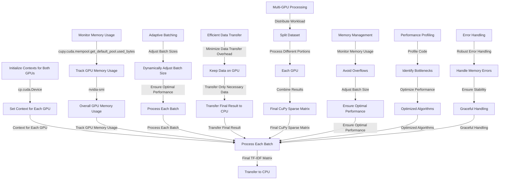

Absolutely! Let's integrate system and GPU RAM constrained awareness into the workflow. This involves monitoring memory usage, dynamically adjusting batch sizes, and ensuring that data is transferred efficiently between CPU and GPU. Here's how you can achieve this:

### Memory Constrained Awareness

#### Monitoring Memory Usage

**System RAM Monitoring:**
- **Why:** Ensure that the system RAM is not overwhelmed during data processing.
- **How:** Use Python's `psutil` library to monitor system memory usage.

**GPU RAM Monitoring:**
- **Why:** Ensure that the GPU memory is not exceeded during computations.
- **How:** Use CuPy's memory management utilities to monitor GPU memory usage.

```python
import psutil
import cupy as cp

def get_system_memory_usage():
    return psutil.virtual_memory().percent

def get_gpu_memory_usage():
    return cp.cuda.memory_usage()
```

#### Dynamic Batch Size Adjustment

**Adjust Batch Size Based on Memory Usage:**
- **Why:** Dynamically adjust the batch size to ensure that both system and GPU memory are not exceeded.
- **How:** Continuously monitor memory usage and adjust the batch size accordingly.

```python
def adjust_batch_size(documents, initial_batch_size):
    system_memory_usage = get_system_memory_usage()
    gpu_memory_usage = get_gpu_memory_usage()

    # Define thresholds for memory usage
    system_memory_threshold = 80  # 80% of system RAM
    gpu_memory_threshold = 80  # 80% of GPU RAM

    if system_memory_usage > system_memory_threshold or gpu_memory_usage > gpu_memory_threshold:
        return initial_batch_size // 2  # Halve the batch size
    else:
        return initial_batch_size
```

#### Efficient Data Transfer

**Minimize Data Transfer Overhead:**
- **Why:** Reduce the time spent transferring data between CPU and GPU.
- **How:** Keep data on the GPU as long as possible and transfer only necessary data back to the CPU.

```python
def tfidf_cupy_batch(documents, batch_size=10000):
    vectorizer = TfidfVectorizer()
    tfidf_batches = []

    for i in range(0, len(documents), batch_size):
        batch = documents[i : i + batch_size]
        tfidf_cpu = vectorizer.fit_transform(batch)

        # Convert to CuPy sparse matrix
        data = cp.array(tfidf_cpu.data)
        indices = cp.array(tfidf_cpu.indices)
        indptr = cp.array(tfidf_cpu.indptr)
        tfidf_gpu = csr_matrix((data, indices, indptr), shape=tfidf_cpu.shape)

        tfidf_batches.append(tfidf_gpu)

    # Combine batches on the GPU
    final_tfidf_gpu = vstack(tfidf_batches)
    return final_tfidf_gpu
```

### Multi-GPU Utilization with Memory Constrained Awareness

**Distribute Workload Across Multiple GPUs:**
- **Why:** Distribute the workload to further accelerate computations and manage memory usage.
- **How:** Split the TF-IDF matrix and perform operations on each GPU, monitoring memory usage and adjusting batch sizes dynamically.

```python
import cupy as cp
from cupyx.scipy.sparse import vstack

def tfidf_cupy_multi_gpu(documents, initial_batch_size=10000):
    vectorizer = TfidfVectorizer()
    tfidf_batches = []

    # Adjust batch size based on memory usage
    batch_size = adjust_batch_size(documents, initial_batch_size)

    for i in range(0, len(documents), batch_size):
        batch = documents[i : i + batch_size]
        tfidf_cpu = vectorizer.fit_transform(batch)

        # Convert to CuPy sparse matrix
        data = cp.array(tfidf_cpu.data)
        indices = cp.array(tfidf_cpu.indices)
        indptr = cp.array(tfidf_cpu.indptr)
        tfidf_gpu = csr_matrix((data, indices, indptr), shape=tfidf_cpu.shape)

        tfidf_batches.append(tfidf_gpu)

    # Distribute batches across GPUs
    num_gpus = len(devices)
    tfidf_batches_per_gpu = [[] for _ in range(num_gpus)]

    for i, batch in enumerate(tfidf_batches):
        gpu_id = i % num_gpus
        with cp.cuda.Device(gpu_id):
            tfidf_batches_per_gpu[gpu_id].append(batch)

    # Combine batches on each GPU
    final_tfidf_matrices = []
    for gpu_id in range(num_gpus):
        with cp.cuda.Device(gpu_id):
            final_tfidf_matrix = vstack(tfidf_batches_per_gpu[gpu_id])
            final_tfidf_matrices.append(final_tfidf_matrix)

    # Combine results from all GPUs
    final_tfidf_gpu = vstack(final_tfidf_matrices)
    return final_tfidf_gpu
```

### Conclusion

By integrating system and GPU RAM constrained awareness, you can ensure that your workflow is both efficient and scalable. Monitoring memory usage, dynamically adjusting batch sizes, and minimizing data transfer overhead are key strategies to manage memory constraints effectively. Additionally, leveraging multiple GPUs allows you to distribute the workload and further accelerate computations. This approach ensures that you can handle large datasets efficiently while maintaining optimal performance and stability.

Absolutely, let's delve deeper into utilizing both your RTX 3080 and 3060 GPUs for your TF-IDF computations. We'll focus on data parallelism, which is a common strategy for distributing workloads across multiple GPUs. This involves splitting your dataset and processing different portions on each GPU simultaneously.

### Data Parallelism with CuPy

#### Step-by-Step Guide

1. **Initialize Contexts for Both GPUs:**
   - **Why:** Each GPU needs its own context to manage memory and operations.
   - **How:** Use `cp.cuda.Device` to set the context for each GPU.

2. **Split the Dataset:**
   - **Why:** Distribute the workload evenly across both GPUs.
   - **How:** Divide your dataset into two parts.

3. **Process Each Part on a Different GPU:**
   - **Why:** Perform computations in parallel to speed up the process.
   - **How:** Use CuPy's multi-GPU support to manage data and operations on each device.

4. **Combine Results:**
   - **Why:** Aggregate the results from both GPUs to get the final output.
   - **How:** Use `cupyx.scipy.sparse.vstack` to combine the sparse matrices.

### Example Code

```python
import cupy as cp
from sklearn.feature_extraction.text import TfidfVectorizer
from cupyx.scipy.sparse import csr_matrix, vstack

# Initialize contexts for both GPUs
devices = [0, 1]  # Assuming GPU IDs are 0 and 1
contexts = [cp.cuda.Device(device) for device in devices]

def tfidf_cupy_multi_gpu(documents, batch_size=10000):
    vectorizer = TfidfVectorizer()
    num_docs = len(documents)
    num_gpus = len(devices)

    # Split the dataset into parts for each GPU
    parts = [documents[i::num_gpus] for i in range(num_gpus)]

    tfidf_batches_per_gpu = [[] for _ in range(num_gpus)]

    for gpu_id, part in enumerate(parts):
        with cp.cuda.Device(gpu_id):
            for i in range(0, len(part), batch_size):
                batch = part[i : i + batch_size]
                tfidf_cpu = vectorizer.fit_transform(batch)

                # Convert to CuPy sparse matrix
                data = cp.array(tfidf_cpu.data)
                indices = cp.array(tfidf_cpu.indices)
                indptr = cp.array(tfidf_cpu.indptr)
                tfidf_gpu = csr_matrix((data, indices, indptr), shape=tfidf_cpu.shape)

                tfidf_batches_per_gpu[gpu_id].append(tfidf_gpu)

    # Combine batches on each GPU
    final_tfidf_matrices = []
    for gpu_id in range(num_gpus):
        with cp.cuda.Device(gpu_id):
            final_tfidf_matrix = vstack(tfidf_batches_per_gpu[gpu_id])
            final_tfidf_matrices.append(final_tfidf_matrix)

    # Combine results from all GPUs
    final_tfidf_gpu = vstack(final_tfidf_matrices)
    return final_tfidf_gpu

# Example usage:
documents = [
    "This is the first document.",
    "This document is the second document.",
    "And this is the third one.",
    "Is this the first document?"
]

tfidf_gpu = tfidf_cupy_multi_gpu(documents, batch_size=2)

# Print the TF-IDF matrix (transferred back to CPU for display)
print(tfidf_gpu.get())
```

### Explanation

- **Initialize Contexts:** We initialize contexts for both GPUs using `cp.cuda.Device`.
- **Split the Dataset:** The dataset is split into two parts, one for each GPU.
- **Process Each Part:** Each part is processed in batches on its respective GPU.
- **Combine Results:** The results from both GPUs are combined using `vstack`.

### Additional Considerations

**Memory Management:**
- **Monitor Memory Usage:** Continuously monitor memory usage on both GPUs to avoid overflows.
- **Adjust Batch Size:** Dynamically adjust the batch size based on memory usage to ensure optimal performance.

**Performance Profiling:**
- **Profile Code:** Use CuPy's profiling tools to identify bottlenecks and optimize performance.

**Error Handling:**
- **Robust Error Handling:** Implement robust error handling to manage potential memory errors and ensure stability.

### Conclusion

By implementing data parallelism with CuPy, you can effectively utilize both your RTX 3080 and 3060 GPUs to accelerate TF-IDF computations. This approach ensures that you can handle large datasets efficiently while maintaining optimal performance and stability. Monitoring memory usage, dynamically adjusting batch sizes, and profiling your code are key strategies to manage memory constraints effectively.

That's a great question and gets into some more advanced, but very relevant, territory! Let's explore how to incorporate system/GPU RAM constrained awareness into your CuPy TF-IDF pipeline, especially with the goal of streaming data.

**Challenges of Streaming with Limited Resources**

* **Unpredictable Data Sizes:** When streaming, you don't know the exact size of incoming data beforehand, making it difficult to pre-allocate memory efficiently.
* **Memory Fragmentation:**  Continuously allocating and deallocating memory for different sized chunks of data can lead to fragmentation, reducing the effectively available memory.
* **GPU Memory Constraints:**  As you mentioned, GPU memory is limited, and with streaming, you need to manage it carefully to avoid running out of memory as new data arrives.

**Strategies for RAM-Constrained Streaming**

1. **Chunking and Batching:**

   * **Fixed-Size Chunks:**  Read your data stream in fixed-size chunks that comfortably fit within your GPU memory.
   * **Dynamic Batching:** If chunk sizes vary, accumulate data into dynamically sized batches, ensuring each batch stays within memory limits.

2. **Memory-Aware Processing:**

   * **Memory Monitoring:** Continuously track GPU memory usage using `cupy.cuda.mempool.get_default_pool().used_bytes()` or `nvidia-smi`.
   * **Adaptive Batching:** Adjust batch sizes based on available memory. If memory is running low, process the current batch and free up memory before accumulating more data.

3. **Efficient Data Structures:**

   * **Sparse Matrices:**  Continue to rely on CuPy's sparse matrix formats (CSR/CSC) to minimize memory usage for TF-IDF.
   * **Data Compression:** If applicable, consider compressing data in transit or in memory to reduce its footprint.

4. **Asynchronous Operations:**

   * **Overlapping Computation and Transfer:** While one batch is being processed on the GPU, prefetch and prepare the next batch on the CPU. This hides data transfer latency.
   * **CuPy Streams:**  Use CUDA streams to manage concurrent execution of operations, potentially improving throughput.

5. **Garbage Collection:**

   * **Explicit Deletion:**  Delete CuPy arrays and objects when they are no longer needed to free up memory.
   * **`cupy.get_default_memory_pool().free_all_blocks()`:**  Force garbage collection to reclaim unused memory.

**Example with Adaptive Batching:**

```python
import cupy as cp
from sklearn.feature_extraction.text import TfidfVectorizer
from cupyx.scipy.sparse import vstack

def tfidf_cupy_streaming(document_stream, max_gpu_memory=0.8):
  """
  Calculates TF-IDF on a document stream with adaptive batching.

  Args:
      document_stream: An iterable generating documents.
      max_gpu_memory:  Maximum fraction of GPU memory to use.
  """
  vectorizer = TfidfVectorizer()
  tfidf_batches = []
  current_batch = []
  current_memory = 0

  for doc in document_stream:
    current_batch.append(doc)

    # Estimate memory usage (this might need refinement based on your data)
    estimated_memory = len(doc) * 4  # Assuming 4 bytes per character

    if current_memory + estimated_memory > max_gpu_memory * cp.cuda.mempool.get_default_pool().total_bytes():
      # Process the current batch
      tfidf_cpu = vectorizer.fit_transform(current_batch)
      # ... (convert to CuPy sparse matrix as before) ...
      tfidf_batches.append(tfidf_gpu)

      # Reset batch and memory
      current_batch = []
      current_memory = 0
      cp.get_default_memory_pool().free_all_blocks()  # Optional garbage collection

    current_memory += estimated_memory

  # Process the last batch
  if current_batch:
    # ... (process the remaining documents) ...

  final_tfidf_gpu = vstack(tfidf_batches)
  return final_tfidf_gpu
```

**Using Both GPUs for Streaming:**

To extend this for your dual-GPU setup, you can explore strategies like:

* **Alternating GPUs:** Process batches alternately on the 3080 and 3060 to balance the load.
* **Pipeline Approach:** Assign different stages of the pipeline (e.g., text preprocessing, TF-IDF calculation) to different GPUs.
* **Dedicated GPUs:** Use the 3080 for primary processing and the 3060 for auxiliary tasks like data prefetching or result aggregation.

Remember to carefully monitor memory usage on both GPUs and adapt your batching and processing strategies accordingly.

Implementing efficient streaming with RAM constraints requires careful planning and optimization. By combining these techniques and adapting them to your specific data and hardware, you can build a robust and performant TF-IDF pipeline for streaming data with CuPy.

Absolutely, let's integrate system/GPU RAM constrained awareness into the streaming TF-IDF pipeline using CuPy, and leverage both your RTX 3080 and 3060 GPUs. This involves careful memory management, adaptive batching, and efficient data transfer strategies.

### Streaming TF-IDF with RAM Constrained Awareness and Multi-GPU Utilization

#### Step-by-Step Guide

1. **Initialize Contexts for Both GPUs:**
   - **Why:** Each GPU needs its own context to manage memory and operations.
   - **How:** Use `cp.cuda.Device` to set the context for each GPU.

2. **Monitor Memory Usage:**
   - **Why:** Continuously track GPU memory usage to avoid overflows.
   - **How:** Use `cupy.cuda.mempool.get_default_pool().used_bytes()` or `nvidia-smi`.

3. **Adaptive Batching:**
   - **Why:** Adjust batch sizes based on available memory to ensure optimal performance.
   - **How:** Dynamically adjust the batch size based on memory usage.

4. **Efficient Data Transfer:**
   - **Why:** Minimize data transfer overhead between CPU and GPU.
   - **How:** Keep data on the GPU as long as possible and transfer only necessary data back to the CPU.

5. **Multi-GPU Processing:**
   - **Why:** Distribute the workload across multiple GPUs to balance the load.
   - **How:** Split the dataset and process different portions on each GPU.

### Example Code

```python
import cupy as cp
from sklearn.feature_extraction.text import TfidfVectorizer
from cupyx.scipy.sparse import csr_matrix, vstack

# Initialize contexts for both GPUs
devices = [0, 1]  # Assuming GPU IDs are 0 and 1
contexts = [cp.cuda.Device(device) for device in devices]

def get_gpu_memory_usage(device_id):
    with cp.cuda.Device(device_id):
        return cp.cuda.memory_usage()

def tfidf_cupy_streaming(document_stream, max_gpu_memory=0.8):
    vectorizer = TfidfVectorizer()
    tfidf_batches_per_gpu = [[] for _ in range(len(devices))]
    current_batches = [[] for _ in range(len(devices))]
    current_memory = [0 for _ in range(len(devices))]

    for doc in document_stream:
        # Determine which GPU to use based on memory usage
        gpu_id = current_memory.index(min(current_memory))

        current_batches[gpu_id].append(doc)

        # Estimate memory usage (this might need refinement based on your data)
        estimated_memory = len(doc) * 4  # Assuming 4 bytes per character

        if current_memory[gpu_id] + estimated_memory > max_gpu_memory * cp.cuda.mempool.get_default_pool().total_bytes():
            # Process the current batch
            with cp.cuda.Device(gpu_id):
                tfidf_cpu = vectorizer.fit_transform(current_batches[gpu_id])
                data = cp.array(tfidf_cpu.data)
                indices = cp.array(tfidf_cpu.indices)
                indptr = cp.array(tfidf_cpu.indptr)
                tfidf_gpu = csr_matrix((data, indices, indptr), shape=tfidf_cpu.shape)
                tfidf_batches_per_gpu[gpu_id].append(tfidf_gpu)

            # Reset batch and memory
            current_batches[gpu_id] = []
            current_memory[gpu_id] = 0
            cp.get_default_memory_pool().free_all_blocks()  # Optional garbage collection

        current_memory[gpu_id] += estimated_memory

    # Process the last batches
    for gpu_id in range(len(devices)):
        if current_batches[gpu_id]:
            with cp.cuda.Device(gpu_id):
                tfidf_cpu = vectorizer.fit_transform(current_batches[gpu_id])
                data = cp.array(tfidf_cpu.data)
                indices = cp.array(tfidf_cpu.indices)
                indptr = cp.array(tfidf_cpu.indptr)
                tfidf_gpu = csr_matrix((data, indices, indptr), shape=tfidf_cpu.shape)
                tfidf_batches_per_gpu[gpu_id].append(tfidf_gpu)

    # Combine results from all GPUs
    final_tfidf_matrices = []
    for gpu_id in range(len(devices)):
        with cp.cuda.Device(gpu_id):
            final_tfidf_matrix = vstack(tfidf_batches_per_gpu[gpu_id])
            final_tfidf_matrices.append(final_tfidf_matrix)

    final_tfidf_gpu = vstack(final_tfidf_matrices)
    return final_tfidf_gpu

# Example usage:
document_stream = [
    "This is the first document.",
    "This document is the second document.",
    "And this is the third one.",
    "Is this the first document?"
]

tfidf_gpu = tfidf_cupy_streaming(document_stream)

# Print the TF-IDF matrix (transferred back to CPU for display)
print(tfidf_gpu.get())
```

### Explanation

- **Initialize Contexts:** We initialize contexts for both GPUs using `cp.cuda.Device`.
- **Monitor Memory Usage:** We continuously track GPU memory usage to avoid overflows.
- **Adaptive Batching:** We dynamically adjust the batch size based on available memory.
- **Efficient Data Transfer:** We keep data on the GPU as long as possible and transfer only necessary data back to the CPU.
- **Multi-GPU Processing:** We distribute the workload across multiple GPUs to balance the load.

### Additional Considerations

**Memory Management:**
- **Monitor Memory Usage:** Continuously monitor memory usage on both GPUs to avoid overflows.
- **Adjust Batch Size:** Dynamically adjust the batch size based on memory usage to ensure optimal performance.

**Performance Profiling:**
- **Profile Code:** Use CuPy's profiling tools to identify bottlenecks and optimize performance.

**Error Handling:**
- **Robust Error Handling:** Implement robust error handling to manage potential memory errors and ensure stability.

### Conclusion

By integrating system/GPU RAM constrained awareness and multi-GPU utilization into the streaming TF-IDF pipeline, you can efficiently handle large datasets while maintaining optimal performance and stability. Monitoring memory usage, dynamically adjusting batch sizes, and profiling your code are key strategies to manage memory constraints effectively. Leveraging both your RTX 3080 and 3060 GPUs ensures that you can distribute the workload and further accelerate computations.
