### **System Overview**

Below is a **Mermaid diagram** to visualize the components of your RAG system, followed by **tree-style pseudocode** to describe the process flow.

---

#### **Mermaid Diagram**

```mermaid
graph TD
    A[User Query] -->|Input Query| B[Query Embedding]
    B -->|Search FAISS Index| C[Retrieve Relevant Documents]
    C -->|Concatenate Documents| D[Create Context]
    D -->|Send Prompt| E[Ollama LLM]
    E -->|Generate Response| F[Response to User]
    subgraph Preprocessing
        G[PDF Files] -->|Convert to Text| H[Text Corpus]
        H -->|Clean and Split| I[Processed Texts]
        I -->|Generate Embeddings| J[Embeddings]
        J -->|Store in FAISS Index| K[GPU-Accelerated FAISS Index]
    end
    subgraph Real-Time Query
        A --> B
        B --> C
        C --> D
        D --> E
        E --> F
    end
```



---

#### **Tree-Type Pseudocode**

```plaintext
System Overview:
    1. Preprocessing:
        - Input: PDF files.
        - Convert PDFs to text using `pdftotext`.
        - Clean text (remove noise, special characters).
        - Split large text files into smaller chunks for efficient processing.
        - Generate embeddings using a GPU-accelerated model (`all-mpnet-base-v2`).
        - Store embeddings in a GPU-accelerated Faiss index.

    2. Query Handling:
        - Input: User query.
        - Generate query embedding using the same model.
        - Perform similarity search in the Faiss index (top-k retrieval).
        - Retrieve top-k relevant documents.

    3. LLM Integration:
        - Concatenate retrieved documents into a context string.
        - Send the context and user query as a prompt to the Ollama LLM.
        - Generate a response based on the query and retrieved context.

    4. Output:
        - Display response to the user.

Detailed Pseudocode:
    - Preprocessing:
        1. For each PDF in the corpus:
            - Convert to text and save in `/data/text-files`.
            - Clean text and save in `/data/cleaned-text`.
        2. For each cleaned text file:
            - Generate embedding using GPU-based model.
            - Add embedding to Faiss index.
        3. Save Faiss index to disk for future use.

    - Real-Time Query:
        1. Input user query.
        2. Generate embedding for the query using the same model.
        3. Search Faiss index for the top-k closest embeddings.
        4. Retrieve corresponding documents.

    - LLM Integration:
        1. Combine retrieved documents into a context string.
        2. Format query and context into a structured prompt.
        3. Send prompt to Ollama LLM for response generation.
        4. Return response to the user.

    - System Deployment:
        1. Automate preprocessing via scripts (e.g., `start_rag.sh`).
        2. Serve the RAG system via a systemd service.
        3. Monitor GPU and memory usage using `nvidia-smi`.
```

---

This breakdown highlights the **data flow**, **processing stages**, and how the **query-response cycle** integrates with GPU-accelerated Faiss and Ollama. It ensures clarity for deployment and debugging.
