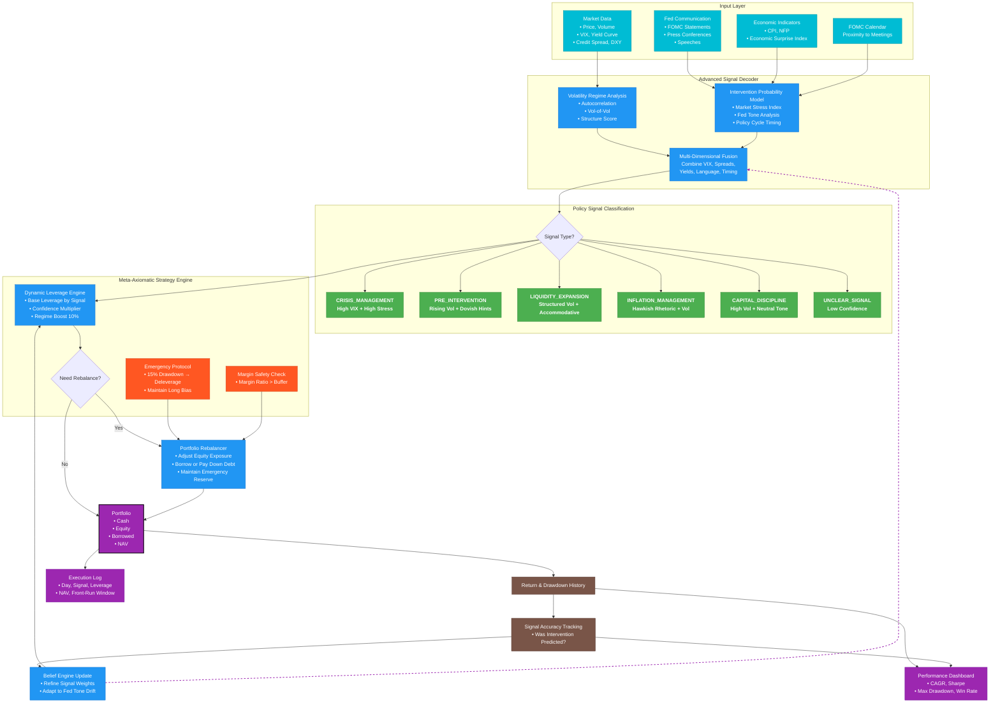

```mermaid
graph TD
    %% === STYLES ===
    classDef input fill:#00BCD4,stroke:#0097A7,color:white;
    classDef process fill:#2196F3,stroke:#1976D2,color:white;
    classDef signal fill:#4CAF50,stroke:#388E3C,color:white,font-weight:bold;
    classDef decision fill:#FF9800,stroke:#F57C00,color:black;
    classDef output fill:#9C27B0,stroke:#7B1FA2,color:white;
    classDef constraint fill:#FF5722,stroke:#D84315,color:white;
    classDef feedback fill:#795548,stroke:#5D4037,color:white;

    %% === INPUT LAYER: Market & Policy Data ===
    subgraph "Input Layer"
        A[Market Data<br>• Price, Volume<br>• VIX, Yield Curve<br>• Credit Spread, DXY]:::input
        B[Fed Communication<br>• FOMC Statements<br>• Press Conferences<br>• Speeches]:::input
        C[Economic Indicators<br>• CPI, NFP<br>• Economic Surprise Index]:::input
        D[FOMC Calendar<br>Proximity to Meetings]:::input
    end

    %% === SIGNAL PROCESSING ENGINE ===
    subgraph "Advanced Signal Decoder"
        E[Volatility Regime Analysis<br>• Autocorrelation<br>• Vol-of-Vol<br>• Structure Score]:::process
        F[Intervention Probability Model<br>• Market Stress Index<br>• Fed Tone Analysis<br>• Policy Cycle Timing]:::process
        G[Multi-Dimensional Fusion<br>Combine VIX, Spreads,<br>Yields, Language, Timing]:::process
    end

    %% === SIGNAL OUTPUTS ===
    subgraph "Policy Signal Classification"
        H{Signal Type?}
        H --> I[CRISIS_MANAGEMENT<br>High VIX + High Stress]:::signal
        H --> J[PRE_INTERVENTION<br>Rising Vol + Dovish Hints]:::signal
        H --> K[LIQUIDITY_EXPANSION<br>Structured Vol + Accommodative]:::signal
        H --> L[INFLATION_MANAGEMENT<br>Hawkish Rhetoric + Vol]:::signal
        H --> M[CAPITAL_DISCIPLINE<br>High Vol + Neutral Tone]:::signal
        H --> N[UNCLEAR_SIGNAL<br>Low Confidence]:::signal
    end

    %% === STRATEGY DECISION ENGINE ===
    subgraph "Meta-Axiomatic Strategy Engine"
        O[Dynamic Leverage Engine<br>• Base Leverage by Signal<br>• Confidence Multiplier<br>• Regime Boost 10%]:::process
        P{Need Rebalance?}
        Q[Emergency Protocol<br>• 15% Drawdown → Deleverage<br>• Maintain Long Bias]:::constraint
        R[Margin Safety Check<br>• Margin Ratio > Buffer]:::constraint
    end

    %% === PORTFOLIO EXECUTION ===
    S[Portfolio Rebalancer<br>• Adjust Equity Exposure<br>• Borrow or Pay Down Debt<br>• Maintain Emergency Reserve]:::process
    T[Portfolio<br>• Cash<br>• Equity<br>• Borrowed<br>• NAV]:::output

    %% === FEEDBACK & LEARNING ===
    U[Return & Drawdown History]:::feedback
    V[Signal Accuracy Tracking<br>• Was Intervention Predicted?]:::feedback
    W[Belief Engine Update<br>• Refine Signal Weights<br>• Adapt to Fed Tone Drift]:::process

    %% === OUTPUT & MONITORING ===
    X[Execution Log<br>• Day, Signal, Leverage<br>• NAV, Front-Run Window]:::output
    Y[Performance Dashboard<br>• CAGR, Sharpe<br>• Max Drawdown, Win Rate]:::output

    %% === CONNECTIONS ===
    A --> E
    B --> F
    C --> F
    D --> F

    E --> G
    F --> G
    G --> H

    H --> O
    O --> P
    P -->|Yes| S
    P -->|No| T

    Q --> S
    R --> S

    S --> T
    T --> U
    U --> V
    V --> W
    W --> O
    W --> G

    T --> X
    U --> Y
    V --> Y

    %% === META-AXIOM LOOP ===
    style T stroke:#000,stroke-width:2px
    linkStyle 24 stroke:#9C27B0,stroke-width:2px,stroke-dasharray: 5 5;

    class T output;
```
