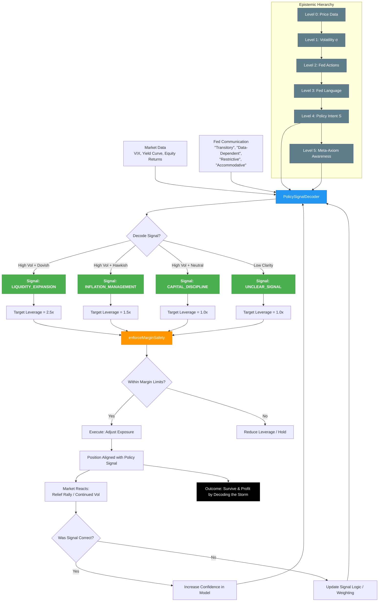

```mermaid
graph TD
    %% === STYLES ===
    classDef signal fill:#4CAF50,stroke:#388E3C,color:white,font-weight:bold;
    classDef process fill:#2196F3,stroke:#1976D2,color:white;
    classDef constraint fill:#FF9800,stroke:#F57C00,color:white;
    classDef outcome fill:#9C27B0,stroke:#7B1FA2,color:white;
    classDef meta fill:#607D8B,stroke:#455A64,color:white;

    %% === INPUTS: Market & Policy Data ===
    A[Market Data<br>VIX, Yield Curve, Equity Returns] --> D[PolicySignalDecoder]
    B[Fed Communication<br>&quot;Transitory&quot;, &quot;Data-Dependent&quot;,<br>&quot;Restrictive&quot;, &quot;Accommodative&quot;] --> D

    %% === CORE ENGINE: Signal Decoder ===
    D:::process --> E{Decode Signal?}
    E -->|High Vol + Dovish| F[Signal: LIQUIDITY_EXPANSION]:::signal
    E -->|High Vol + Hawkish| G[Signal: INFLATION_MANAGEMENT]:::signal
    E -->|High Vol + Neutral| H[Signal: CAPITAL_DISCIPLINE]:::signal
    E -->|Low Clarity| I[Signal: UNCLEAR_SIGNAL]:::signal

    %% === STRATEGY MAP: From Signal to Leverage ===
    F --> J[Target Leverage = 2.5x]
    G --> K[Target Leverage = 1.5x]
    H --> L[Target Leverage = 1.0x]
    M[Target Leverage = 1.0x]
    I --> M

    %% === MARGIN SAFETY: Practical Constraint ===
    J --> N[enforceMarginSafety]
    K --> N
    L --> N
    M --> N

    N:::constraint --> O{Within Margin Limits?}
    O -->|Yes| P[Execute: Adjust Exposure]
    O -->|No| Q[Reduce Leverage / Hold]
    P --> R[Position Aligned with Policy Signal]

    %% === FEEDBACK LOOP: Market Response & Recalibration ===
    R --> S[Market Reacts:<br>Relief Rally / Continued Vol]
    S --> T{Was Signal Correct?}
    T -->|Yes| U[Increase Confidence in Model]
    T -->|No| V[Update Signal Logic / Weighting]
    U --> D
    V --> D

    %% === META-KNOWLEDGE LAYERS (Right Side) ===
    subgraph "Epistemic Hierarchy"
        Z1[Level 0: Price Data]:::meta
        Z2[Level 1: Volatility σ]:::meta
        Z3[Level 2: Fed Actions]:::meta
        Z4[Level 3: Fed Language]:::meta
        Z5[Level 4: Policy Intent S]:::meta
        Z6[Level 5: Meta-Axiom Awareness]:::meta

        Z1 --> Z2 --> Z3 --> Z4 --> Z5 --> Z6
    end

    %% === CONNECTION: Knowledge Informs Decoder ===
    Z5 --> D
    Z6 --> D

    %% === OUTPUT: Survival Through Interpretation ===
    R --> W[Outcome: Survive & Profit by Decoding the Storm]
    W:::outcome

    %% === STYLING OVERRIDE FOR OUTPUT ===
    style W fill:#000,stroke:#fff,color:white
```
