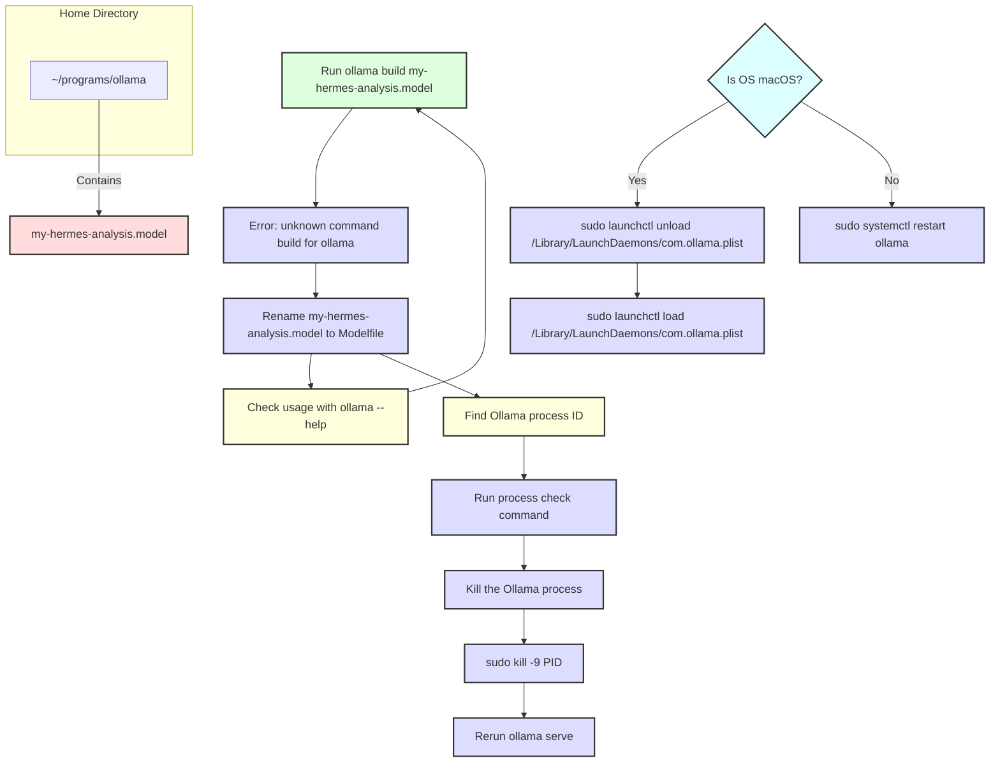

joebob@briggs_ubuntu:~/programs/ollama$ ls

my-hermes-analysis.model

joebob@briggs_ubuntu:~/programs/ollama$ ollama build my-hermes-analysis.model 

Error: unknown command "build" for "ollama"

joebob@briggs_ubuntu:~/programs/ollama$ olama

Command 'olama' not found, did you mean:

  command 'llama' from snap llama (1.4.0)

  command 'olam' from snap olam (v1.2.151+git4.45662d9)

  command 'ollama' from snap ollama (0.3.0-29-gd0fa960)

See 'snap info <snapname>' for additional versions.

joebob@briggs_ubuntu:~/programs/ollama$ ollama

Usage:

  ollama [flags]

  ollama [command]

Available Commands:

  serve       Start ollama

  create      Create a model from a Modelfile

  show        Show information for a model

  run         Run a model

  stop        Stop a running model

  pull        Pull a model from a registry

  push        Push a model to a registry

  list        List models

  ps          List running models

  cp          Copy a model

  rm          Remove a model

  help        Help about any command

Flags:

  -h, --help      help for ollama

  -v, --version   Show version information

Use "ollama [command] --help" for more information about a command.

joebob@briggs_ubuntu:~/programs/ollama$ ollama create my-hermes-analysis.model 

Error: open /home/smduck/programs/ollama/Modelfile: no such file or directory

joebob@briggs_ubuntu:~/programs/ollama$ ls

my-hermes-analysis.model

joebob@briggs_ubuntu:~/programs/ollama$ 

Ah, I see the issue! You're very close. The problem is that ollama create expects a file named exactly Modelfile (case-sensitive) in the current directory.

Here's how to fix it:

Rename: Rename your my-hermes-analysis.model file to Modelfile.

Run the command again: Now try running the ollama create command:

Bash
ollama create my-hermes-analysis 
Use code with caution.

(Remember to use the model name without the .model extension here)

Explanation:

ollama create: This command is used to create a new Ollama model based on a Modelfile.
Modelfile: The ollama create command specifically looks for a file named Modelfile in the current directory. This file contains the instructions for building the model.
my-hermes-analysis: This is the name you want to give to your new Ollama model.
By renaming your model file to Modelfile, you'll provide the ollama create command with the input it expects, and it should successfully create your model.

Ok that worked now how do we restart ollama so it serves that modfile?

Show drafts

Great! Now that you've created the model, you need to restart the Ollama server to make sure it recognizes and loads the new model. Here's how you can do it depending on your operating system:

macOS:

If you're running Ollama from the macOS app: Simply quit the Ollama app and reopen it. This will restart the server and load your new model.

If you're running Ollama as a service:

Open a terminal.
Run the following command to restart the service:
Bash
sudo launchctl unload /Library/LaunchDaemons/com.ollama.plist
sudo launchctl load /Library/LaunchDaemons/com.ollama.plist
Use code with caution.

Linux:

Open a terminal.

Run the following command to restart the service:

Bash
sudo systemctl restart ollama
Use code with caution.

General Approach (if the above doesn't work):

If you're unsure about your operating system or the above methods don't work, you can try this more general approach:

Find the Ollama process ID (PID):

Bash
ps aux | grep ollama
Use code with caution.

This will show you the running Ollama process and its PID.

Kill the Ollama process:

Bash
sudo kill -9 <PID> 
Use code with caution.

(Replace <PID> with the actual process ID you found in the previous step.)

Restart Ollama:

Bash
ollama serve
Use code with caution.

This will terminate the current Ollama server and start a new one, ensuring your new model is loaded correctly.

