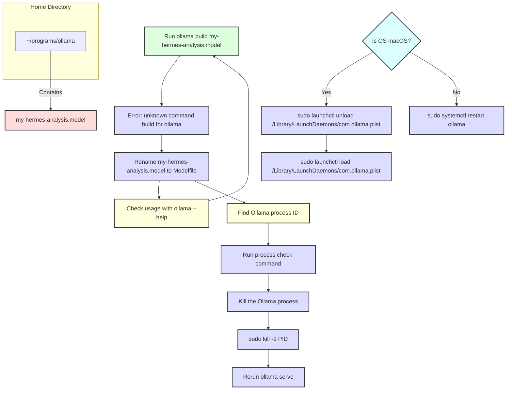

Certainly! Below is a cleaned-up version of your markdown file entry for clarity and correctness:

```markdown
# Q: What should I name that module file and does this look right?

## Example Modelfile

```
FROM nous-hermes2:10.7b-solar-q8_0

SYSTEM You are a helpful and friendly AI assistant. Perform Analysis.

PARAMETER num_ctx 4096
```

### Naming the Modelfile:

Keep it descriptive:
- A good name clearly indicates the model and its purpose.
- Some suggestions: `nous-hermes2-4096.model`, `hermes2-assistant.model`, or `my-hermes-analysis.model`.
- Use a `.model` extension (common convention for Ollama Modelfiles).
- Store it correctly in the same directory where you'll run the `ollama build` command.

### Your Modelfile:

```
FROM nous-hermes2:10.7b-solar-q8_0

SYSTEM You are a helpful and friendly AI assistant. Perform Analysis.

PARAMETER num_ctx 4096
```

#### Breakdown:
- **FROM**: Correctly specifies the base model you want to use.
- **SYSTEM**: Provides a clear system prompt to guide the AI's behavior.
- **PARAMETER num_ctx 4096**: Sets the context window to 4096 tokens, effectively limiting the maximum output length.

### Important Notes:
1. **Building the Model**:
   - Once you've saved the Modelfile (e.g., as `hermes2-assistant.model`), build the Ollama model using:
     ```bash
     ollama build hermes2-assistant
     ```
     Use code with caution.
   
   - Note: Use the name without the `.model` extension for the `ollama build` command.

2. **Running the Model**:
   - After building, run the model with:
     ```bash
     ollama run hermes2-assistant
     ```
     Use code with caution.

### Troubleshooting:

```bash
joebob@briggs_ubuntu:~/programs/ollama$ ls
my-hermes-analysis.model

joebob@briggs_ubuntu:~/programs/ollama$ ollama build my-hermes-analysis.model 
Error: unknown command "build" for "ollama"

joebob@briggs_ubuntu:~/programs/ollama$ olama
Command 'olama' not found, did you mean:
  command 'llama' from snap llama (1.4.0)
  command 'olam' from snap olam (v1.2.151+git4.45662d9)
  command 'ollama' from snap ollama (0.3.0-29-gd0fa960)
See 'snap info <command>' for additional versions.

joebob@briggs_ubuntu:~/programs/ollama$ ollama
Usage:
  ollama [flags]
  ollama [command]

Available Commands:
  create      Create a model from a Modelfile
  help        Help about any command
  list        List models
  pull        Pull a model from a registry
  push        Push a model to a registry
  run         Run a model
  serve       Start ollama

...

joebob@briggs_ubuntu:~/programs/ollama$ ollama create my-hermes-analysis.model 
Error: open /home/smduck/programs/ollama/Modelfile: no such file or directory

joebob@briggs_ubuntu:~/programs/ollama$ ls
my-hermes-analysis.model
```

**Solution**:
- The issue is that `ollama create` expects a file named exactly `Modelfile` (case-sensitive) in the current directory.
  
  - **Rename**: Rename your `my-hermes-analysis.model` file to `Modelfile`.
  - **Run the command again**:
    ```bash
    ollama create my-hermes-analysis
    ```
    
    Use code with caution.

### Restarting Ollama:

Once you've created the model, restart the Ollama server to ensure it recognizes and loads your new model. Here's how depending on your operating system:

#### macOS:
1. **Running from the macOS app**:
   - Simply quit the Ollama app and reopen it.
   
2. **Running as a service**:
   ```bash
   sudo launchctl unload /Library/LaunchDaemons/com.ollama.plist
   sudo launchctl load /Library/LaunchDaemons/com.ollama.plist
   ```

#### Linux:
```bash
sudo systemctl restart ollama
```

### General Approach (if the above doesn't work):
1. **Find the Ollama process ID (PID)**:
    ```bash
    ps aux | grep ollama
    ```
   
2. **Kill the Ollama process**:
   - Replace `<actual_pid>` with the actual process ID you found in the previous step.
     ```bash
     sudo kill -9 <actual_pid>
     ```

3. **Restart Ollama**:
    ```bash
    ollama serve
    ```
```

This should provide a clear and structured guide for your users!
