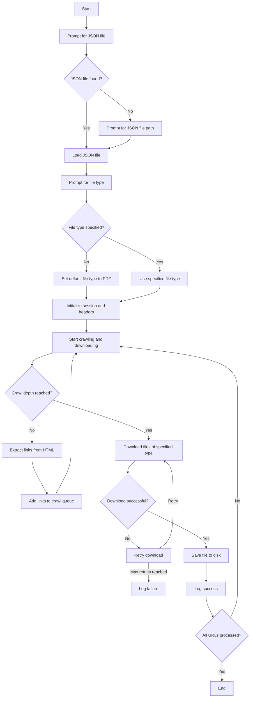

# Web Crawler and File Downloader

This Python script is designed to crawl web pages, discover downloadable files (e.g., PDFs, HTML files), and download them in parallel. It supports graceful shutdown, retries for failed downloads, and customizable file type filtering.

---

## Features

- **Crawling**: Recursively crawls web pages up to a specified depth to discover downloadable files.
- **File Type Filtering**: Allows the user to specify the type of files to download (e.g., PDF, HTML). Defaults to PDF if no type is specified.
- **Parallel Downloads**: Uses `ThreadPoolExecutor` to download multiple files concurrently.
- **Graceful Shutdown**: Handles `Ctrl+C` interrupts gracefully, stopping all ongoing downloads.
- **Retry Mechanism**: Retries failed downloads up to 3 times with exponential backoff.
- **Default JSON File Detection**: Automatically detects JSON files in the current directory and suggests them as defaults.

---
```
## Prerequisites

- Python 3.7 or higher
- Required Python packages:
  - `requests`
  - `beautifulsoup4`
  - `urllib3`

Install the required packages using:

```bash
pip install requests beautifulsoup4

```
Usage
Prepare a JSON file:
Create a JSON file containing a list of URLs to start crawling from. Example:

json
Copy
[
    {
        "urls": [
            "https://example.com/page1",
            "https://example.com/page2"
        ]
    }
]
Run the script:
Execute the script from the command line:

bash
Copy
python web_crawler.py
Follow the prompts:

Enter the path to the JSON file (or press Enter to use the default if one is found).

Enter the file type to download (e.g., pdf, html, etc.). Press Enter to default to pdf.
```
```

