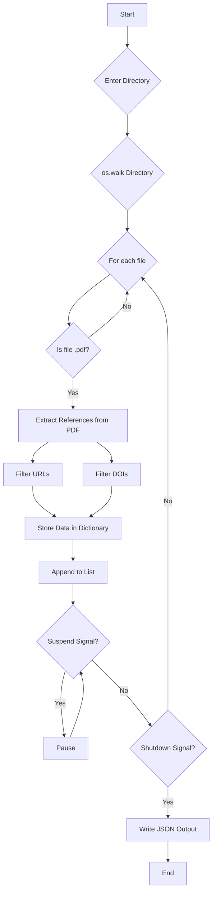

# PDF Reference Extractor

This Python script `pdf_extractor.py` recursively scans a directory for PDF files, extracts potential references, URLs, and DOIs, and saves them to a JSON file. It also includes features for suspending, resuming, and gracefully shutting down the process.

## Features

-   **Recursive Directory Scanning:** Uses `os.walk` to traverse directories and find all PDF files.
-   **JSON Output:** Stores extracted data in a structured JSON format (`extracted_references.json`).
-   **Suspend/Resume:** Pauses and resumes processing using `SIGUSR1` and `SIGUSR2` signals.
-   **Graceful Shutdown:** Terminates the process safely using `SIGINT` or `SIGTERM` signals.
-   **Robust Signal Handling:** Implements reliable signal handlers for various operations.
-   **Error Handling:** Includes `try/except` blocks to manage file not found and other exceptions.
-   **Clear Output:** Consistent output to console and JSON file.
-   **Data Structure:** Stores data in a list of dictionaries, where each dictionary represents a PDF file and its extracted content.

## Usage

1.  **Run the script:**

    ```bash
    python pdf_extractor.py
    ```

2.  **Enter the directory to scan:**

    The script will prompt you to enter the directory containing the PDF files.

3.  **Suspend/Resume:**

    -   **Suspend:** Send a `SIGUSR1` signal to the process:

        ```bash
        kill -SIGUSR1 <PID>
        ```

    -   **Resume:** Send a `SIGUSR2` signal to the process:

        ```bash
        kill -SIGUSR2 <PID>
        ```

4.  **Shutdown:**

    -   Press `Ctrl+C` or send a `SIGINT` or `SIGTERM` signal:

        ```bash
        kill -SIGTERM <PID>
        ```

5.  **Find the PID:**

    Use the following command to find the process ID (PID):

    ```bash
    ps aux | grep pdf_extractor.py
    ```

## JSON Output Example

```json
[
    {
        "pdf_file": "/path/to/your/file1.pdf",
        "references": [
            "[1] Example reference.",
            "Author et al., 2023",
            "DOI: 10.1234/example"
        ],
        "urls": [
            "[https://www.example.com](https://www.example.com)"
        ],
        "dois": [
            "10.1234/example"
        ]
    },
    {
        "pdf_file": "/path/to/your/file2.pdf",
        "references": [
            "Another reference."
        ],
        "urls": [],
        "dois": []
    }
]
```

