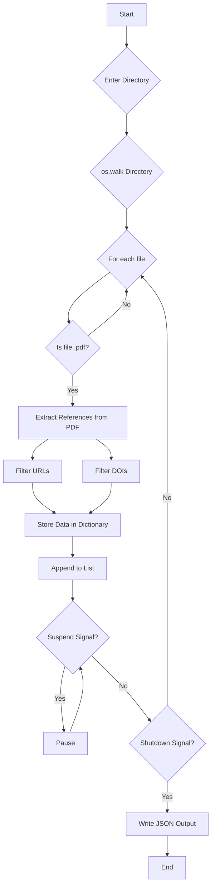

# PDF Reference Extractor

This Python script `pdf_extractor.py` recursively scans a directory for PDF files, extracts potential references, URLs, and DOIs, and saves them to a JSON file. It also includes features for suspending, resuming, and gracefully shutting down the process.

## Features

-   **Recursive Directory Scanning:** Uses `os.walk` to traverse directories and find all PDF files.
-   **JSON Output:** Stores extracted data in a structured JSON format (`extracted_references.json`).
-   **Suspend/Resume:** Pauses and resumes processing using `SIGUSR1` and `SIGUSR2` signals.
-   **Graceful Shutdown:** Terminates the process safely using `SIGINT` or `SIGTERM` signals.
-   **Robust Signal Handling:** Implements reliable signal handlers for various operations.
-   **Error Handling:** Includes `try/except` blocks to manage file not found and other exceptions.
-   **Clear Output:** Consistent output to console and JSON file.
-   **Data Structure:** Stores data in a list of dictionaries, where each dictionary represents a PDF file and its extracted content.

## Usage

1.  **Run the script:**

    ```bash
    python pdf_extractor.py
    ```

2.  **Enter the directory to scan:**

    The script will prompt you to enter the directory containing the PDF files.

3.  **Suspend/Resume:**

    -   **Suspend:** Send a `SIGUSR1` signal to the process:

        ```bash
        kill -SIGUSR1 <PID>
        ```

    -   **Resume:** Send a `SIGUSR2` signal to the process:

        ```bash
        kill -SIGUSR2 <PID>
        ```

4.  **Shutdown:**

    -   Press `Ctrl+C` or send a `SIGINT` or `SIGTERM` signal:

        ```bash
        kill -SIGTERM <PID>
        ```

5.  **Find the PID:**

    Use the following command to find the process ID (PID):

    ```bash
    ps aux | grep pdf_extractor.py
    ```

## JSON Output Example

```json
[
    {
        "pdf_file": "/path/to/your/file1.pdf",
        "references": [
            "[1] Example reference.",
            "Author et al., 2023",
            "DOI: 10.1234/example"
        ],
        "urls": [
            "[https://www.example.com](https://www.example.com)"
        ],
        "dois": [
            "10.1234/example"
        ]
    },
    {
        "pdf_file": "/path/to/your/file2.pdf",
        "references": [
            "Another reference."
        ],
        "urls": [],
        "dois": []
    }
]
```

```
```
Note: The pdf_ref_extractor program, in its modified version that handles both text and JSON output, waits until it has finished processing all PDF files in the specified directory before writing the output to the default directory.

Here's why:

Data Collection:

The process_directory function iterates through all PDF files and calls process_pdf for each one.
The process_pdf function extracts the data from each PDF and stores it in the output_data dictionary.
The output_data dictionary is populated throughout the whole process of reading all of the pdf files.
Output Writing:

After the process_directory function completes (i.e., after all PDFs have been processed), the program then checks the value of the running variable. If it is still true, then it proceeds to write the output file.
The output file is written based on the output_format selected by the user. If the user selected "txt", then the data from the output_data dictionary is written to a text file. If they selected "json", then the output_data dictionary is written to a JSON file.
Therefore, the writing of the file is the very last step, after all of the pdf files have been read and processed.

This approach ensures that the output file contains the complete results of processing all the PDFs in the directory.
```
