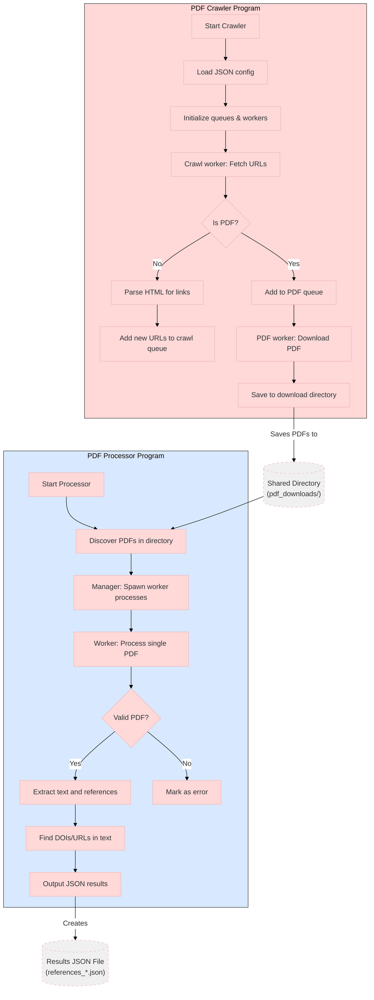

How They Work Together:
Crawler Program (Left):

Starts with a JSON config of URLs to crawl

Uses async workers to crawl web pages and find PDFs

Downloads found PDFs to a shared directory (pdf_downloads/)

Processor Program (Right):

Scans the shared directory for PDFs

Uses a manager-worker pattern to process each PDF

Each worker extracts text, references, DOIs and URLs

Results are aggregated into a JSON file

Data Flow:

The crawler populates the shared directory with PDFs

The processor consumes these PDFs to extract academic references

This creates a pipeline where the crawler gathers content and the processor analyzes it

Key Features Shown:

Parallel processing in both programs (async in crawler, multiprocessing in processor)

Fault tolerance (error handling in both)

Separation of concerns (crawling vs content analysis)

Shared filesystem as integration point

