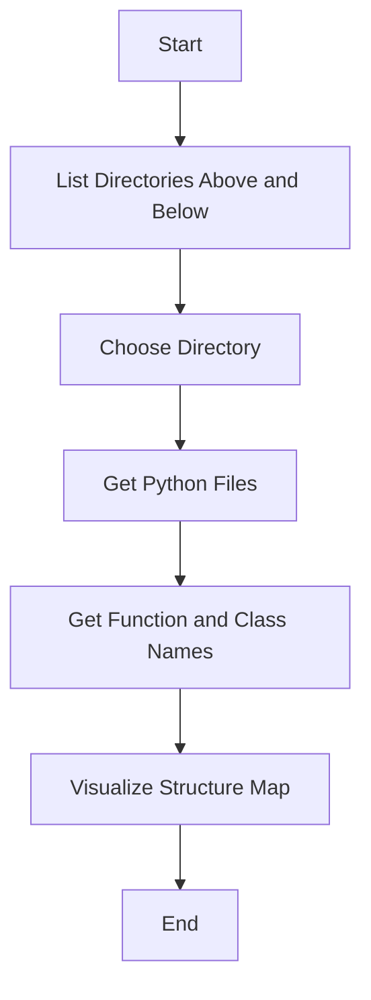

# Python File Structure Visualizer

This Python script is designed to scan a directory for Python files, analyze their structure, and visualize the relationships between files, functions, and classes in a 3D point cloud using Plotly. The script allows users to explore the directory structure and gain insights into the organization of Python code.

## Features

- **Directory Scanning**: Lists directories both above and below the current directory up to a specified depth.
- **Python File Collection**: Recursively collects all Python files within a chosen directory.
- **Code Analysis**: Extracts function and class names from Python files using Abstract Syntax Trees (AST).
- **3D Visualization**: Visualizes the file structure as a 3D point cloud, with directories, files, functions, and classes represented as points in space.
- **Interactive Menu**: Allows users to select a directory from a list for further analysis.

## Installation


To use this script, ensure you have the following Python packages installed:

```bash
pip install plotly inquirer
```

## Usage

1. **Run the Script**: Execute the script in your terminal or IDE.
2. **Choose a Directory**: The script will display a list of directories for you to choose from.
3. **Visualize the Structure**: Once a directory is selected, the script will scan for Python files, analyze their structure, and display the results in a 3D point cloud.

## Code Overview

### Functions

- **list_directories_above_and_below(start_directory, max_depth=2)**: Lists directories both above and below the current directory up to a specified depth.
- **get_python_files(directory)**: Recursively collects all Python files within a chosen directory.
- **get_function_and_class_names(file_path)**: Extracts function and class names from a Python file.
- **visualize_structure_map_point_cloud_plotly(file_structure_map, show_detail=True)**: Visualizes the file structure as a 3D point cloud using Plotly.
- **find_similar_python_files(directory)**: Scans the chosen directory for Python files and compares their structures.
- **choose_directory(directories)**: Displays a menu for the user to choose a directory.

### Main Execution

The script starts by listing directories around the current working directory, allowing the user to select one. It then scans the chosen directory for Python files, analyzes their structure, and visualizes the results.

## Mermaid Diagram



## Example Output

When you run the script, you might see output similar to the following:

```
Current working directory: /path/to/current/directory
Searching for directories below: /path/to/current/directory
Found subdirectory: /path/to/current/directory/subdir1
Found subdirectory: /path/to/current/directory/subdir2
Searching for parent directories above: /path/to/current/directory
Found parent directory: /path/to/parent/directory
Displaying directory choices to the user...
User selected directory: /path/to/current/directory/subdir1
Scanning for Python files in: /path/to/current/directory/subdir1
Found Python file: example.py
Analyzing file: /path/to/current/directory/subdir1/example.py
Found 3 functions and 2 classes in file: /path/to/current/directory/subdir1/example.py
Structure map built for 1 files.
Starting visualization using Plotly...
Clustering points based on directories and files...
Prepared 5 data points for visualization.
Rendering the Plotly figure...
Plotly figure rendered successfully.
Press Enter to exit...
```

## Conclusion

This script provides a powerful tool for visualizing the structure of Python projects, helping developers understand the relationships between files, functions, and classes. The interactive 3D visualization makes it easy to explore complex codebases and identify patterns or anomalies.
